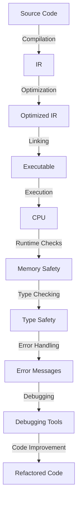

## Introduction
**Swift** is a modern, high-performance, and safe language developed by **Apple** for building **iOS**, **macOS**, **watchOS**, and **tvOS** applications. It was first released in 2014 and has since become the primary language for developing Apple ecosystem applications. Swift is designed to give developers more freedom to create powerful, modern apps with a clean and easy-to-read syntax. In this overview, we'll explore the core concepts, internal mechanics, and real-world applications of Swift, as well as provide code examples, comparisons, and interview tips.

> **Note:** Swift is not just limited to Apple ecosystem development; it can also be used for server-side development with frameworks like **Vapor** and **Kitura**.

Swift is a **compiled language**, which means that the code is converted into machine code before it's executed. This compilation step allows for **type checking**, **memory safety**, and **performance optimization**. Swift's design goals include:

* **Safety**: Prevent common programming errors like null pointer dereferences and buffer overflows.
* **Performance**: Provide high-performance capabilities while maintaining a clean and easy-to-read syntax.
* **Modern**: Support modern programming concepts like **closures**, **generics**, and **protocols**.

## Core Concepts
Swift has several core concepts that are essential to understanding the language. These include:

* **Variables**: Used to store values, which can be **constants** (let) or **variables** (var).
* **Data Types**: Swift has a variety of built-in data types, including **Int**, **Double**, **String**, and **Array**.
* **Control Flow**: Used to control the flow of execution, including **if-else statements**, **loops**, and **switch statements**.
* **Functions**: Used to encapsulate code and reuse it, with support for **closures** and **higher-order functions**.
* **Classes**: Used to define custom data types, with support for **inheritance**, **polymorphism**, and **encapsulation**.

> **Tip:** Swift's **type inference** feature allows you to omit type annotations in many cases, making the code more concise and easier to read.

## How It Works Internally
Swift's internal mechanics are designed to provide **memory safety**, **performance**, and **ease of use**. Here's a step-by-step breakdown of how Swift works internally:

1. **Compilation**: The Swift compiler converts the source code into **Intermediate Representation (IR)**.
2. **Optimization**: The IR is optimized for performance, including **dead code elimination**, **constant folding**, and **loop unrolling**.
3. **Linking**: The optimized IR is linked with the **Swift Standard Library** and other dependencies to create an **executable**.
4. **Execution**: The executable is executed by the **CPU**, with **runtime checks** for memory safety and **type checking**.

> **Warning:** Swift's **optional binding** feature can help prevent **null pointer dereferences**, but it's essential to understand how it works to avoid common pitfalls.

## Code Examples
Here are three complete and runnable code examples to demonstrate Swift's basics:

### Example 1: Basic Usage
```swift
// Define a constant and a variable
let name = "John"
var age = 30

// Print the values
print("Name: \(name), Age: \(age)")

// Update the variable
age = 31
print("Updated Age: \(age)")
```

### Example 2: Real-World Pattern
```swift
// Define a struct for a Person
struct Person {
    let name: String
    var age: Int
}

// Create an instance of Person
let person = Person(name: "Jane", age: 25)

// Print the person's details
print("Name: \(person.name), Age: \(person.age)")

// Update the person's age
person.age = 26
print("Updated Age: \(person.age)")
```

### Example 3: Advanced Usage
```swift
// Define a class for a BankAccount
class BankAccount {
    let accountNumber: Int
    var balance: Double
    
    init(accountNumber: Int, initialBalance: Double) {
        self.accountNumber = accountNumber
        self.balance = initialBalance
    }
    
    func deposit(amount: Double) {
        balance += amount
    }
    
    func withdraw(amount: Double) {
        if amount > balance {
            print("Insufficient funds")
        } else {
            balance -= amount
        }
    }
}

// Create an instance of BankAccount
let account = BankAccount(accountNumber: 12345, initialBalance: 1000.0)

// Deposit and withdraw money
account.deposit(amount: 500.0)
account.withdraw(amount: 200.0)

// Print the final balance
print("Final Balance: \(account.balance)")
```

## Visual Diagram

This diagram illustrates the Swift compilation and execution process, from source code to executable, with various stages of optimization, linking, and runtime checks.

## Comparison
Here's a comparison table of Swift with other popular programming languages:

| Language | Type System | Memory Safety | Performance |
| --- | --- | --- | --- |
| Swift | Statically typed | Memory safe | High-performance |
| Objective-C | Statically typed | Not memory safe | High-performance |
| Java | Statically typed | Memory safe | Medium-performance |
| Python | Dynamically typed | Not memory safe | Low-performance |
| C++ | Statically typed | Not memory safe | High-performance |

> **Interview:** What are the advantages of using Swift over Objective-C for iOS development?

## Real-world Use Cases
Here are three real-world examples of companies using Swift:

1. **Uber**: Uber's mobile app is built using Swift, providing a seamless user experience for riders and drivers.
2. **Airbnb**: Airbnb's mobile app is built using Swift, offering a user-friendly interface for hosts and guests to manage their bookings.
3. **Pinterest**: Pinterest's mobile app is built using Swift, providing a visually appealing and interactive experience for users to discover and save content.

## Common Pitfalls
Here are four common mistakes to avoid when using Swift:

1. **Optional Binding**: Failing to properly handle optional values can lead to **null pointer dereferences**.
```swift
// Wrong way
let name: String? = "John"
print(name!) // This will crash if name is nil

// Right way
let name: String? = "John"
if let unwrappedName = name {
    print(unwrappedName)
}
```

2. **Type Casting**: Incorrectly using **type casting** can lead to **runtime errors**.
```swift
// Wrong way
let value: Any = "Hello"
let castedValue = value as! Int // This will crash at runtime

// Right way
let value: Any = "Hello"
if let castedValue = value as? String {
    print(castedValue)
}
```

3. **Memory Leaks**: Failing to properly manage memory can lead to **memory leaks**.
```swift
// Wrong way
class MyClass {
    var myProperty: String?
    init() {
        myProperty = "Hello"
    }
    deinit {
        // Not releasing the property
    }
}

// Right way
class MyClass {
    var myProperty: String?
    init() {
        myProperty = "Hello"
    }
    deinit {
        myProperty = nil // Releasing the property
    }
}
```

4. **Concurrency**: Incorrectly using **concurrency** can lead to **deadlocks** or **race conditions**.
```swift
// Wrong way
let queue = DispatchQueue.main
queue.sync {
    // Performing a long-running operation on the main queue
}

// Right way
let queue = DispatchQueue.global()
queue.async {
    // Performing a long-running operation on a background queue
}
```

## Interview Tips
Here are three common interview questions related to Swift:

1. **What is the difference between `let` and `var` in Swift?**
	* Weak answer: "Let is used for constants, and var is used for variables."
	* Strong answer: "Let is used for constants, which are immutable, while var is used for variables, which are mutable. This distinction is essential for maintaining code readability and preventing unexpected behavior."
2. **How do you handle errors in Swift?**
	* Weak answer: "I use try-catch blocks to handle errors."
	* Strong answer: "Swift provides a robust error handling mechanism through the use of **Error** protocol and **try-catch** blocks. I use **do-catch** blocks to handle errors and provide meaningful error messages to users."
3. **What is the purpose of **optional binding** in Swift?**
	* Weak answer: "Optional binding is used to unwrap optional values."
	* Strong answer: "Optional binding is a safe and efficient way to handle optional values in Swift. It allows developers to unwrap optional values and perform actions only if the value is not nil, thereby preventing **null pointer dereferences** and improving code readability."

## Key Takeaways
Here are ten key takeaways to remember when working with Swift:

* **Swift is a compiled language** that provides high-performance capabilities.
* **Memory safety** is a core design goal of Swift, achieved through **optional binding** and **type checking**.
* **Type inference** allows for concise code, but it's essential to understand the underlying type system.
* **Error handling** is critical in Swift, and **do-catch** blocks provide a robust mechanism for handling errors.
* **Concurrency** is essential for building responsive and scalable applications, but it requires careful consideration of **deadlocks** and **race conditions**.
* **Optional binding** is a safe and efficient way to handle optional values.
* **Type casting** should be used judiciously, with careful consideration of **runtime errors**.
* **Memory leaks** can occur if memory is not properly managed, leading to **performance issues**.
* **Swift's standard library** provides a wide range of useful functions and data structures.
* **Swift's syntax** is designed to be concise and easy to read, but it's essential to understand the underlying mechanics to write efficient and effective code.