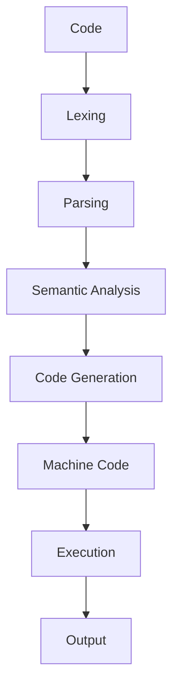

## Introduction
Swift is a powerful, modern, and high-performance programming language developed by Apple for building iOS, macOS, watchOS, and tvOS applications. It was designed to give developers the ability to create powerful, modern apps with a clean and easy-to-read syntax. Swift is a statically typed language, which means that it checks the types of variables at compile time, preventing type-related runtime errors. With its growing popularity, Swift has become a crucial skill for any aspiring iOS developer. In this overview, we will explore the core concepts, internal workings, and best practices of the Swift programming language.

## Core Concepts
To understand Swift, it's essential to grasp its core concepts, including **variables**, **data types**, **control structures**, and **functions**. Variables are used to store and manipulate data, while data types determine the type of data that can be stored in a variable. Control structures, such as **if-else statements** and **loops**, are used to control the flow of a program. Functions are reusable blocks of code that perform a specific task. Swift also supports **object-oriented programming (OOP)** concepts like **classes**, **structs**, and **enums**, which are used to define custom data types and organize code.

> **Note:** Swift's type system is designed to be safe and flexible, allowing developers to write robust and maintainable code.

## How It Works Internally
When you write Swift code, it is compiled into machine code that can be executed directly by the CPU. The compilation process involves several steps, including **lexing**, **parsing**, **semantic analysis**, and **code generation**. Lexing breaks the code into individual tokens, while parsing analyzes the tokens to ensure that the code is syntactically correct. Semantic analysis checks the code for type errors and other semantic issues, and code generation produces the final machine code.

Here's a high-level overview of the Swift compilation process:
1. **Lexing**: The compiler breaks the code into individual tokens.
2. **Parsing**: The compiler analyzes the tokens to ensure that the code is syntactically correct.
3. **Semantic Analysis**: The compiler checks the code for type errors and other semantic issues.
4. **Code Generation**: The compiler produces the final machine code.

## Code Examples
Here are three complete and runnable Swift code examples that demonstrate basic, real-world, and advanced usage:

### Example 1: Basic Usage
```swift
// Define a variable
var name: String = "John"

// Print the variable
print(name)

// Define a function
func greet(name: String) {
    print("Hello, \(name)!")
}

// Call the function
greet(name: "Jane")
```

### Example 2: Real-World Pattern
```swift
// Define a struct
struct Person {
    let name: String
    let age: Int
}

// Create an instance of the struct
let person = Person(name: "John", age: 30)

// Print the person's details
print("Name: \(person.name), Age: \(person.age)")

// Define a function that takes an array of persons
func printPersonDetails(persons: [Person]) {
    for person in persons {
        print("Name: \(person.name), Age: \(person.age)")
    }
}

// Create an array of persons
let persons = [Person(name: "John", age: 30), Person(name: "Jane", age: 25)]

// Call the function
printPersonDetails(persons: persons)
```

### Example 3: Advanced Usage
```swift
// Define a class
class Vehicle {
    let make: String
    let model: String
    let year: Int

    init(make: String, model: String, year: Int) {
        self.make = make
        self.model = model
        self.year = year
    }

    func printDetails() {
        print("Make: \(make), Model: \(model), Year: \(year)")
    }
}

// Create an instance of the class
let vehicle = Vehicle(make: "Toyota", model: "Camry", year: 2020)

// Print the vehicle's details
vehicle.printDetails()

// Define a function that takes an array of vehicles
func printVehicleDetails(vehicles: [Vehicle]) {
    for vehicle in vehicles {
        vehicle.printDetails()
    }
}

// Create an array of vehicles
let vehicles = [Vehicle(make: "Toyota", model: "Camry", year: 2020), Vehicle(make: "Honda", model: "Civic", year: 2019)]

// Call the function
printVehicleDetails(vehicles: vehicles)
```

## Visual Diagram

This diagram illustrates the Swift compilation process, from code to machine code execution.

> **Tip:** Understanding the compilation process can help you write more efficient and effective code.

## Comparison
Here's a comparison of Swift with other popular programming languages:
| Language | Type System | Memory Management | Performance |
| --- | --- | --- | --- |
| Swift | Statically Typed | Automatic Reference Counting (ARC) | High |
| Java | Statically Typed | Garbage Collection | Medium |
| Python | Dynamically Typed | Garbage Collection | Low |
| C++ | Statically Typed | Manual Memory Management | High |
| JavaScript | Dynamically Typed | Garbage Collection | Medium |

## Real-world Use Cases
Here are three real-world use cases of Swift in production:
1. **Uber**: Uber uses Swift to build their iOS app, which provides a seamless ride-hailing experience for millions of users worldwide.
2. **Instagram**: Instagram uses Swift to build their iOS app, which allows users to share photos and videos with their followers.
3. **Dropbox**: Dropbox uses Swift to build their iOS app, which provides cloud storage and file sharing capabilities for users.

> **Warning:** Swift's strong type system can help prevent type-related errors, but it's still possible to write buggy code if you're not careful.

## Common Pitfalls
Here are four common pitfalls to avoid when writing Swift code:
1. **Optional Binding**: Not using optional binding to unwrap optional values can lead to runtime errors.
```swift
// Wrong way
let name: String? = "John"
print(name!)

// Right way
let name: String? = "John"
if let unwrappedName = name {
    print(unwrappedName)
}
```
2. **Array Index Out of Bounds**: Accessing an array index that is out of bounds can lead to runtime errors.
```swift
// Wrong way
let array = [1, 2, 3]
print(array[3])

// Right way
let array = [1, 2, 3]
if array.indices.contains(3) {
    print(array[3])
} else {
    print("Index out of bounds")
}
```
3. **Memory Leaks**: Not releasing memory allocated to objects can lead to memory leaks.
```swift
// Wrong way
class Person {
    let name: String
    init(name: String) {
        self.name = name
    }
    deinit {
        // Not releasing memory
    }
}

// Right way
class Person {
    let name: String
    init(name: String) {
        self.name = name
    }
    deinit {
        // Releasing memory
        print("Memory released")
    }
}
```
4. **Concurrency Issues**: Not handling concurrency properly can lead to runtime errors.
```swift
// Wrong way
func performTask() {
    // Not handling concurrency
    print("Task performed")
}

// Right way
func performTask() {
    // Handling concurrency using DispatchQueue
    DispatchQueue.main.async {
        print("Task performed")
    }
}
```

## Interview Tips
Here are three common interview questions related to Swift, along with weak and strong answers:
1. **What is the difference between Swift and Objective-C?**
Weak answer: "Swift is a newer language than Objective-C."
Strong answer: "Swift is a modern, high-performance language developed by Apple, while Objective-C is a legacy language that was used to build iOS apps. Swift has a cleaner syntax, better memory management, and improved performance compared to Objective-C."
2. **How does Swift handle memory management?**
Weak answer: "Swift uses garbage collection."
Strong answer: "Swift uses Automatic Reference Counting (ARC), which is a memory management system that automatically manages the memory allocated to objects. ARC uses a reference count to track the number of references to an object, and when the reference count reaches zero, the object is deallocated."
3. **What is the difference between a struct and a class in Swift?**
Weak answer: "A struct is a value type, while a class is a reference type."
Strong answer: "A struct is a value type, which means that it is passed by value, while a class is a reference type, which means that it is passed by reference. This difference affects how the types are used in code, with structs being more suitable for immutable data and classes being more suitable for mutable data."

> **Interview:** Be prepared to answer questions about Swift's type system, memory management, and performance, as well as its differences with other programming languages.

## Key Takeaways
Here are ten key takeaways to remember about Swift:
* Swift is a modern, high-performance language developed by Apple.
* Swift has a clean and easy-to-read syntax.
* Swift is a statically typed language, which means that it checks the types of variables at compile time.
* Swift uses Automatic Reference Counting (ARC) for memory management.
* Swift has a strong focus on safety and security.
* Swift is a versatile language that can be used for building iOS, macOS, watchOS, and tvOS apps.
* Swift has a growing community of developers and a wide range of resources available.
* Swift is compatible with Objective-C and C code, making it easy to integrate with existing projects.
* Swift has a high-performance runtime environment that is optimized for mobile devices.
* Swift is a constantly evolving language, with new features and improvements being added regularly.