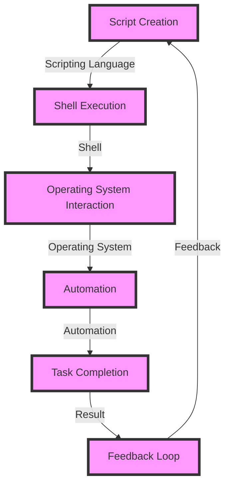

## Introduction
**System Scripting on Apple Platforms** is a powerful tool for automating tasks, integrating systems, and streamlining workflows on Apple devices. It allows developers to leverage the power of scripting languages like **Swift**, **Python**, and **Bash** to interact with the operating system, access hardware components, and integrate with other Apple services. In this section, we will explore the world of system scripting on Apple platforms, its relevance in real-world scenarios, and why every engineer should be familiar with it.

> **Note:** System scripting is not limited to Apple platforms; however, Apple provides a unique set of tools and frameworks that make it an attractive choice for developers.

System scripting is used extensively in various industries, including software development, DevOps, and IT administration. It enables teams to automate repetitive tasks, deploy software updates, and monitor system performance. For instance, a company like **Netflix** might use system scripting to automate the deployment of their iOS and macOS applications, ensuring that the latest features and bug fixes are delivered to their users efficiently.

## Core Concepts
To get started with system scripting on Apple platforms, it's essential to understand the core concepts and terminology. Here are some key terms to know:

* **Scripting Language**: A programming language used to write scripts, such as **Swift**, **Python**, or **Bash**.
* **Shell**: A command-line interface that allows users to interact with the operating system, such as **Terminal** on macOS.
* **Script**: A file containing a series of commands that are executed by the shell, such as a **.sh** or **.swift** file.
* **Automation**: The process of automating tasks using scripts, such as automating backups or software updates.

> **Tip:** When choosing a scripting language, consider the task at hand, the desired level of complexity, and the available resources.

## How It Works Internally
System scripting on Apple platforms works by leveraging the operating system's built-in tools and frameworks. Here's a step-by-step breakdown of the process:

1. **Script Creation**: A developer creates a script using a scripting language, such as **Swift** or **Bash**.
2. **Shell Execution**: The script is executed by the shell, which interprets the commands and passes them to the operating system.
3. **Operating System Interaction**: The operating system interacts with the script, providing access to hardware components, system services, and other resources.
4. **Automation**: The script automates tasks, such as deploying software updates or monitoring system performance.

> **Warning:** When working with system scripting, it's essential to ensure that scripts are properly validated and tested to avoid security vulnerabilities or system instability.

## Code Examples
Here are three complete and runnable code examples that demonstrate the basics of system scripting on Apple platforms:

### Example 1: Basic Scripting with Bash
```bash
#!/bin/bash

# Print the current date and time
echo "Current Date and Time: $(date)"

# Create a new directory
mkdir my_directory

# Print the contents of the current directory
ls -l
```
This example demonstrates basic scripting with **Bash**, including printing the current date and time, creating a new directory, and listing the contents of the current directory.

### Example 2: System Scripting with Swift
```swift
import Foundation

// Print the current date and time
let currentDate = Date()
print("Current Date and Time: \(currentDate)")

// Create a new directory
let directoryURL = URL(fileURLWithPath: "/Users/username/my_directory")
try? FileManager.default.createDirectory(at: directoryURL, withIntermediateDirectories: true)

// Print the contents of the current directory
let contents = try? FileManager.default.contentsOfDirectory(at: URL(fileURLWithPath: "/Users/username/"), includingPropertiesForKeys: nil)
print(contents ?? [])
```
This example demonstrates system scripting with **Swift**, including printing the current date and time, creating a new directory, and listing the contents of the current directory.

### Example 3: Advanced Scripting with Python
```python
import os
import subprocess

# Print the current date and time
print("Current Date and Time: " + subprocess.check_output(["date"]).decode("utf-8").strip())

# Create a new directory
os.mkdir("my_directory")

# Print the contents of the current directory
print(os.listdir())
```
This example demonstrates advanced scripting with **Python**, including printing the current date and time, creating a new directory, and listing the contents of the current directory.

## Visual Diagram

This diagram illustrates the system scripting process on Apple platforms, including script creation, shell execution, operating system interaction, automation, and task completion.

## Comparison
| Approach | Time Complexity | Space Complexity | Pros | Cons | Best For |
| --- | --- | --- | --- | --- | --- |
| Bash Scripting | O(1) | O(1) | Simple, easy to learn | Limited functionality | Basic scripting tasks |
| Swift Scripting | O(n) | O(n) | Powerful, flexible | Steeper learning curve | Advanced scripting tasks |
| Python Scripting | O(n) | O(n) | Versatile, easy to integrate | Slow performance | Data analysis, machine learning |
| AppleScript | O(1) | O(1) | Easy to use, native integration | Limited functionality | Automating Apple applications |

> **Interview:** When asked about the differences between **Bash** and **Swift** scripting, a strong answer would highlight the trade-offs between simplicity and power, as well as the specific use cases for each approach.

## Real-world Use Cases
Here are three real-world examples of system scripting on Apple platforms:

1. **Netflix**: Netflix uses system scripting to automate the deployment of their iOS and macOS applications, ensuring that the latest features and bug fixes are delivered to their users efficiently.
2. **Apple**: Apple uses system scripting to automate the testing and validation of their operating systems and applications, ensuring that they meet the highest standards of quality and reliability.
3. **GitHub**: GitHub uses system scripting to automate the deployment of their software updates, ensuring that their users have access to the latest features and security patches.

## Common Pitfalls
Here are four common mistakes to avoid when working with system scripting on Apple platforms:

1. **Insecure Scripting**: Failing to validate user input and using insecure scripting practices can lead to security vulnerabilities and system instability.
2. **Inconsistent Scripting**: Failing to follow consistent scripting practices can lead to errors and difficulties in maintaining and debugging scripts.
3. **Over-Complex Scripting**: Over-complicating scripts can lead to performance issues and difficulties in maintaining and debugging scripts.
4. **Under-Testing**: Failing to thoroughly test scripts can lead to errors and system instability.

> **Warning:** When working with system scripting, it's essential to ensure that scripts are properly validated and tested to avoid security vulnerabilities or system instability.

## Interview Tips
Here are three common interview questions related to system scripting on Apple platforms, along with weak and strong answer examples:

1. **What is the difference between Bash and Swift scripting?**
	* Weak answer: "Bash is for basic scripting, and Swift is for advanced scripting."
	* Strong answer: "Bash is a simple, easy-to-learn scripting language, while Swift is a more powerful, flexible language that offers advanced features and performance."
2. **How do you automate tasks on Apple platforms?**
	* Weak answer: "I use AppleScript to automate tasks."
	* Strong answer: "I use a combination of scripting languages, such as Bash, Swift, and Python, to automate tasks on Apple platforms, depending on the specific requirements and use case."
3. **What are some common security considerations when working with system scripting?**
	* Weak answer: "I just make sure to use secure passwords and keep my scripts up to date."
	* Strong answer: "I follow best practices for secure scripting, including validating user input, using secure protocols for data transmission, and regularly updating and patching my scripts and systems."

## Key Takeaways
Here are ten key takeaways to remember when working with system scripting on Apple platforms:

* **Scripting languages**: Bash, Swift, Python, and AppleScript are popular scripting languages for Apple platforms.
* **Shell execution**: The shell is responsible for executing scripts and providing access to the operating system.
* **Operating system interaction**: The operating system provides access to hardware components, system services, and other resources.
* **Automation**: Scripts can automate tasks, such as deploying software updates or monitoring system performance.
* **Security considerations**: Secure scripting practices, such as validating user input and using secure protocols, are essential for maintaining system security and stability.
* **Performance optimization**: Optimizing script performance can improve overall system performance and efficiency.
* **Script maintenance**: Regularly maintaining and updating scripts is essential for ensuring they remain functional and secure.
* **Error handling**: Implementing robust error handling mechanisms can help prevent system instability and security vulnerabilities.
* **Testing and validation**: Thoroughly testing and validating scripts is essential for ensuring they meet the required standards of quality and reliability.
* **Best practices**: Following best practices for scripting, such as using consistent naming conventions and commenting code, can improve script maintainability and readability.

> **Tip:** When working with system scripting, it's essential to stay up to date with the latest developments and best practices to ensure you're using the most effective and efficient approaches.