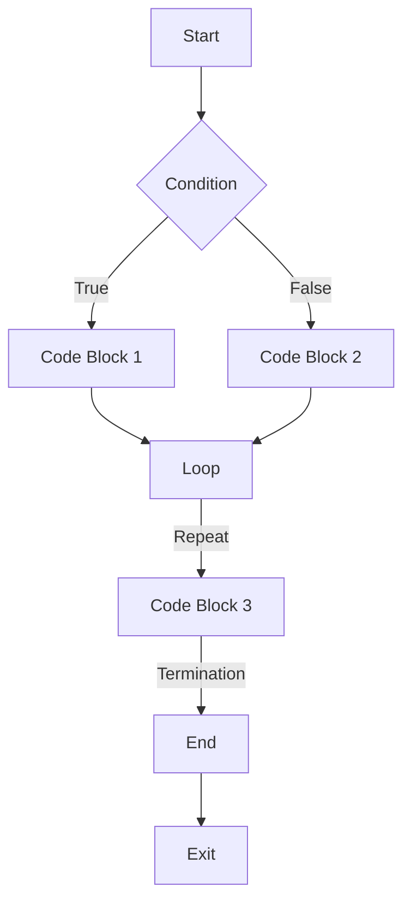

## Introduction
Control flow is a fundamental concept in programming that determines the order in which a program's code is executed. It is essential for implementing logic, making decisions, and handling different scenarios in a program. In Swift, control flow is achieved through various statements, including if-else, switch, for-in, while, and repeat-while. Understanding control flow is crucial for writing efficient, readable, and maintainable code.

> **Note:** Control flow is not unique to Swift; it is a fundamental concept in programming that applies to all languages. However, the syntax and usage may vary depending on the language.

In real-world scenarios, control flow is used extensively in various applications, such as:

* Validating user input
* Handling errors and exceptions
* Implementing business logic
* Optimizing performance

For example, a banking app may use control flow to validate user credentials, check account balances, and handle transactions.

## Core Concepts
The core concepts of control flow in Swift include:

* **Conditional statements**: if-else and switch statements that execute code based on conditions
* **Loops**: for-in, while, and repeat-while statements that execute code repeatedly
* **Control transfer statements**: break, continue, and return statements that transfer control to different parts of the program

Mental models for control flow include:

* Thinking of a program as a flowchart, where each statement is a node that executes code and transfers control to the next node
* Visualizing the program's execution as a sequence of steps, where each step is a statement that executes code

Key terminology includes:

* **Branching**: the act of transferring control to a different part of the program based on a condition
* **Iteration**: the act of executing code repeatedly
* **Termination**: the act of ending a program or a loop

## How It Works Internally
Control flow in Swift works internally through the following steps:

1. **Compilation**: The Swift compiler translates the source code into machine code that the CPU can execute.
2. **Execution**: The CPU executes the machine code, statement by statement.
3. **Branching**: When a conditional statement is encountered, the CPU checks the condition and transfers control to the corresponding branch.
4. **Iteration**: When a loop is encountered, the CPU executes the loop body repeatedly until the termination condition is met.

> **Warning:** Infinite loops can cause a program to crash or hang. It is essential to ensure that loops have a termination condition.

## Code Examples
### Example 1: Basic if-else Statement
```swift
// Define a variable to store the user's age
var age = 25

// Check if the user is eligible to vote
if age >= 18 {
    print("You are eligible to vote.")
} else {
    print("You are not eligible to vote.")
}
```

### Example 2: Switch Statement with Multiple Cases
```swift
// Define a variable to store the user's choice
var choice = "apple"

// Use a switch statement to handle different cases
switch choice {
case "apple":
    print("You chose an apple.")
case "banana":
    print("You chose a banana.")
default:
    print("Invalid choice.")
}
```

### Example 3: Advanced Loop with Repeat-While
```swift
// Define a variable to store the loop counter
var counter = 0

// Use a repeat-while loop to execute code repeatedly
repeat {
    print("Loop iteration \(counter)")
    counter += 1
} while counter < 5
```

## Visual Diagram

This diagram illustrates the control flow of a program with conditional statements and loops.

## Comparison
| Approach | Time Complexity | Space Complexity | Pros | Cons | Best For |
| --- | --- | --- | --- | --- | --- |
| if-else | O(1) | O(1) | Simple and easy to understand | Limited scalability | Simple conditional logic |
| switch | O(1) | O(1) | Efficient for multiple cases | Limited flexibility | Multiple case handling |
| for-in | O(n) | O(1) | Easy to iterate over collections | Limited control | Iterating over collections |
| while | O(n) | O(1) | Flexible and efficient | Difficult to understand | Complex loop logic |
| repeat-while | O(n) | O(1) | Easy to implement | Limited control | Simple loop logic |

> **Tip:** Choose the approach that best fits the problem requirements. Consider factors such as time complexity, space complexity, and readability.

## Real-world Use Cases
1. **Apple's Siri**: Uses control flow to handle user input and execute corresponding actions.
2. **Google's Search Algorithm**: Uses control flow to rank search results based on relevance and other factors.
3. **Amazon's Recommendation Engine**: Uses control flow to suggest products based on user behavior and preferences.

## Common Pitfalls
1. **Infinite Loops**: Failing to include a termination condition in a loop can cause the program to crash or hang.
```swift
// WRONG: Infinite loop
while true {
    print("Hello, World!")
}

// RIGHT: Loop with termination condition
var counter = 0
while counter < 5 {
    print("Hello, World!")
    counter += 1
}
```

2. **Unreachable Code**: Placing code after a return statement can make it unreachable.
```swift
// WRONG: Unreachable code
func foo() {
    return
    print("Hello, World!") // Unreachable code
}

// RIGHT: No unreachable code
func foo() {
    print("Hello, World!")
    return
}
```

3. **Uninitialized Variables**: Failing to initialize variables can cause unexpected behavior.
```swift
// WRONG: Uninitialized variable
var x: Int
print(x) // Error: Uninitialized variable

// RIGHT: Initialized variable
var x: Int = 0
print(x) // Output: 0
```

4. **Off-by-One Errors**: Failing to account for off-by-one errors can cause incorrect results.
```swift
// WRONG: Off-by-one error
var array = [1, 2, 3, 4, 5]
for i in 1...6 {
    print(array[i-1])
}

// RIGHT: No off-by-one error
var array = [1, 2, 3, 4, 5]
for i in 0...4 {
    print(array[i])
}
```

## Interview Tips
1. **What is the difference between if-else and switch statements?**
	* Weak answer: "If-else is used for simple conditions, while switch is used for multiple cases."
	* Strong answer: "If-else is used for simple conditions, while switch is used for multiple cases. However, switch is more efficient for large numbers of cases, while if-else is more flexible for complex conditions."
2. **How do you handle errors in a loop?**
	* Weak answer: "I use a try-catch block to catch errors."
	* Strong answer: "I use a try-catch block to catch errors, and also include a termination condition to prevent infinite loops. Additionally, I log the error and provide a meaningful error message to the user."
3. **What is the time complexity of a for-in loop?**
	* Weak answer: "O(1)"
	* Strong answer: "O(n), where n is the number of elements in the collection. However, the time complexity can be improved by using a more efficient algorithm or data structure."

## Key Takeaways
* Control flow is essential for implementing logic and handling different scenarios in a program.
* Choose the approach that best fits the problem requirements, considering factors such as time complexity, space complexity, and readability.
* Use if-else statements for simple conditions, switch statements for multiple cases, and loops for iterating over collections.
* Always include a termination condition in loops to prevent infinite loops.
* Handle errors and exceptions properly, using try-catch blocks and logging mechanisms.
* Use meaningful variable names and comments to improve code readability.
* Consider factors such as performance, scalability, and maintainability when designing control flow logic.