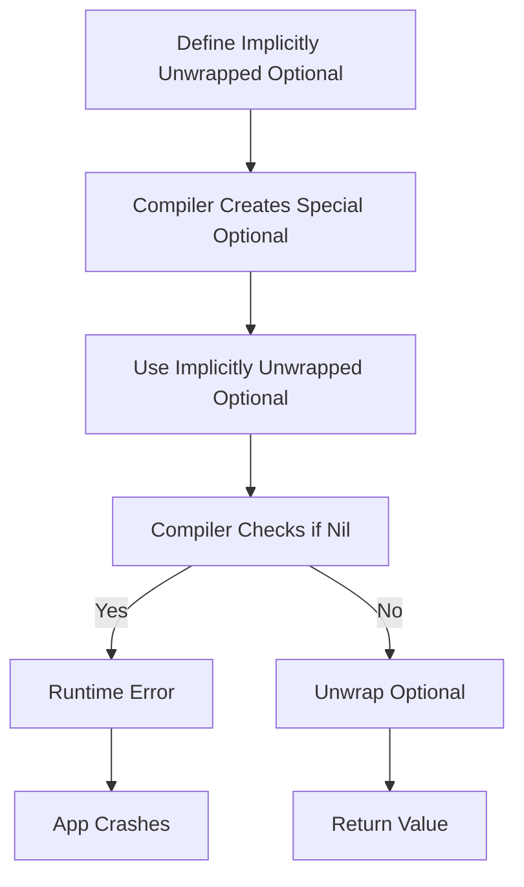

## Introduction
**Implicitly unwrapped optionals**, denoted by the `!` symbol, are a type of optional in Swift that can be used to wrap a value that may or may not be present. They are called "implicitly unwrapped" because the compiler will automatically unwrap the optional when it is used, without the need for explicit unwrapping using the `?` or `!` operators. Implicitly unwrapped optionals are useful when you need to use a value that may or may not be present, but you are certain that it will always be present when you use it. For example, when working with outlets in a UIKit view controller, the outlets are implicitly unwrapped optionals because they are guaranteed to be initialized before they are used.

> **Note:** Implicitly unwrapped optionals are not a substitute for proper error handling. They should only be used when you are certain that the value will always be present, and the compiler will not be able to catch any errors that may occur.

In real-world scenarios, implicitly unwrapped optionals are commonly used in iOS development, particularly when working with UIKit and Core Animation. They are also used in other areas of Swift development, such as when working with Core Data and networking.

## Core Concepts
The core concept of implicitly unwrapped optionals is that they are a type of optional that can be used to wrap a value that may or may not be present. They are defined using the `!` symbol, and they can be used in a similar way to regular optionals. However, unlike regular optionals, implicitly unwrapped optionals do not require explicit unwrapping using the `?` or `!` operators.

The key terminology to understand when working with implicitly unwrapped optionals is:

* **Implicitly unwrapped optional**: A type of optional that can be used to wrap a value that may or may not be present, and is automatically unwrapped by the compiler.
* **Optional**: A type of variable that can hold a value or be `nil`.
* **Unwrapping**: The process of accessing the value inside an optional.

> **Warning:** Implicitly unwrapped optionals can be a source of bugs if not used carefully. If an implicitly unwrapped optional is `nil`, and you try to access its value, your app will crash.

## How It Works Internally
When you define an implicitly unwrapped optional, the compiler will create a special kind of optional that is automatically unwrapped when you use it. This is done using a combination of compiler magic and runtime checks.

Here is a step-by-step breakdown of how it works:

1. You define an implicitly unwrapped optional using the `!` symbol.
2. The compiler creates a special kind of optional that is automatically unwrapped when you use it.
3. When you use the implicitly unwrapped optional, the compiler checks if it is `nil`.
4. If it is `nil`, the compiler will raise a runtime error.
5. If it is not `nil`, the compiler will unwrap the optional and return the value inside.

> **Tip:** When working with implicitly unwrapped optionals, it's a good idea to use the `if let` statement to unwrap the optional and handle the case where it is `nil`.

## Code Examples
Here are three complete and runnable examples of using implicitly unwrapped optionals in Swift:

### Example 1: Basic Usage
```swift
var implicitlyUnwrappedOptional: String! = "Hello, World!"
print(implicitlyUnwrappedOptional) // prints "Hello, World!"
```
In this example, we define an implicitly unwrapped optional `implicitlyUnwrappedOptional` and assign it a value. We can then print the value without explicitly unwrapping it.

### Example 2: Real-World Pattern
```swift
class ViewController: UIViewController {
    @IBOutlet weak var label: UILabel!

    override func viewDidLoad() {
        super.viewDidLoad()
        label.text = "Hello, World!"
    }
}
```
In this example, we define a `UILabel` outlet `label` as an implicitly unwrapped optional. We can then use it in the `viewDidLoad` method to set its text.

### Example 3: Advanced Usage
```swift
func optionalBindingExample() {
    var implicitlyUnwrappedOptional: String! = "Hello, World!"
    if let unwrappedOptional = implicitlyUnwrappedOptional {
        print(unwrappedOptional) // prints "Hello, World!"
    }
}
```
In this example, we define an implicitly unwrapped optional `implicitlyUnwrappedOptional` and use an `if let` statement to unwrap it. We can then print the unwrapped value.

## Visual Diagram

This diagram illustrates the process of defining and using an implicitly unwrapped optional. It shows how the compiler creates a special kind of optional, and how it checks if the optional is `nil` when it is used.

## Comparison
Here is a comparison of implicitly unwrapped optionals with other types of optionals in Swift:
| Type | Description | Time Complexity | Space Complexity |
| --- | --- | --- | --- |
| Implicitly Unwrapped Optional | Automatically unwrapped by compiler | O(1) | O(1) |
| Regular Optional | Requires explicit unwrapping | O(1) | O(1) |
| Forced Unwrapping | Unwraps optional using `!` operator | O(1) | O(1) |
| Optional Binding | Unwraps optional using `if let` statement | O(1) | O(1) |

> **Interview:** When asked about implicitly unwrapped optionals in an interview, be sure to explain how they work internally, and how they differ from other types of optionals. You should also be able to provide examples of when to use them, and how to handle errors that may occur.

## Real-world Use Cases
Here are three real-world use cases for implicitly unwrapped optionals:

* **iOS Development**: Implicitly unwrapped optionals are commonly used in iOS development, particularly when working with UIKit and Core Animation.
* **Core Data**: Implicitly unwrapped optionals can be used when working with Core Data to wrap values that may or may not be present.
* **Networking**: Implicitly unwrapped optionals can be used when working with networking to wrap values that may or may not be present in a response.

## Common Pitfalls
Here are four common pitfalls to watch out for when working with implicitly unwrapped optionals:

* **Not checking for nil**: Failing to check if an implicitly unwrapped optional is `nil` before using it can cause a runtime error.
* **Using implicitly unwrapped optionals for error handling**: Implicitly unwrapped optionals should not be used for error handling. Instead, use `if let` statements or `guard` statements to handle errors.
* **Not understanding how implicitly unwrapped optionals work internally**: Not understanding how implicitly unwrapped optionals work internally can lead to confusion and bugs.
* **Using implicitly unwrapped optionals excessively**: Using implicitly unwrapped optionals excessively can make code harder to read and maintain.

> **Warning:** When working with implicitly unwrapped optionals, be sure to check for `nil` before using them, and avoid using them for error handling.

## Interview Tips
Here are three common interview questions related to implicitly unwrapped optionals, along with sample answers:

* **What is an implicitly unwrapped optional?**: An implicitly unwrapped optional is a type of optional that can be used to wrap a value that may or may not be present, and is automatically unwrapped by the compiler.
* **How do implicitly unwrapped optionals work internally?**: Implicitly unwrapped optionals work internally by using a combination of compiler magic and runtime checks to unwrap the optional when it is used.
* **When should I use implicitly unwrapped optionals?**: Implicitly unwrapped optionals should be used when you are certain that the value will always be present, and you need to use it in a context where explicit unwrapping is not possible.

## Key Takeaways
Here are ten key takeaways to remember when working with implicitly unwrapped optionals:

* **Implicitly unwrapped optionals are automatically unwrapped by the compiler**: Implicitly unwrapped optionals are automatically unwrapped by the compiler when they are used.
* **Implicitly unwrapped optionals can be used to wrap values that may or may not be present**: Implicitly unwrapped optionals can be used to wrap values that may or may not be present.
* **Implicitly unwrapped optionals should be used with caution**: Implicitly unwrapped optionals should be used with caution, as they can cause runtime errors if not used carefully.
* **Implicitly unwrapped optionals should not be used for error handling**: Implicitly unwrapped optionals should not be used for error handling. Instead, use `if let` statements or `guard` statements to handle errors.
* **Implicitly unwrapped optionals work internally using a combination of compiler magic and runtime checks**: Implicitly unwrapped optionals work internally using a combination of compiler magic and runtime checks to unwrap the optional when it is used.
* **Implicitly unwrapped optionals have a time complexity of O(1)**: Implicitly unwrapped optionals have a time complexity of O(1) because they are automatically unwrapped by the compiler.
* **Implicitly unwrapped optionals have a space complexity of O(1)**: Implicitly unwrapped optionals have a space complexity of O(1) because they do not require any additional memory to store the unwrapped value.
* **Implicitly unwrapped optionals are commonly used in iOS development**: Implicitly unwrapped optionals are commonly used in iOS development, particularly when working with UIKit and Core Animation.
* **Implicitly unwrapped optionals can be used with Core Data and networking**: Implicitly unwrapped optionals can be used with Core Data and networking to wrap values that may or may not be present.
* **Implicitly unwrapped optionals should be used sparingly and with caution**: Implicitly unwrapped optionals should be used sparingly and with caution, as they can make code harder to read and maintain if not used carefully.