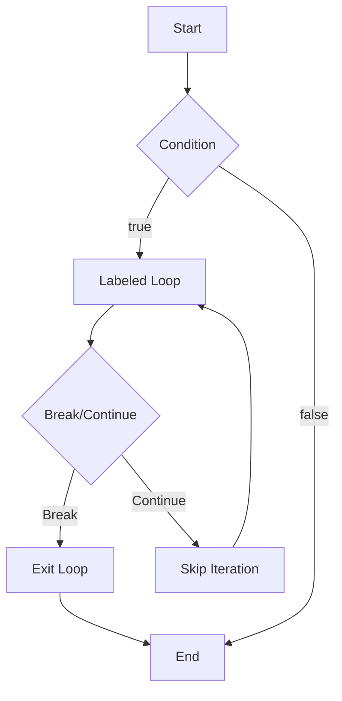

## Introduction
**Labeled statements** are a fundamental concept in programming, allowing developers to control the flow of their code with precision. In Swift, labeled statements are used in conjunction with `break` and `continue` statements to exit or skip iterations in loops. This concept is crucial in programming as it enables developers to handle complex logic and nested loops efficiently. Every engineer should understand labeled statements, as they are a common feature in many programming languages, including Swift.

## Core Concepts
A **labeled statement** is a statement that is assigned a label, which can be used to identify the statement. In Swift, labels are used with `break` and `continue` statements to specify which loop or statement to exit or skip. The key terminology includes:
- **Label**: A unique identifier assigned to a statement.
- **Break statement**: Exits the loop or statement.
- **Continue statement**: Skips the current iteration and moves to the next one.

## How It Works Internally
When a `break` or `continue` statement is encountered, the compiler checks for a label. If a label is provided, the compiler will exit or skip the corresponding labeled statement. If no label is provided, the compiler will exit or skip the innermost loop. The step-by-step process is as follows:
1. The compiler encounters a `break` or `continue` statement.
2. The compiler checks if a label is provided.
3. If a label is provided, the compiler exits or skips the corresponding labeled statement.
4. If no label is provided, the compiler exits or skips the innermost loop.

## Code Examples
### Example 1: Basic Usage
```swift
// Labeled loop
loop1: for i in 1...5 {
    if i == 3 {
        break loop1
    }
    print("Iteration \(i)")
}

// Output: Iteration 1, Iteration 2
```
### Example 2: Real-World Pattern
```swift
// Nested loops with labeled statements
outerLoop: for i in 1...3 {
    innerLoop: for j in 1...3 {
        if i == 2 && j == 2 {
            break outerLoop
        }
        print("Iteration (\(i), \(j))")
    }
}

// Output: Iteration (1, 1), Iteration (1, 2), Iteration (1, 3), 
//          Iteration (2, 1)
```
### Example 3: Advanced Usage
```swift
// Labeled while loop
var i = 0
loop2: while i < 5 {
    if i == 3 {
        continue loop2
    }
    print("Iteration \(i)")
    i += 1
}

// Output: Iteration 0, Iteration 1, Iteration 2, Iteration 4
```
> **Tip:** When using labeled statements, it's essential to choose unique and descriptive labels to avoid confusion.

## Visual Diagram

The diagram illustrates the flow of a labeled loop with `break` and `continue` statements.

## Comparison
| Approach | Time Complexity | Space Complexity | Pros | Cons | Best For |
|----------|----------------|-----------------|------|------|----------|
| Labeled Statements | O(1) | O(1) | Easy to read, flexible | Can be confusing | Simple loops |
| Unlabeled Statements | O(1) | O(1) | Simple, efficient | Limited flexibility | Complex loops |
| Functions | O(1) | O(1) | Modular, reusable | Overhead of function calls | Large programs |
| Goto Statements | O(1) | O(1) | Flexible, efficient | Error-prone, hard to read | Legacy code |

## Real-world Use Cases
1. **Apple's Swift**: Labeled statements are used in Apple's Swift programming language to control the flow of loops.
2. **Google's Go**: Labeled statements are used in Google's Go programming language to exit and skip loops.
3. **Amazon's Alexa**: Labeled statements are used in Amazon's Alexa skills to handle complex logic and nested loops.

## Common Pitfalls
1. **Incorrect Label**: Using an incorrect label can lead to unexpected behavior.
```swift
// Incorrect label
loop1: for i in 1...5 {
    if i == 3 {
        break loop2 // Incorrect label
    }
    print("Iteration \(i)")
}
```
2. **Missing Label**: Failing to provide a label can lead to exiting the wrong loop.
```swift
// Missing label
for i in 1...5 {
    if i == 3 {
        break // Missing label
    }
    print("Iteration \(i)")
}
```
> **Warning:** Always use unique and descriptive labels to avoid confusion.

## Interview Tips
1. **What is the purpose of labeled statements?**: The purpose of labeled statements is to control the flow of loops with precision.
2. **How do you use labeled statements in Swift?**: Labeled statements are used with `break` and `continue` statements to exit or skip loops.
3. **What are the benefits of using labeled statements?**: Labeled statements make the code easy to read and maintain, and they provide flexibility in controlling the flow of loops.

## Key Takeaways
* Labeled statements are used to control the flow of loops with precision.
* Labels are used with `break` and `continue` statements to specify which loop or statement to exit or skip.
* Labeled statements have a time complexity of O(1) and a space complexity of O(1).
* Labeled statements are easy to read and maintain, but can be confusing if not used correctly.
* Labeled statements are used in many programming languages, including Swift, Go, and Java.
* Always use unique and descriptive labels to avoid confusion.
* Labeled statements are best used in simple loops, while unlabeled statements are best used in complex loops.
* Functions are best used in large programs, while goto statements are best used in legacy code.

> **Note:** Labeled statements are an essential concept in programming, and every engineer should understand how to use them effectively.