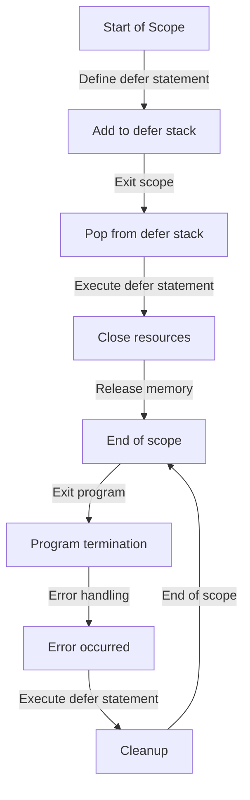

## Introduction
The `defer` statement in Swift is a powerful tool for managing cleanup code. It allows developers to execute a block of code when the current scope is exited, regardless of whether an error occurred or not. This makes it perfect for handling tasks such as releasing system resources, closing files, or removing temporary data. In this section, we will explore the importance of `defer` and its real-world applications.

> **Tip:** When working with system resources, it's essential to use `defer` to ensure that resources are released properly, even in the event of an error.

In production environments, `defer` is commonly used in scenarios where resources need to be released after use. For example, when working with files, `defer` can be used to close the file after reading or writing, regardless of whether an error occurred.

## Core Concepts
The `defer` statement is a fundamental concept in Swift that allows developers to execute a block of code when the current scope is exited. Here are some key concepts related to `defer`:

*   **Scope:** The scope of a `defer` statement is the block of code where it is defined. When the scope is exited, the `defer` block is executed.
*   **Execution Order:** `defer` statements are executed in reverse order of their definition. This means that the last `defer` statement defined in a scope will be executed first.
*   **Error Handling:** `defer` statements are executed regardless of whether an error occurred or not.

> **Note:** `defer` statements are not executed if the program terminates abruptly, such as in the case of a fatal error or a crash.

## How It Works Internally
When a `defer` statement is defined, it is added to a stack of deferred statements. When the scope is exited, the `defer` statements are popped off the stack and executed in reverse order.

Here is a step-by-step breakdown of how `defer` works internally:

1.  The `defer` statement is defined in a scope.
2.  The `defer` statement is added to a stack of deferred statements.
3.  When the scope is exited, the `defer` statements are popped off the stack.
4.  The `defer` statements are executed in reverse order of their definition.

> **Warning:** Be careful when using `defer` statements with loops, as this can lead to unexpected behavior.

## Code Examples
Here are some examples of using `defer` in Swift:

### Example 1: Basic Usage
```swift
func readFromFile() {
    // Open the file
    let file = fopen("example.txt", "r")
    defer {
        // Close the file when the scope is exited
        fclose(file)
    }
    
    // Read from the file
    let buffer = UnsafeMutablePointer<Int8>.allocate(capacity: 1024)
    defer {
        // Release the buffer when the scope is exited
        buffer.deallocate()
    }
    
    fread(buffer, 1, 1024, file)
    print(String(cString: buffer))
}
```

### Example 2: Error Handling
```swift
func writeToFile() {
    // Open the file
    let file = fopen("example.txt", "w")
    defer {
        // Close the file when the scope is exited
        fclose(file)
    }
    
    do {
        // Write to the file
        let data = "Hello, World!".data(using: .utf8)
        fwrite(data?.baseAddress, 1, data?.count ?? 0, file)
    } catch {
        print("Error writing to file: \(error)")
    }
}
```

### Example 3: Advanced Usage
```swift
func performTransaction() {
    // Start the transaction
    let transaction = Transaction()
    defer {
        // Commit or rollback the transaction when the scope is exited
        if transaction.isCommitted {
            transaction.commit()
        } else {
            transaction.rollback()
        }
    }
    
    // Perform the transaction
    transaction.perform()
}
```

## Visual Diagram


The diagram illustrates the flow of a `defer` statement, from definition to execution.

## Comparison
Here is a comparison of different approaches to managing cleanup code:

| Approach | Time Complexity | Space Complexity | Pros | Cons | Best For |
| --- | --- | --- | --- | --- | --- |
| `defer` | O(1) | O(1) | Easy to use, flexible | Can be slow for large scopes | General-purpose cleanup |
| `try`-`catch`-`finally` | O(1) | O(1) | Provides error handling | Verbose, error-prone | Error handling and cleanup |
| Manual cleanup | O(1) | O(1) | Fast, efficient | Error-prone, tedious | Performance-critical code |

> **Interview:** What is the main difference between `defer` and `try`-`catch`-`finally`?

## Real-world Use Cases
Here are some real-world examples of using `defer` in production environments:

*   **File I/O:** `defer` can be used to close files after reading or writing, ensuring that system resources are released properly.
*   **Database transactions:** `defer` can be used to commit or rollback database transactions, ensuring that data consistency is maintained.
*   **Network requests:** `defer` can be used to close network connections after sending or receiving data, ensuring that system resources are released properly.

## Common Pitfalls
Here are some common mistakes to avoid when using `defer`:

*   **Incorrect scope:** Using `defer` outside of a scope can lead to unexpected behavior.
*   **Nested `defer` statements:** Using nested `defer` statements can lead to unexpected behavior.
*   **Error handling:** Failing to handle errors properly can lead to unexpected behavior.

> **Warning:** Be careful when using `defer` statements with loops, as this can lead to unexpected behavior.

Here is an example of incorrect usage:
```swift
func readFromFile() {
    let file = fopen("example.txt", "r")
    // Incorrect usage: defer statement outside of scope
    defer {
        fclose(file)
    }
}
```

And here is the correct usage:
```swift
func readFromFile() {
    let file = fopen("example.txt", "r")
    defer {
        // Close the file when the scope is exited
        fclose(file)
    }
    // Read from the file
    let buffer = UnsafeMutablePointer<Int8>.allocate(capacity: 1024)
    defer {
        // Release the buffer when the scope is exited
        buffer.deallocate()
    }
    fread(buffer, 1, 1024, file)
    print(String(cString: buffer))
}
```

## Interview Tips
Here are some common interview questions related to `defer`:

*   **What is the main difference between `defer` and `try`-`catch`-`finally`?**
    *   Weak answer: "They are similar, but `defer` is faster."
    *   Strong answer: "The main difference is that `defer` is used for general-purpose cleanup, while `try`-`catch`-`finally` is used for error handling and cleanup. `defer` is more flexible and easier to use, but `try`-`catch`-`finally` provides more control over error handling."
*   **How do you use `defer` to manage cleanup code?**
    *   Weak answer: "You just use `defer` whenever you need to cleanup something."
    *   Strong answer: "You use `defer` to define a block of code that will be executed when the current scope is exited. This ensures that system resources are released properly, even in the event of an error. You should use `defer` to manage cleanup code for system resources, such as files, network connections, and database transactions."

## Key Takeaways
Here are the key takeaways from this section:

*   **Use `defer` for general-purpose cleanup:** `defer` is a flexible and easy-to-use statement for managing cleanup code.
*   **Use `try`-`catch`-`finally` for error handling and cleanup:** `try`-`catch`-`finally` provides more control over error handling and cleanup.
*   **Be careful with scope:** Make sure to use `defer` within the correct scope to avoid unexpected behavior.
*   **Avoid nested `defer` statements:** Nested `defer` statements can lead to unexpected behavior.
*   **Handle errors properly:** Failing to handle errors properly can lead to unexpected behavior.
*   **Use `defer` to manage system resources:** `defer` is essential for managing system resources, such as files, network connections, and database transactions.
*   **Use `defer` to ensure data consistency:** `defer` can be used to ensure data consistency by committing or rolling back database transactions.
*   **Use `defer` to improve performance:** `defer` can be used to improve performance by releasing system resources promptly.