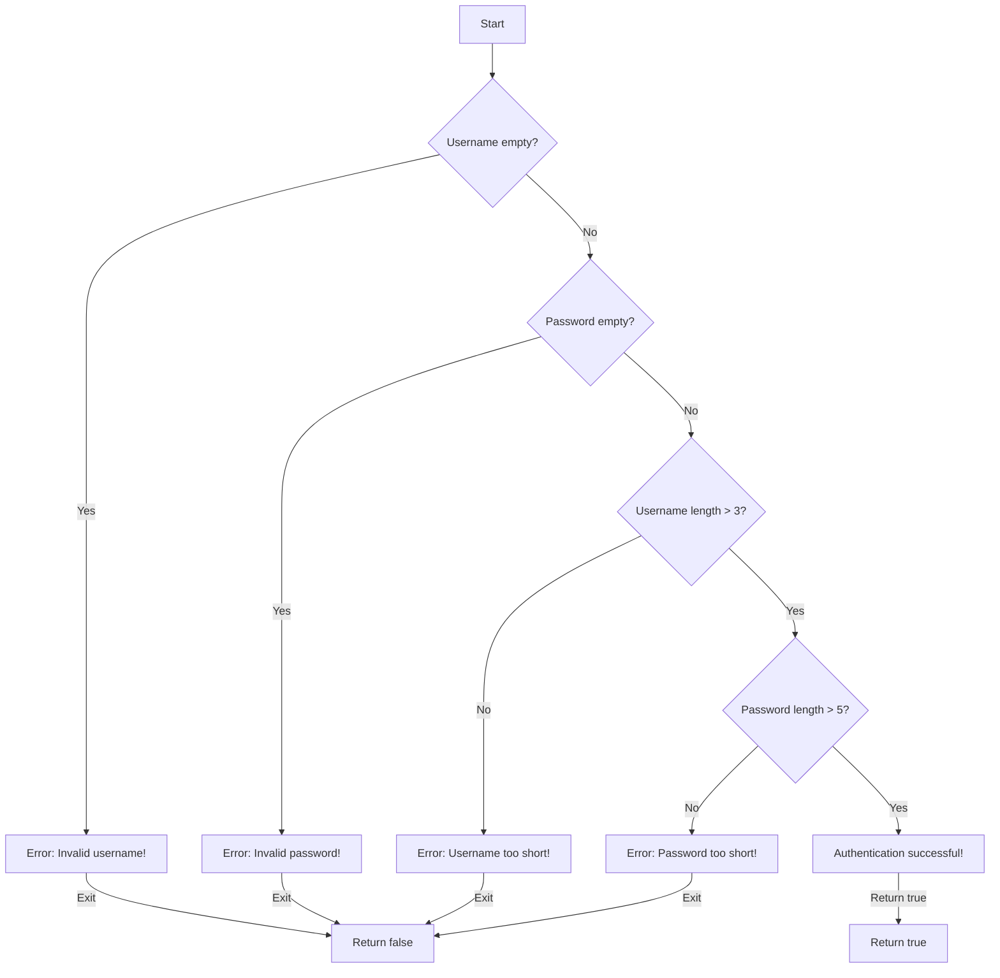

## Introduction
The **guard** statement, also known as the early exit pattern, is a fundamental concept in programming that allows developers to simplify their code and improve its readability. In essence, it's a conditional statement that checks for certain conditions at the beginning of a function or method, and if those conditions are not met, it immediately exits the function. This approach has numerous benefits, including reduced nesting, improved code clarity, and enhanced performance. In this article, we'll delve into the world of **guard** statements, exploring their core concepts, internal mechanics, and practical applications in Swift.

## Core Concepts
At its core, the **guard** statement is a conditional construct that enables early exit from a function or method. It's typically used to validate input parameters, check for errors, or ensure that certain conditions are met before proceeding with the execution of the code. The **guard** statement consists of three main components:
- A conditional expression that evaluates to a boolean value
- A `let` or `var` declaration that binds a value to a constant or variable
- An `else` clause that specifies the code to execute if the condition is not met

The **guard** statement is often used in conjunction with optional binding (`if let` or `if var`) to safely unwrap optional values and avoid runtime errors.

> **Note:** The **guard** statement is not unique to Swift and can be found in other programming languages, such as C#, Java, and Python, under different names or implementations.

## How It Works Internally
When a **guard** statement is executed, the following steps occur:
1. The conditional expression is evaluated, and if it's `true`, the code within the **guard** block is skipped.
2. If the condition is `false`, the code within the `else` clause is executed, and the function or method exits immediately.
3. If the **guard** statement includes a `let` or `var` declaration, the value is bound to a constant or variable, which can then be used within the function or method.

In terms of performance, the **guard** statement has a time complexity of O(1), as it only involves a single conditional evaluation. However, the space complexity depends on the specific implementation and the size of the input parameters.

## Code Examples
### Example 1: Basic **guard** Statement
```swift
func divide(_ a: Int, _ b: Int) -> Int? {
    guard b != 0 else {
        print("Error: Division by zero!")
        return nil
    }
    return a / b
}

print(divide(10, 2)) // Output: Optional(5)
print(divide(10, 0)) // Output: nil
```
In this example, the **guard** statement checks if the divisor (`b`) is zero, and if so, it immediately exits the function and returns `nil`.

### Example 2: **guard** Statement with Optional Binding
```swift
func greet(_ name: String?) -> String {
    guard let unwrappedName = name else {
        return "Hello, stranger!"
    }
    return "Hello, \(unwrappedName)!"
}

print(greet("John")) // Output: Hello, John!
print(greet(nil)) // Output: Hello, stranger!
```
In this example, the **guard** statement uses optional binding to safely unwrap the `name` parameter. If `name` is `nil`, the function returns a default greeting.

### Example 3: **guard** Statement with Multiple Conditions
```swift
func authenticate(_ username: String, _ password: String) -> Bool {
    guard !username.isEmpty, !password.isEmpty, username.count > 3, password.count > 5 else {
        print("Error: Invalid credentials!")
        return false
    }
    return true
}

print(authenticate("john", "secret")) // Output: true
print(authenticate("", "")) // Output: false
```
In this example, the **guard** statement checks multiple conditions, including the length of the username and password. If any of these conditions are not met, the function immediately exits and returns `false`.

## Visual Diagram

This diagram illustrates the flow of the **guard** statement with multiple conditions. Each condition is evaluated in sequence, and if any of them are not met, the function exits immediately.

## Comparison
| Approach | Time Complexity | Space Complexity | Pros | Cons | Best For |
|----------|----------------|-----------------|------|------|----------|
| **guard** statement | O(1) | O(1) | Simplifies code, reduces nesting | Limited to simple conditions | Simple validation, error handling |
| `if` statement | O(1) | O(1) | More flexible, allows for complex conditions | Can lead to deep nesting | Complex validation, decision-making |
| `switch` statement | O(1) | O(1) | Efficient for multiple cases | Limited to discrete values | Enumerated values, multiple cases |
| Optional binding | O(1) | O(1) | Safely unwraps optional values | Limited to optional values | Optional values, error handling |

> **Tip:** When choosing an approach, consider the complexity of the conditions and the readability of the code. The **guard** statement is ideal for simple validation and error handling, while `if` statements and `switch` statements are better suited for more complex conditions.

## Real-world Use Cases
1. **Validation**: The **guard** statement is commonly used in validation logic to ensure that input parameters meet certain criteria. For example, in a login system, a **guard** statement can check if the username and password are not empty and meet specific length requirements.
2. **Error handling**: The **guard** statement can be used to handle errors and exceptions in a concise and readable way. For example, in a network request, a **guard** statement can check if the response is successful and handle errors accordingly.
3. **Authentication**: The **guard** statement can be used in authentication logic to ensure that users are authenticated and authorized to access certain resources. For example, in a web application, a **guard** statement can check if the user is logged in and has the required permissions to access a certain page.

> **Interview:** When asked about the **guard** statement in an interview, be prepared to explain its benefits, such as simplifying code and reducing nesting, as well as its limitations, such as being limited to simple conditions.

## Common Pitfalls
1. **Deep nesting**: One common pitfall when using the **guard** statement is deep nesting, which can occur when multiple **guard** statements are nested within each other. To avoid this, consider using a single **guard** statement with multiple conditions.
2. **Complex conditions**: Another pitfall is using complex conditions within a **guard** statement, which can make the code harder to read and understand. To avoid this, consider breaking down complex conditions into simpler ones.
3. **Optional binding**: When using optional binding with the **guard** statement, be careful not to unwrap optional values multiple times, which can lead to runtime errors.
4. **Early exit**: Finally, be mindful of the early exit behavior of the **guard** statement, which can sometimes lead to unexpected behavior if not handled properly.

> **Warning:** When using the **guard** statement, be aware of the potential for deep nesting and complex conditions, which can make the code harder to read and understand.

## Interview Tips
1. **Explain the benefits**: When asked about the **guard** statement, be prepared to explain its benefits, such as simplifying code and reducing nesting.
2. **Provide examples**: Provide examples of how the **guard** statement can be used in real-world scenarios, such as validation and error handling.
3. **Discuss limitations**: Discuss the limitations of the **guard** statement, such as being limited to simple conditions, and how to overcome them.
4. **Show code**: Show code examples of how to use the **guard** statement effectively, including how to handle errors and exceptions.

> **Tip:** When answering interview questions about the **guard** statement, be prepared to provide concrete examples and code snippets to demonstrate your understanding of the concept.

## Key Takeaways
* The **guard** statement is a conditional construct that enables early exit from a function or method.
* It's commonly used in validation logic, error handling, and authentication.
* The **guard** statement has a time complexity of O(1) and a space complexity of O(1).
* It's ideal for simple validation and error handling, but can be limited by complex conditions.
* When using the **guard** statement, be mindful of deep nesting, complex conditions, and optional binding.
* The **guard** statement can be used in conjunction with optional binding to safely unwrap optional values.
* It's an essential concept in Swift programming, and understanding its benefits and limitations is crucial for writing effective and readable code.