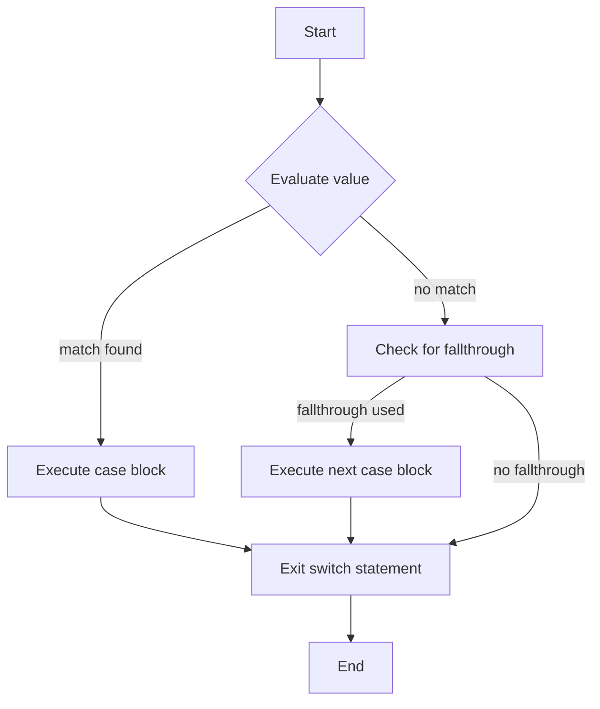

## Introduction
The **switch** statement in Swift is a powerful tool for pattern matching and controlling the flow of your program. It allows you to execute different blocks of code based on the value of a variable or expression. Unlike other languages, Swift's **switch** statement has no fallthrough by default, which means that once a matching case is found, the code will only execute the block associated with that case. In this section, we will explore the **switch** statement in Swift, its features, and how it can be used in real-world applications.

> **Note:** The **switch** statement in Swift is more powerful than its counterparts in other languages due to its ability to perform pattern matching and its lack of fallthrough.

## Core Concepts
The **switch** statement in Swift consists of several key components:
- **switch**: The keyword used to begin the **switch** statement.
- **value**: The value or expression that is being evaluated.
- **case**: A possible value that the **value** can take.
- **break**: Not required in Swift, as there is no fallthrough by default.
- **fallthrough**: A keyword that can be used to explicitly allow fallthrough between cases.

> **Tip:** When using the **switch** statement, it's essential to consider the order of your cases, as the first matching case will be executed.

## How It Works Internally
When the **switch** statement is executed, the following steps occur:
1. The **value** is evaluated.
2. The **switch** statement iterates over each **case** to find a match.
3. Once a match is found, the associated code block is executed.
4. If no **fallthrough** keyword is used, the **switch** statement exits after executing the matched case.
5. If the **fallthrough** keyword is used, the execution will continue to the next case.

> **Warning:** Be cautious when using the **fallthrough** keyword, as it can lead to unexpected behavior if not used carefully.

## Code Examples
### Example 1: Basic Usage
```swift
let day = 2
switch day {
case 1:
    print("Monday")
case 2:
    print("Tuesday")
default:
    print("Other day")
}
// Output: Tuesday
```
### Example 2: Pattern Matching
```swift
let point = (1, 2)
switch point {
case (0, 0):
    print("Origin")
case (let x, 0):
    print("On x-axis, x = \(x)")
case (0, let y):
    print("On y-axis, y = \(y)")
case (let x, let y):
    print("At (\(x), \(y))")
}
// Output: At (1, 2)
```
### Example 3: Advanced Usage with fallthrough
```swift
let number = 5
switch number {
case 1...5:
    print("Number is between 1 and 5")
    fallthrough
case 6...10:
    print("Number is between 1 and 10")
default:
    print("Number is greater than 10")
}
// Output:
// Number is between 1 and 5
// Number is between 1 and 10
```

## Visual Diagram

The diagram illustrates the flow of the **switch** statement, including the evaluation of the value, execution of the matched case, and the use of the **fallthrough** keyword.

## Comparison
| Approach | Time Complexity | Space Complexity | Pros | Cons | Best For |
|----------|----------------|-----------------|------|------|----------|
| **switch** | O(1) | O(1) | Efficient, easy to read | Limited to discrete values | Small, fixed sets of values |
| **if-else** | O(n) | O(1) | Flexible, can handle any condition | Verbose, error-prone | Complex, dynamic conditions |
| **dictionary lookup** | O(1) | O(n) | Fast, scalable | Memory-intensive | Large, dynamic sets of values |
| **enum-based switch** | O(1) | O(1) | Type-safe, efficient | Limited to enum values | Enum-based values |

## Real-world Use Cases
1. **Apple's iOS**: The **switch** statement is used extensively in iOS development to handle different UI events, such as button taps and gesture recognizers.
2. **SwiftUI**: SwiftUI uses the **switch** statement to handle different states and configurations of views.
3. **Game Development**: The **switch** statement can be used in game development to handle different game states, such as menu, gameplay, and pause screens.

## Common Pitfalls
1. **Forgetting to handle all possible cases**: Failing to include a **default** case can lead to unexpected behavior.
```swift
// Wrong
let day = 8
switch day {
case 1:
    print("Monday")
case 2:
    print("Tuesday")
}

// Right
let day = 8
switch day {
case 1:
    print("Monday")
case 2:
    print("Tuesday")
default:
    print("Other day")
}
```
2. **Using **fallthrough** incorrectly**: Using **fallthrough** without careful consideration can lead to unexpected behavior.
```swift
// Wrong
let number = 5
switch number {
case 1...5:
    print("Number is between 1 and 5")
    fallthrough
case 6...10:
    print("Number is between 6 and 10")
}

// Right
let number = 5
switch number {
case 1...5:
    print("Number is between 1 and 5")
    fallthrough
case 6...10:
    print("Number is between 1 and 10")
}
```

## Interview Tips
1. **What is the difference between **switch** and **if-else**?**: Be prepared to explain the advantages and disadvantages of each approach.
2. **How do you handle unexpected values in a **switch** statement?**: Discuss the importance of including a **default** case to handle unexpected values.
3. **Can you give an example of using **fallthrough** in a **switch** statement?**: Provide a concise example of using **fallthrough** correctly.

## Key Takeaways
* The **switch** statement in Swift is a powerful tool for pattern matching and controlling the flow of your program.
* Swift's **switch** statement has no fallthrough by default, which means that once a matching case is found, the code will only execute the block associated with that case.
* The **fallthrough** keyword can be used to explicitly allow fallthrough between cases.
* The **switch** statement can be used with various data types, including integers, strings, and enums.
* The **switch** statement can be used to handle different states and configurations of views in SwiftUI.
* The time complexity of the **switch** statement is O(1), making it an efficient approach for handling discrete values.
* The space complexity of the **switch** statement is O(1), making it a memory-efficient approach.