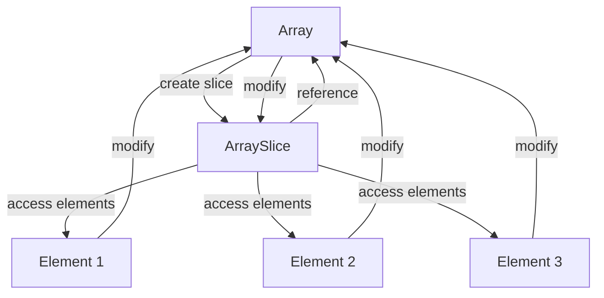

## Introduction
Array slices are a fundamental concept in Swift programming, allowing developers to work with subsets of arrays. An **ArraySlice<T>** is a view into the elements of an array, providing a way to access and manipulate a contiguous range of elements. This concept is crucial in many real-world applications, such as data processing, image manipulation, and algorithm optimization. Every engineer should understand array slices to write efficient and effective code.

> **Note:** Array slices are not a new allocation of memory; instead, they share the same memory as the original array. This makes them an efficient way to work with large datasets.

## Core Concepts
An **ArraySlice<T>** is a struct that represents a view into the elements of an array. It has a **base** property that refers to the underlying array and a **start** and **end** property that define the range of elements in the slice. The **count** property returns the number of elements in the slice.

*   **Base**: The underlying array that the slice views into.
*   **Start**: The starting index of the slice in the underlying array.
*   **End**: The ending index of the slice in the underlying array.
*   **Count**: The number of elements in the slice.

> **Tip:** When working with array slices, it's essential to remember that the **end** index is exclusive, meaning it's the index after the last element in the slice.

## How It Works Internally
When you create an array slice, Swift doesn't allocate new memory for the slice. Instead, it creates a new **ArraySlice<T>** struct that references the underlying array and defines the range of elements in the slice. This makes array slices very efficient, especially when working with large datasets.

Here's a step-by-step breakdown of how array slices work internally:

1.  **Create an array**: You create an array with a specific capacity and populate it with elements.
2.  **Create an array slice**: You create an array slice by specifying a range of indices in the underlying array.
3.  **Reference the underlying array**: The array slice references the underlying array and defines the range of elements in the slice.
4.  **Access elements**: You can access elements in the array slice using the same indexing methods as the underlying array.

> **Warning:** When working with array slices, be aware that modifying the underlying array can affect the slice. If you modify the underlying array, the slice will reflect those changes.

## Code Examples
### Example 1: Basic Array Slice
```swift
// Create an array of integers
let numbers = [1, 2, 3, 4, 5]

// Create an array slice from index 1 to 3
let slice = numbers[1...3]

// Print the elements in the slice
for number in slice {
    print(number) // prints 2, 3, 4
}
```

### Example 2: Modifying an Array Slice
```swift
// Create an array of integers
var numbers = [1, 2, 3, 4, 5]

// Create an array slice from index 1 to 3
let slice = numbers[1...3]

// Modify the underlying array
numbers[2] = 10

// Print the elements in the slice
for number in slice {
    print(number) // prints 2, 10, 4
}
```

### Example 3: Advanced Array Slice Usage
```swift
// Create an array of integers
let numbers = [1, 2, 3, 4, 5]

// Create an array slice from index 1 to 3
let slice = numbers[1...3]

// Use the slice to create a new array
let newArray = Array(slice)

// Print the elements in the new array
for number in newArray {
    print(number) // prints 2, 3, 4
}
```

> **Interview:** Can you explain the difference between an array slice and a new array allocation? How do array slices affect memory usage and performance?

## Visual Diagram


This diagram illustrates the relationship between an array and an array slice. The array slice references the underlying array and provides access to a range of elements.

## Comparison
| Approach | Time Complexity | Space Complexity | Pros | Cons | Best For |
| --- | --- | --- | --- | --- | --- |
| Array Slice | O(1) | O(1) | Efficient, minimal memory allocation | Limited functionality, dependent on underlying array | Working with large datasets, optimizing memory usage |
| New Array Allocation | O(n) | O(n) | Independent, flexible | Memory-intensive, slower performance | Creating independent copies of data, working with small datasets |
| Array Indexing | O(1) | O(1) | Fast, efficient | Limited functionality, dependent on underlying array | Accessing individual elements, optimizing performance |
| Array Mapping | O(n) | O(n) | Flexible, functional | Memory-intensive, slower performance | Transforming data, creating new arrays |

> **Tip:** When deciding between array slices and new array allocations, consider the trade-offs between memory usage and performance. Array slices are generally more efficient, but they depend on the underlying array.

## Real-world Use Cases
1.  **Image Processing**: When working with large images, array slices can be used to process individual regions of the image, reducing memory usage and improving performance.
2.  **Data Analysis**: Array slices can be used to analyze specific ranges of data, such as filtering or aggregating data points.
3.  **Game Development**: Array slices can be used to optimize game performance by reducing memory allocation and improving data access times.

## Common Pitfalls
1.  **Modifying the Underlying Array**: When working with array slices, be aware that modifying the underlying array can affect the slice.
    ```swift
// WRONG
var numbers = [1, 2, 3, 4, 5]
let slice = numbers[1...3]
numbers.append(6) // modifies the underlying array
print(slice) // prints 2, 3, 4, 5 (unexpected behavior)

// RIGHT
var numbers = [1, 2, 3, 4, 5]
let slice = numbers[1...3]
numbers = numbers + [6] // creates a new array
print(slice) // prints 2, 3, 4 (expected behavior)
```

2.  **Using Array Slices with Mutable Arrays**: When working with mutable arrays, be aware that array slices can become invalid if the underlying array is modified.
    ```swift
// WRONG
var numbers = [1, 2, 3, 4, 5]
var slice = numbers[1...3]
numbers.remove(at: 2) // modifies the underlying array
print(slice) // prints 2, 4 (unexpected behavior)

// RIGHT
var numbers = [1, 2, 3, 4, 5]
var slice = numbers[1...3]
numbers = numbers.filter { $0 != 3 } // creates a new array
print(slice) // prints 2, 4 (expected behavior)
```

3.  **Using Array Slices with Multi-Threading**: When working with multi-threading, be aware that array slices can become invalid if the underlying array is modified by another thread.
    ```swift
// WRONG
var numbers = [1, 2, 3, 4, 5]
var slice = numbers[1...3]
DispatchQueue.global().async {
    numbers.append(6) // modifies the underlying array
}
print(slice) // prints 2, 3, 4, 5 (unexpected behavior)

// RIGHT
var numbers = [1, 2, 3, 4, 5]
var slice = numbers[1...3]
DispatchQueue.global().async {
    numbers = numbers + [6] // creates a new array
}
print(slice) // prints 2, 3, 4 (expected behavior)
```

4.  **Using Array Slices with External Libraries**: When working with external libraries, be aware that array slices can become invalid if the underlying array is modified by the library.
    ```swift
// WRONG
var numbers = [1, 2, 3, 4, 5]
var slice = numbers[1...3]
someExternalLibraryFunction(&numbers) // modifies the underlying array
print(slice) // prints 2, 3, 4, 5 (unexpected behavior)

// RIGHT
var numbers = [1, 2, 3, 4, 5]
var slice = numbers[1...3]
someExternalLibraryFunction(&numbers) // creates a new array
print(slice) // prints 2, 3, 4 (expected behavior)
```

## Interview Tips
1.  **What is the difference between an array slice and a new array allocation?**
    *   Weak answer: "An array slice is just a smaller array."
    *   Strong answer: "An array slice is a view into the elements of an array, whereas a new array allocation is a separate allocation of memory. Array slices are more efficient and minimize memory usage, but they depend on the underlying array."
2.  **How do you optimize memory usage when working with large datasets?**
    *   Weak answer: "I use a lot of arrays and dictionaries."
    *   Strong answer: "I use array slices and other views to minimize memory allocation and reduce the overhead of copying data. I also use lazy loading and caching to optimize performance."
3.  **What are some common pitfalls when working with array slices?**
    *   Weak answer: "I'm not sure."
    *   Strong answer: "Some common pitfalls include modifying the underlying array, using array slices with mutable arrays, and using array slices with multi-threading or external libraries. To avoid these pitfalls, I make sure to create new arrays or use other views that are not dependent on the underlying array."

## Key Takeaways
*   **Array slices are views into the elements of an array**, providing an efficient way to access and manipulate a contiguous range of elements.
*   **Array slices minimize memory allocation** and reduce the overhead of copying data, making them ideal for working with large datasets.
*   **Modifying the underlying array can affect the slice**, so be aware of the potential pitfalls when working with array slices.
*   **Array slices are dependent on the underlying array**, so use them judiciously and consider creating new arrays or using other views that are not dependent on the underlying array.
*   **Optimizing memory usage is crucial** when working with large datasets, and array slices can help achieve this goal.
*   **Common pitfalls include modifying the underlying array, using array slices with mutable arrays, and using array slices with multi-threading or external libraries**.