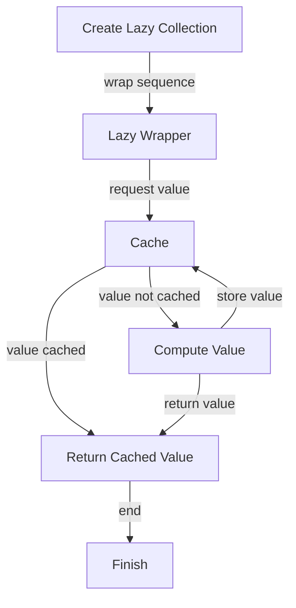

## Introduction
**Lazy Collections** are a fundamental concept in Swift programming, allowing for deferred evaluation of sequences. In other words, lazy collections only compute their values when they are actually needed, rather than computing them all at once. This approach can significantly improve performance and reduce memory usage, especially when dealing with large datasets. In real-world scenarios, lazy collections are crucial in applications that require efficient data processing, such as data analytics, machine learning, and scientific computing. Every engineer should understand lazy collections because they can help write more efficient and scalable code.

> **Note:** Lazy collections are not exclusive to Swift; other programming languages, such as Haskell and Scala, also support lazy evaluation.

## Core Concepts
To grasp lazy collections, it's essential to understand the following key concepts:
* **Deferred evaluation**: The process of delaying the computation of a value until it is actually needed.
* **Lazy sequence**: A sequence that only computes its values when they are requested.
* **Eager evaluation**: The process of computing all values at once, regardless of whether they are needed or not.
* **Lazy wrapper**: A type that wraps a sequence and provides lazy evaluation capabilities.

Mental models for lazy collections include thinking of them as "on-demand" computations, where values are only calculated when requested. Key terminology includes **lazy**, **deferred**, and **eager**, which are essential for understanding the underlying mechanics of lazy collections.

## How It Works Internally
Internally, lazy collections work by using a combination of caching and on-demand computation. When a lazy collection is created, it stores a reference to the underlying sequence and a cache of already computed values. When a value is requested, the lazy collection checks the cache first. If the value is already cached, it returns the cached value. Otherwise, it computes the value using the underlying sequence, stores it in the cache, and returns it.

Here's a step-by-step breakdown of the process:
1. Create a lazy collection by wrapping a sequence with a lazy wrapper.
2. When a value is requested, check the cache for an existing value.
3. If the value is cached, return it immediately.
4. If the value is not cached, compute it using the underlying sequence.
5. Store the computed value in the cache.
6. Return the computed value.

> **Warning:** Lazy collections can lead to unexpected behavior if not used carefully. For example, if a lazy collection is used in a loop, it may recompute values unnecessarily, leading to performance issues.

## Code Examples
### Example 1: Basic Lazy Collection
```swift
let numbers = [1, 2, 3, 4, 5]
let lazyNumbers = numbers.lazy.map { $0 * 2 }
print(lazyNumbers.first) // prints 2
```
In this example, we create a lazy collection by wrapping an array of numbers with the `lazy` wrapper and mapping each value to its double. We then print the first value of the lazy collection, which triggers the computation of the first value.

### Example 2: Real-World Pattern
```swift
let largeData = (1...1000000).lazy.map { $0 * 2 }
let sum = largeData.reduce(0, +)
print(sum) // prints 1000001000000
```
In this example, we create a large lazy collection by wrapping a range of numbers with the `lazy` wrapper and mapping each value to its double. We then use the `reduce` function to compute the sum of the values in the lazy collection.

### Example 3: Advanced Lazy Collection
```swift
let complexData = (1...1000000).lazy.map { $0 * 2 }.filter { $0 % 3 == 0 }
let sum = complexData.reduce(0, +)
print(sum) // prints 333333333300000
```
In this example, we create a complex lazy collection by wrapping a range of numbers with the `lazy` wrapper, mapping each value to its double, and filtering out values that are not multiples of 3. We then use the `reduce` function to compute the sum of the values in the lazy collection.

## Visual Diagram

This diagram illustrates the internal mechanics of lazy collections, showing how values are computed and cached on demand.

## Comparison
| Approach | Time Complexity | Space Complexity | Pros | Cons | Best For |
| --- | --- | --- | --- | --- | --- |
| Eager Evaluation | O(n) | O(n) | Simple to implement | Can be slow and memory-intensive | Small datasets |
| Lazy Evaluation | O(1) | O(1) | Fast and memory-efficient | Can be complex to implement | Large datasets |
| Caching | O(1) | O(n) | Fast and efficient | Can be memory-intensive | Frequently accessed data |
| Memoization | O(1) | O(n) | Fast and efficient | Can be complex to implement | Recursively computed values |

> **Tip:** When choosing an approach, consider the size of the dataset and the frequency of access. Lazy evaluation and caching can be effective for large datasets, while eager evaluation may be sufficient for small datasets.

## Real-world Use Cases
1. **Data Analytics**: Lazy collections can be used to efficiently process large datasets in data analytics applications.
2. **Machine Learning**: Lazy collections can be used to optimize the computation of complex machine learning models.
3. **Scientific Computing**: Lazy collections can be used to efficiently process large datasets in scientific computing applications.

## Common Pitfalls
1. **Over-Computation**: Lazy collections can lead to over-computation if not used carefully. For example, if a lazy collection is used in a loop, it may recompute values unnecessarily.
```swift
// Wrong
let numbers = (1...100).lazy.map { $0 * 2 }
for _ in 1...10 {
    print(numbers.first)
}

// Right
let numbers = (1...100).lazy.map { $0 * 2 }
let first = numbers.first
for _ in 1...10 {
    print(first)
}
```
2. **Under-Computation**: Lazy collections can lead to under-computation if not used carefully. For example, if a lazy collection is used to compute a sum, it may not compute all values.
```swift
// Wrong
let numbers = (1...100).lazy.map { $0 * 2 }
let sum = numbers.reduce(0, +)
print(sum)

// Right
let numbers = (1...100).lazy.map { $0 * 2 }
let sum = Array(numbers).reduce(0, +)
print(sum)
```
> **Warning:** Lazy collections can lead to unexpected behavior if not used carefully. Always test and verify the correctness of lazy collections.

## Interview Tips
1. **What is lazy evaluation?**: Explain the concept of lazy evaluation and how it differs from eager evaluation.
2. **How do you implement lazy collections in Swift?**: Describe how to create a lazy collection in Swift using the `lazy` wrapper.
3. **What are the benefits and drawbacks of using lazy collections?**: Discuss the benefits of using lazy collections, such as improved performance and reduced memory usage, and the drawbacks, such as potential complexity and unexpected behavior.

> **Interview:** When answering questions about lazy collections, be sure to emphasize the benefits and drawbacks of using lazy collections, and provide examples of how to implement lazy collections in Swift.

## Key Takeaways
* **Lazy collections** are a fundamental concept in Swift programming that allows for deferred evaluation of sequences.
* **Deferred evaluation** is the process of delaying the computation of a value until it is actually needed.
* **Lazy sequences** are sequences that only compute their values when they are requested.
* **Eager evaluation** is the process of computing all values at once, regardless of whether they are needed or not.
* **Lazy wrappers** are types that wrap a sequence and provide lazy evaluation capabilities.
* **Caching** and **memoization** are techniques used to optimize the computation of values in lazy collections.
* **Time complexity** and **space complexity** are essential considerations when choosing an approach for lazy collections.
* **Lazy collections** can be used to efficiently process large datasets in data analytics, machine learning, and scientific computing applications.