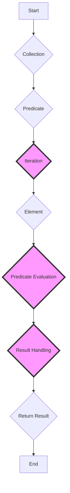

## Introduction
The `first(where:)`, `contains(where:)`, and `allSatisfy` methods are essential components of the Swift Standard Library, providing a set of powerful tools for working with collections. These methods enable developers to efficiently search, filter, and validate data in arrays, sets, and other collection types. In this section, we will delve into the world of Swift collections, exploring the importance of these methods and their real-world applications.

> **Note:** Understanding the `first(where:)`, `contains(where:)`, and `allSatisfy` methods is crucial for any Swift developer, as they are frequently used in everyday programming tasks.

## Core Concepts
To grasp the concepts of `first(where:)`, `contains(where:)`, and `allSatisfy`, it is essential to understand the following key terms:

* **Closure**: A self-contained block of code that can be passed around like any other object.
* **Predicate**: A closure that takes an element as an argument and returns a boolean value indicating whether the element matches a specific condition.
* **Collection**: A type that represents a group of elements, such as an array or set.

> **Warning:** When using closures as predicates, be aware of the potential for retain cycles and performance issues if not implemented correctly.

## How It Works Internally
Let's take a step-by-step look at how the `first(where:)`, `contains(where:)`, and `allSatisfy` methods work internally:

1. **Iteration**: The method iterates over the elements of the collection using a for-each loop or an iterator.
2. **Predicate Evaluation**: For each element, the method evaluates the predicate closure, passing the element as an argument.
3. **Result Handling**: Based on the result of the predicate evaluation, the method determines the outcome:
	* `first(where:)`: Returns the first element that matches the predicate or `nil` if no element matches.
	* `contains(where:)`: Returns `true` if at least one element matches the predicate, `false` otherwise.
	* `allSatisfy`: Returns `true` if all elements match the predicate, `false` otherwise.

> **Tip:** When using `first(where:)`, consider using `firstIndex(where:)` instead if you need to access the index of the matching element.

## Code Examples
Here are three complete and runnable code examples demonstrating the usage of `first(where:)`, `contains(where:)`, and `allSatisfy`:

### Example 1: Basic Usage
```swift
let numbers = [1, 2, 3, 4, 5]
if let firstEven = numbers.first(where: { $0 % 2 == 0 }) {
    print("First even number: \(firstEven)")
}
```

### Example 2: Real-World Pattern
```swift
struct Person {
    let name: String
    let age: Int
}

let people = [
    Person(name: "John", age: 30),
    Person(name: "Jane", age: 25),
    Person(name: "Bob", age: 40)
]

if people.contains(where: { $0.age > 30 }) {
    print("At least one person is older than 30")
}

if people.allSatisfy({ $0.age >= 18 }) {
    print("All people are adults")
}
```

### Example 3: Advanced Usage
```swift
let matrix = [
    [1, 2, 3],
    [4, 5, 6],
    [7, 8, 9]
]

if matrix.allSatisfy({ row in row.allSatisfy({ $0 < 10 }) }) {
    print("All numbers in the matrix are less than 10")
}
```

## Visual Diagram

The diagram illustrates the internal workflow of the `first(where:)`, `contains(where:)`, and `allSatisfy` methods.

> **Note:** The time complexity of these methods is O(n), where n is the number of elements in the collection, since they potentially iterate over the entire collection.

## Comparison
The following table compares the `first(where:)`, `contains(where:)`, and `allSatisfy` methods:

| Method | Time Complexity | Space Complexity | Pros | Cons |
| --- | --- | --- | --- | --- |
| `first(where:)` | O(n) | O(1) | Returns the first matching element | May not find all matches |
| `contains(where:)` | O(n) | O(1) | Returns a boolean indicating the presence of a match | Does not return the matching element |
| `allSatisfy` | O(n) | O(1) | Returns a boolean indicating whether all elements match | May be slower than `contains(where:)` for large collections |

## Real-world Use Cases
Here are three real-world examples of using `first(where:)`, `contains(where:)`, and `allSatisfy` in production code:

* **Apple Music**: When searching for a specific song in a playlist, `first(where:)` can be used to find the first matching song.
* **Facebook**: When validating user input, `allSatisfy` can be used to ensure that all input fields meet the required criteria.
* **Amazon**: When processing orders, `contains(where:)` can be used to check if a specific product is in the order.

> **Interview:** Be prepared to answer questions about the time and space complexity of these methods, as well as how to use them in real-world scenarios.

## Common Pitfalls
Here are four common mistakes to avoid when using `first(where:)`, `contains(where:)`, and `allSatisfy`:

* **Incorrect predicate**: Using a predicate that does not correctly filter the elements can lead to incorrect results.
* **Performance issues**: Using these methods with large collections can lead to performance issues if not optimized correctly.
* **Nil safety**: Not handling nil values correctly can lead to runtime errors.
* **Closure capture**: Not being aware of closure capture can lead to retain cycles and memory leaks.

## Interview Tips
Here are three common interview questions related to `first(where:)`, `contains(where:)`, and `allSatisfy`:

* **What is the time complexity of `first(where:)`?** A strong answer would be O(n), where n is the number of elements in the collection.
* **How would you use `allSatisfy` to validate a collection of objects?** A strong answer would demonstrate how to use `allSatisfy` with a predicate to validate the objects.
* **What is the difference between `contains(where:)` and `first(where:)`?** A strong answer would explain the difference in return types and use cases.

## Key Takeaways
Here are ten key takeaways to remember:

* `first(where:)` returns the first matching element or nil.
* `contains(where:)` returns a boolean indicating the presence of a match.
* `allSatisfy` returns a boolean indicating whether all elements match.
* The time complexity of these methods is O(n).
* The space complexity of these methods is O(1).
* Use `first(where:)` when you need to find the first matching element.
* Use `contains(where:)` when you need to check if a match exists.
* Use `allSatisfy` when you need to validate all elements.
* Be aware of potential performance issues with large collections.
* Always handle nil values correctly to avoid runtime errors.