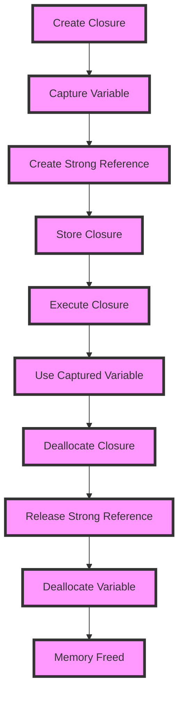

## Introduction
**Capturing values in closures** is a fundamental concept in Swift programming that allows you to create self-contained blocks of code that can capture and use variables from their surrounding scope. This concept is crucial in various scenarios, such as handling asynchronous operations, implementing event-driven programming, and creating reusable code. In real-world applications, capturing values in closures is commonly used in frameworks like UIKit, where you need to handle user interactions and update the UI accordingly. Every engineer should understand this concept to write efficient, readable, and maintainable code.

## Core Concepts
To grasp capturing values in closures, you need to understand the following key concepts:
- **Closures**: A closure is a self-contained block of code that can capture variables from its surrounding scope.
- **Capture lists**: A capture list is used to specify which variables from the surrounding scope should be captured by the closure.
- **Closure types**: There are three types of closures: **non-escaping**, **escaping**, and **autoclosure**.
- **Memory management**: Closures can create strong references to captured variables, which can lead to memory leaks if not managed properly.

> **Note:** Understanding the difference between **value capture** and **reference capture** is essential. Value capture creates a copy of the variable, while reference capture creates a reference to the original variable.

## How It Works Internally
When a closure captures a variable, Swift creates a strong reference to the variable. This means that the variable will not be deallocated until the closure is deallocated. To avoid memory leaks, you can use a **weak** or **unowned** reference to the variable.

Here's a step-by-step breakdown of how capturing values in closures works:
1. The closure is created and captures the variable from the surrounding scope.
2. The closure creates a strong reference to the variable.
3. The closure is stored in a variable or passed to a function.
4. The closure is executed, and it uses the captured variable.
5. The closure is deallocated, and the strong reference to the variable is released.

> **Warning:** If you capture a variable with a strong reference, it can create a retain cycle, leading to a memory leak.

## Code Examples
### Example 1: Basic Capture
```swift
var counter = 0
let incrementCounter = { () -> Void in
    counter += 1
    print(counter)
}
incrementCounter() // prints 1
incrementCounter() // prints 2
```
In this example, the closure `incrementCounter` captures the `counter` variable and increments it each time it's called.

### Example 2: Using Capture Lists
```swift
var name = "John"
let greet = { [name] in
    print("Hello, \(name)!")
}
greet() // prints "Hello, John!"
name = "Jane"
let greetAgain = { [name] in
    print("Hello, \(name)!")
}
greetAgain() // prints "Hello, Jane!"
```
In this example, the closure `greet` captures the `name` variable using a capture list. The `greetAgain` closure captures the updated `name` variable.

### Example 3: Using Weak References
```swift
class Person {
    let name: String
    init(name: String) {
        self.name = name
    }
    deinit {
        print("\(name) has been deallocated")
    }
}
var person: Person? = Person(name: "John")
let greetPerson = { [weak person] in
    print("Hello, \(person?.name ?? "unknown")!")
}
greetPerson() // prints "Hello, John!"
person = nil
greetPerson() // prints "Hello, unknown!"
```
In this example, the closure `greetPerson` captures the `person` variable using a weak reference. When the `person` variable is set to `nil`, the closure no longer holds a strong reference to the `Person` object, and it's deallocated.

## Visual Diagram

This diagram illustrates the steps involved in capturing values in closures, from creating the closure to deallocating the variable.

> **Tip:** Use the `weak` or `unowned` keyword to create a weak reference to the captured variable, especially when working with objects that have a strong reference cycle.

## Comparison
| Approach | Time Complexity | Space Complexity | Pros | Cons | Best For |
| --- | --- | --- | --- | --- | --- |
| Value Capture | O(1) | O(1) | Simple, efficient | Creates a copy of the variable | Small, immutable variables |
| Reference Capture | O(1) | O(1) | Efficient, flexible | Can create strong references | Large, mutable variables |
| Weak Reference | O(1) | O(1) | Avoids strong references | Can be nil | Objects with strong reference cycles |
| Unowned Reference | O(1) | O(1) | Avoids strong references | Can crash if nil | Objects with strong reference cycles, but guaranteed to be non-nil |

## Real-world Use Cases
1. **UIKit**: Capturing values in closures is commonly used in UIKit to handle user interactions, such as button taps and gesture recognizers.
2. **Networking**: Capturing values in closures is used in networking frameworks like Alamofire to handle asynchronous requests and responses.
3. **Core Data**: Capturing values in closures is used in Core Data to handle asynchronous fetch requests and updates.

> **Interview:** Can you explain the difference between value capture and reference capture in closures?

## Common Pitfalls
1. **Strong Reference Cycles**: Creating strong references to captured variables can lead to memory leaks.
2. **Nil Values**: Using weak or unowned references can result in nil values if not handled properly.
3. **Capture Lists**: Forgetting to use capture lists can lead to unexpected behavior.
4. **Escaping Closures**: Failing to mark closures as escaping can lead to memory leaks.

> **Warning:** Always use capture lists and weak or unowned references to avoid strong reference cycles.

## Interview Tips
1. **What is a closure?**: A closure is a self-contained block of code that can capture variables from its surrounding scope.
2. **What is the difference between value capture and reference capture?**: Value capture creates a copy of the variable, while reference capture creates a reference to the original variable.
3. **How do you avoid strong reference cycles in closures?**: Use weak or unowned references to captured variables.

> **Tip:** Always use capture lists and weak or unowned references to avoid strong reference cycles.

## Key Takeaways
* Capturing values in closures allows you to create self-contained blocks of code that can capture and use variables from their surrounding scope.
* Use capture lists to specify which variables to capture.
* Use weak or unowned references to avoid strong reference cycles.
* Value capture creates a copy of the variable, while reference capture creates a reference to the original variable.
* Escaping closures can lead to memory leaks if not marked as escaping.
* Always use capture lists and weak or unowned references to avoid strong reference cycles.
* Use the `weak` or `unowned` keyword to create a weak reference to the captured variable.
* Avoid using strong references to captured variables to prevent memory leaks.