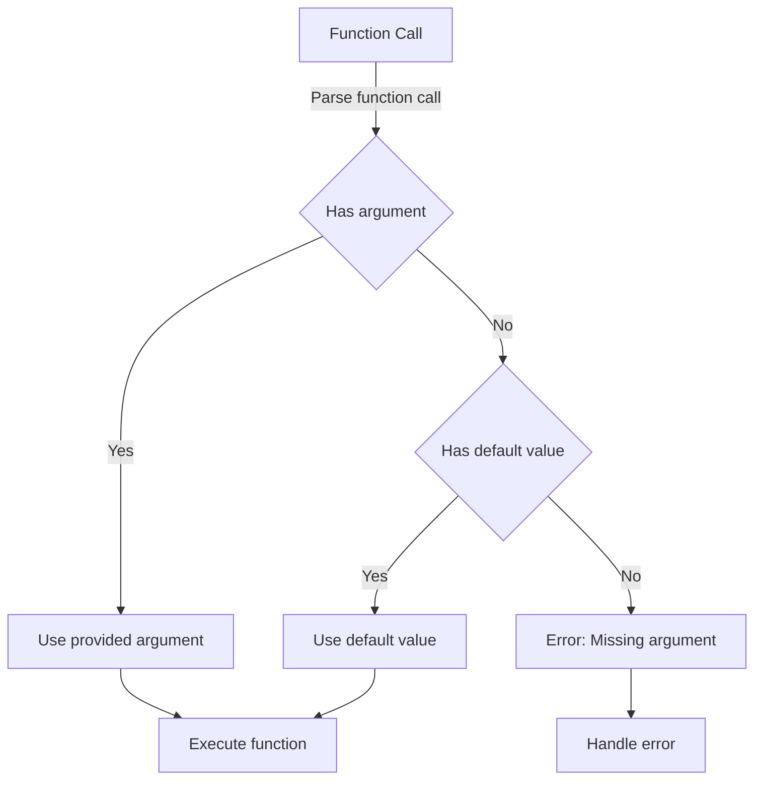

## Introduction
**Default parameter values** are a fundamental concept in Swift programming, allowing developers to specify default values for function parameters. This feature enhances code readability, reduces boilerplate code, and improves overall maintainability. In real-world applications, default parameter values are commonly used in APIs, frameworks, and libraries to provide a more flexible and user-friendly interface. For instance, when designing a networking library, you might want to provide default values for parameters such as timeout intervals, caching policies, or authentication tokens.

> **Note:** Default parameter values are not unique to Swift; many programming languages, including Python, Java, and C++, support similar features.

## Core Concepts
To understand default parameter values, it's essential to grasp the following key concepts:

* **Parameter**: A variable that is passed to a function or method.
* **Default value**: A value assigned to a parameter if no value is provided when calling the function.
* **Optional parameter**: A parameter that can be omitted when calling a function, in which case the default value is used.

Mental models for default parameter values include thinking of them as "fallback" values or "sensible defaults" that simplify function calls and reduce the likelihood of errors.

## How It Works Internally
When a function with default parameter values is called, the Swift compiler performs the following steps:

1. **Parse the function call**: The compiler analyzes the function call, identifying the provided arguments and their corresponding parameters.
2. **Check for default values**: For each parameter, the compiler checks if a default value is specified. If a default value is present and no argument is provided, the compiler uses the default value.
3. **Evaluate the function**: The function is executed with the provided arguments and default values.

The under-the-hood mechanics of default parameter values involve the Swift compiler generating additional code to handle the default values. This code is typically optimized to minimize performance overhead.

## Code Examples
Here are three complete, runnable examples demonstrating the use of default parameter values in Swift:

### Example 1: Basic Usage
```swift
func greet(name: String, message: String = "Hello") {
    print("\(message), \(name)!")
}

greet(name: "John") // Output: Hello, John!
greet(name: "Jane", message: "Hi") // Output: Hi, Jane!
```

### Example 2: Real-World Pattern
```swift
struct NetworkingRequest {
    let url: String
    let timeout: TimeInterval = 30 // Default timeout: 30 seconds
    let cachePolicy: URLRequest.CachePolicy = .useProtocolCachePolicy // Default cache policy

    func execute() {
        // Execute the networking request with the specified parameters
        print("Executing request to \(url) with timeout \(timeout) and cache policy \(cachePolicy)")
    }
}

let request = NetworkingRequest(url: "https://example.com/api/data")
request.execute() // Output: Executing request to https://example.com/api/data with timeout 30.0 and cache policy useProtocolCachePolicy
```

### Example 3: Advanced Usage
```swift
func calculateArea(length: Double, width: Double? = nil) -> Double? {
    guard let width = width else { return nil }
    return length * width
}

print(calculateArea(length: 10, width: 5)) // Output: Optional(50.0)
print(calculateArea(length: 10)) // Output: nil
```

## Visual Diagram

The diagram illustrates the process of handling default parameter values in Swift, including parsing the function call, checking for provided arguments, and using default values when necessary.

## Comparison
| Approach | Time Complexity | Space Complexity | Pros | Cons | Best For |
| --- | --- | --- | --- | --- | --- |
| Default Parameter Values | O(1) | O(1) | Simplifies code, reduces errors | Limited flexibility | APIs, frameworks, and libraries |
| Optional Parameters | O(1) | O(1) | Provides flexibility, allows for nil values | More verbose code | Complex logic, error handling |
| Function Overloading | O(1) | O(1) | Allows for multiple function signatures | Increases code complexity | Performance-critical code, optimized functions |
| Closure Properties | O(1) | O(1) | Enables dynamic behavior, flexible configuration | Steeper learning curve | Advanced use cases, dynamic programming |

## Real-world Use Cases
1. **Apple's Foundation Framework**: The `URLRequest` class uses default parameter values to provide a flexible and user-friendly interface for creating networking requests.
2. **SwiftUI**: The `View` protocol uses default parameter values to simplify the creation of user interfaces and provide a more intuitive API.
3. **RxSwift**: The `Observable` class uses default parameter values to provide a flexible and customizable way to handle asynchronous data streams.

## Common Pitfalls
1. **Overusing default values**: Using default values excessively can lead to confusing code and unexpected behavior. 
    ```swift
// Wrong
func calculateArea(length: Double, width: Double = 0) -> Double {
    return length * width
}

// Right
func calculateArea(length: Double, width: Double) -> Double {
    return length * width
}
```
2. **Ignoring nil values**: Failing to handle nil values can result in runtime errors and crashes.
    ```swift
// Wrong
func calculateArea(length: Double, width: Double?) -> Double {
    return length * width!
}

// Right
func calculateArea(length: Double, width: Double?) -> Double? {
    guard let width = width else { return nil }
    return length * width
}
```
3. **Using default values for optional parameters**: Using default values for optional parameters can lead to unexpected behavior and errors.
    ```swift
// Wrong
func calculateArea(length: Double, width: Double? = nil) -> Double {
    return length * width!
}

// Right
func calculateArea(length: Double, width: Double) -> Double {
    return length * width
}
```
4. **Not documenting default values**: Failing to document default values can make it difficult for other developers to understand the code and use it correctly.
    ```swift
// Wrong
func calculateArea(length: Double, width: Double = 0) -> Double {
    return length * width
}

// Right
/// Calculates the area of a rectangle.
///
/// - Parameters:
///   - length: The length of the rectangle.
///   - width: The width of the rectangle (default: 0).
/// - Returns: The area of the rectangle.
func calculateArea(length: Double, width: Double = 0) -> Double {
    return length * width
}
```

## Interview Tips
1. **What are default parameter values, and how do they work?**: Be prepared to explain the concept of default parameter values, how they are used in Swift, and provide examples.
2. **How do you handle optional parameters with default values?**: Discuss the importance of handling nil values and provide examples of how to do it correctly.
3. **What are some common pitfalls when using default parameter values?**: Be prepared to discuss common mistakes, such as overusing default values, ignoring nil values, and not documenting default values.

## Key Takeaways
* Default parameter values simplify code and reduce errors.
* Optional parameters provide flexibility, but require careful handling of nil values.
* Function overloading allows for multiple function signatures, but increases code complexity.
* Closure properties enable dynamic behavior, but have a steeper learning curve.
* Default parameter values have a time complexity of O(1) and a space complexity of O(1).
* Apple's Foundation Framework, SwiftUI, and RxSwift use default parameter values extensively.
* Common pitfalls include overusing default values, ignoring nil values, using default values for optional parameters, and not documenting default values.