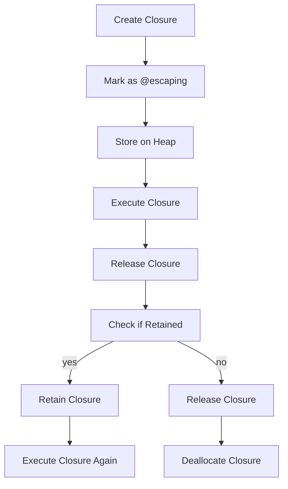

## Introduction
In **Swift**, closures are a powerful tool for encapsulating functionality and passing it around like any other value. However, when working with closures, it's essential to understand the concept of **escaping closures**, denoted by the `@escaping` keyword. In this section, we'll delve into the world of escaping closures, exploring what they are, why they matter, and their real-world relevance.

Escaping closures are crucial in scenarios where a closure needs to outlive the scope in which it was created. This is particularly common in asynchronous programming, where a closure might be executed after the surrounding function has returned. Without the `@escaping` keyword, the compiler would assume the closure is non-escaping, leading to potential memory leaks or runtime errors.

> **Note:** Escaping closures are not unique to Swift; similar concepts exist in other programming languages, such as JavaScript's callbacks or Python's lambda functions.

## Core Concepts
To grasp escaping closures, let's define some key terms:

* **Closure**: A self-contained block of code that can be passed around like any other value.
* **Escaping closure**: A closure that outlives the scope in which it was created.
* **Non-escaping closure**: A closure that does not outlive the scope in which it was created.
* **@escaping**: A keyword used to denote an escaping closure.

A simple mental model to understand escaping closures is to think of a closure as a balloon. When a closure is created, it's like inflating the balloon. If the balloon (closure) is not tied to anything, it will float away and disappear (i.e., the closure will be deallocated). However, if the balloon is tied to a string (i.e., the closure is marked as `@escaping`), it will remain attached and can be retrieved later.

## How It Works Internally
When a closure is marked as `@escaping`, the compiler generates additional code to ensure the closure is properly stored and retrieved. Here's a step-by-step breakdown:

1. The closure is created and stored on the stack.
2. When the surrounding function returns, the closure is copied to the heap, allowing it to outlive the original scope.
3. The `@escaping` keyword instructs the compiler to generate code that properly retains and releases the closure, preventing memory leaks.

> **Warning:** Failing to use `@escaping` when necessary can lead to runtime errors or crashes, as the closure may be deallocated prematurely.

## Code Examples
Let's explore three complete, runnable examples to illustrate the concept of escaping closures:

### Example 1: Basic Escaping Closure
```swift
func delayedPrint(_ message: String, afterDelay delay: TimeInterval) {
    // Create an escaping closure to print the message after a delay
    DispatchQueue.main.asyncAfter(deadline: .now() + delay) {
        print(message)
    }
}

delayedPrint("Hello, world!", afterDelay: 2.0)
```
In this example, the closure passed to `DispatchQueue.main.asyncAfter` is an escaping closure, as it outlives the `delayedPrint` function.

### Example 2: Real-World Pattern
```swift
class NetworkManager {
    func fetchUserData(completion: @escaping (UserData) -> Void) {
        // Simulate a network request
        DispatchQueue.main.asyncAfter(deadline: .now() + 1.0) {
            let userData = UserData(name: "John Doe", email: "johndoe@example.com")
            completion(userData)
        }
    }
}

struct UserData {
    let name: String
    let email: String
}

let networkManager = NetworkManager()
networkManager.fetchUserData { userData in
    print("User data: \(userData.name), \(userData.email)")
}
```
In this example, the `fetchUserData` method takes an escaping closure as a parameter, which is executed after the network request completes.

### Example 3: Advanced Usage
```swift
func retry(_ operation: @escaping () -> Void, maxAttempts: Int, delay: TimeInterval) {
    var attempts = 0
    func attempt() {
        operation()
        attempts += 1
        if attempts < maxAttempts {
            DispatchQueue.main.asyncAfter(deadline: .now() + delay) {
                attempt()
            }
        }
    }
    attempt()
}

retry {
    print("Attempting to connect to server...")
}, maxAttempts: 3, delay: 1.0
```
In this example, the `retry` function takes an escaping closure as a parameter, which is executed repeatedly until the maximum number of attempts is reached.

## Visual Diagram

This diagram illustrates the lifecycle of an escaping closure, from creation to deallocation.

> **Tip:** When working with escaping closures, it's essential to ensure proper memory management to prevent leaks or crashes.

## Comparison
| Approach | Time Complexity | Space Complexity | Pros | Cons | Best For |
| --- | --- | --- | --- | --- | --- |
| Non-Escaping Closure | O(1) | O(1) | Simple, efficient | Limited scope | Small, self-contained operations |
| Escaping Closure | O(n) | O(n) | Flexible, reusable | Complex, error-prone | Asynchronous programming, network requests |
| Delegate Pattern | O(1) | O(1) | Simple, easy to implement | Limited flexibility | Small, self-contained operations |
| Notification Center | O(n) | O(n) | Flexible, reusable | Complex, error-prone | Asynchronous programming, event-driven systems |

## Real-world Use Cases
1. **Apple's URLSession**: Uses escaping closures to handle network requests and responses.
2. **Facebook's SDK**: Employs escaping closures to handle asynchronous API requests and callbacks.
3. **Stripe's Payment Gateway**: Utilizes escaping closures to handle payment processing and callbacks.

## Common Pitfalls
1. **Failing to use @escaping**: Can lead to runtime errors or crashes.
2. **Incorrectly using @escaping**: Can cause memory leaks or unexpected behavior.
3. **Not properly releasing closures**: Can lead to memory leaks or crashes.
4. **Using non-escaping closures in asynchronous contexts**: Can cause runtime errors or crashes.

> **Interview:** Be prepared to explain the differences between escaping and non-escaping closures, as well as common use cases and pitfalls.

## Interview Tips
1. **What is an escaping closure?**: Explain the concept of an escaping closure and provide examples.
2. **How does @escaping work?**: Describe the internal mechanics of the `@escaping` keyword and its impact on memory management.
3. **When to use @escaping?**: Discuss common scenarios where escaping closures are necessary, such as asynchronous programming and network requests.

## Key Takeaways
* Escaping closures are crucial in asynchronous programming and network requests.
* The `@escaping` keyword ensures proper memory management and prevents runtime errors.
* Non-escaping closures are suitable for small, self-contained operations.
* Delegate patterns and notification centers are alternative approaches to handling asynchronous events.
* Properly releasing closures is essential to prevent memory leaks or crashes.
* Understanding the internal mechanics of `@escaping` is vital for effective use.
* Escaping closures have a time complexity of O(n) and space complexity of O(n).
* Non-escaping closures have a time complexity of O(1) and space complexity of O(1).