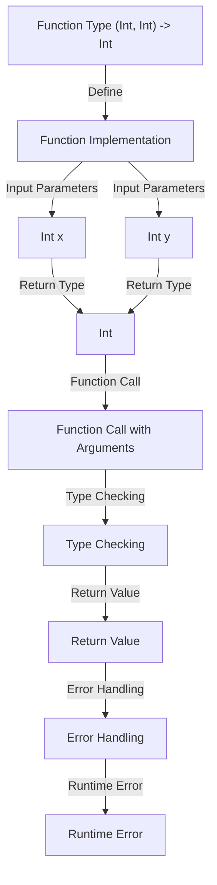

## Introduction
Function types are a fundamental concept in programming, particularly in functional programming languages like Swift. A function type, denoted as `(Int, Int) -> Int`, represents a function that takes two integer arguments and returns an integer value. This concept is crucial in understanding how functions are defined, composed, and used in programming. In real-world scenarios, function types are used extensively in data processing, algorithm implementation, and software development. For instance, a simple calculator app might use a function type like `(Int, Int) -> Int` to perform arithmetic operations.

> **Note:** Function types are not unique to Swift; they are a fundamental concept in programming languages, including Haskell, Scala, and JavaScript.

## Core Concepts
A function type is defined by its input parameters, return type, and the relationship between them. In the case of `(Int, Int) -> Int`, we have two input parameters of type `Int` and a return type of `Int`. The function type is a contract that specifies the expected input and output of a function.

* **Input Parameters:** The input parameters are the values passed to a function when it is called. In this case, we have two `Int` parameters.
* **Return Type:** The return type is the value returned by a function when it is called. In this case, the return type is `Int`.
* **Function Signature:** The function signature is the combination of the input parameters and the return type. It is a unique identifier for a function.

> **Tip:** When working with function types, it is essential to understand the concept of **currying**, which allows us to transform a function with multiple arguments into a sequence of functions, each taking a single argument.

## How It Works Internally
When a function is defined with a specific type, the compiler checks the function's implementation to ensure it matches the declared type. If the types do not match, the compiler will report an error.

1. **Type Checking:** The compiler checks the function's input parameters and return type to ensure they match the declared type.
2. **Function Call:** When a function is called, the compiler checks the types of the arguments passed to the function to ensure they match the function's input parameters.
3. **Return Value:** The function returns a value, which is checked by the compiler to ensure it matches the declared return type.

> **Warning:** If the function's implementation does not match the declared type, the compiler will report an error, which can lead to runtime errors if not addressed.

## Code Examples
### Example 1: Basic Usage
```swift
// Define a function with type (Int, Int) -> Int
func add(x: Int, y: Int) -> Int {
    return x + y
}

// Call the function with two Int arguments
let result = add(x: 2, y: 3)
print(result) // Output: 5
```

### Example 2: Real-World Pattern
```swift
// Define a function to calculate the area of a rectangle
func calculateArea(width: Int, height: Int) -> Int {
    return width * height
}

// Define a function to calculate the perimeter of a rectangle
func calculatePerimeter(width: Int, height: Int) -> Int {
    return 2 * (width + height)
}

// Call the functions with two Int arguments
let area = calculateArea(width: 4, height: 5)
let perimeter = calculatePerimeter(width: 4, height: 5)
print("Area: \(area), Perimeter: \(perimeter)")
```

### Example 3: Advanced Usage
```swift
// Define a function to calculate the sum of an array of integers
func calculateSum(array: [Int]) -> Int {
    return array.reduce(0, +)
}

// Define a function to calculate the product of an array of integers
func calculateProduct(array: [Int]) -> Int {
    return array.reduce(1, *)
}

// Call the functions with an array of integers
let array = [1, 2, 3, 4, 5]
let sum = calculateSum(array: array)
let product = calculateProduct(array: array)
print("Sum: \(sum), Product: \(product)")
```

## Visual Diagram

The diagram illustrates the process of defining a function type, implementing the function, and calling the function with arguments. It also shows the type checking and error handling mechanisms in place.

## Comparison
| Approach | Time Complexity | Space Complexity | Pros | Cons | Best For |
|----------|----------------|-----------------|------|------|----------|
| Recursive | O(n) | O(n) | Easy to implement, intuitive | Inefficient, stack overflow | Small datasets |
| Iterative | O(n) | O(1) | Efficient, scalable | More complex to implement | Large datasets |
| Dynamic Programming | O(n) | O(n) | Efficient, scalable | Complex to implement, high memory usage | Optimization problems |
| Memoization | O(n) | O(n) | Efficient, scalable | Complex to implement, high memory usage | Optimization problems |

## Real-world Use Cases
1. **Calculator App:** A calculator app uses function types to perform arithmetic operations, such as addition and multiplication.
2. **Data Processing:** A data processing pipeline uses function types to transform and aggregate data.
3. **Machine Learning:** A machine learning model uses function types to predict outputs based on input data.

> **Interview:** When asked about function types, be prepared to explain the concept, provide examples, and discuss the trade-offs between different approaches.

## Common Pitfalls
1. **Type Mismatch:** Using a function with the wrong type can lead to runtime errors.
2. **Null Pointer Exception:** Not checking for null values can lead to null pointer exceptions.
3. **Infinite Recursion:** Not implementing a base case can lead to infinite recursion.
4. **Memory Leak:** Not releasing resources can lead to memory leaks.

## Interview Tips
1. **Function Type Definition:** Be prepared to define a function type and explain its components.
2. **Function Implementation:** Be prepared to implement a function with a specific type.
3. **Type Checking:** Be prepared to explain the type checking mechanism and how it ensures type safety.

> **Tip:** When answering interview questions, focus on providing clear and concise explanations, and be prepared to provide examples and discuss trade-offs.

## Key Takeaways
* Function types are a fundamental concept in programming.
* Function types are defined by their input parameters and return type.
* Type checking ensures type safety and prevents runtime errors.
* Recursive functions can be inefficient and lead to stack overflow.
* Iterative functions are more efficient and scalable.
* Dynamic programming and memoization can be used to optimize function calls.
* Function types are used extensively in data processing, machine learning, and software development.
* Common pitfalls include type mismatch, null pointer exceptions, infinite recursion, and memory leaks.