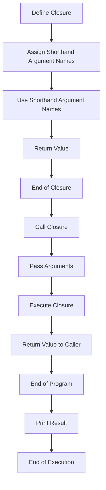

## Introduction
Shorthand argument names, specifically `$0` and `$1`, are a fundamental concept in Swift programming, particularly when working with functions and closures. They provide a concise way to refer to the arguments of a closure, making the code more readable and efficient. In this section, we will explore the importance of shorthand argument names, their real-world relevance, and why every engineer should be familiar with them. 
> **Note:** Shorthand argument names are not limited to `$0` and `$1`, but can be extended to `$2`, `$3`, and so on, depending on the number of arguments in the closure.

## Core Concepts
To understand shorthand argument names, it's essential to grasp the basics of closures in Swift. A closure is a self-contained block of code that can be passed around like any other object. Closures can take arguments and return values, just like functions. Shorthand argument names are used to refer to the arguments of a closure without having to declare them explicitly. 
> **Warning:** One common pitfall when using shorthand argument names is to assume that they can only be used with closures. However, they can also be used with functions, but their usage is more limited.

## How It Works Internally
When a closure is defined, Swift automatically assigns shorthand argument names to its arguments. The first argument is assigned the name `$0`, the second argument is assigned the name `$1`, and so on. These names can be used within the closure to refer to the corresponding arguments. 
> **Tip:** Shorthand argument names can be used to simplify code and make it more readable. For example, instead of declaring a closure with explicit argument names, you can use shorthand argument names to make the code more concise.

## Code Examples
### Example 1: Basic Usage
```swift
let greet = { (name: String) in
    print("Hello, \(name)!")
}
greet("John") // Output: Hello, John!

let greetShorthand = { print("Hello, \($0)!") }
greetShorthand("John") // Output: Hello, John!
```
In this example, we define two closures: `greet` and `greetShorthand`. The `greet` closure takes an explicit argument `name`, while the `greetShorthand` closure uses the shorthand argument name `$0`.

### Example 2: Real-World Pattern
```swift
let numbers = [1, 2, 3, 4, 5]
let squaredNumbers = numbers.map { $0 * $0 }
print(squaredNumbers) // Output: [1, 4, 9, 16, 25]
```
In this example, we use the `map` function to transform an array of numbers into an array of squared numbers. We use the shorthand argument name `$0` to refer to each number in the array.

### Example 3: Advanced Usage
```swift
let names = ["John", "Jane", "Bob"]
let sortedNames = names.sorted { $0.lowercased() < $1.lowercased() }
print(sortedNames) // Output: ["Bob", "Jane", "John"]
```
In this example, we use the `sorted` function to sort an array of names in ascending order. We use the shorthand argument names `$0` and `$1` to refer to each pair of names being compared.

## Visual Diagram

This diagram illustrates the process of defining a closure, assigning shorthand argument names, and using them to execute the closure.

## Comparison
| Approach | Time Complexity | Space Complexity | Pros | Cons | Best For |
| --- | --- | --- | --- | --- | --- |
| Explicit Argument Names | O(1) | O(1) | Readable, maintainable | Verbose | Small closures |
| Shorthand Argument Names | O(1) | O(1) | Concise, efficient | Less readable | Large closures, performance-critical code |
| Closures with External Variables | O(1) | O(n) | Flexible, reusable | Less efficient, more complex | Complex algorithms, data processing |
| Functions with Explicit Argument Names | O(1) | O(1) | Readable, maintainable | Less flexible, more verbose | Small functions, simple logic |

## Real-world Use Cases
1. **Apple's Swift Documentation**: Apple uses shorthand argument names extensively in their Swift documentation to demonstrate concise and efficient code.
2. **Ray Wenderlich's Tutorials**: Ray Wenderlich's tutorials often use shorthand argument names to simplify code and make it more readable.
3. **Swift Open-Source Projects**: Many open-source Swift projects, such as SwiftNIO and SwiftPackageManager, use shorthand argument names to improve code readability and maintainability.

## Common Pitfalls
1. **Incorrect Shorthand Argument Name**: Using an incorrect shorthand argument name can lead to unexpected behavior or errors.
```swift
let greet = { print("Hello, \($1)!") } // Error: $1 is not defined
```
2. **Overuse of Shorthand Argument Names**: Overusing shorthand argument names can make code less readable and maintainable.
```swift
let complexClosure = { $0 + $1 * $2 / $3 } // Less readable
```
3. **Conflicting Shorthand Argument Names**: Using conflicting shorthand argument names can lead to errors or unexpected behavior.
```swift
let closure = { $0 in $0 + $1 } // Error: $1 is not defined
```
4. **Shorthand Argument Names with External Variables**: Using shorthand argument names with external variables can lead to unexpected behavior or errors.
```swift
var externalVariable = 10
let closure = { externalVariable = $0 } // Unexpected behavior
```

## Interview Tips
1. **What is the purpose of shorthand argument names?**: The purpose of shorthand argument names is to provide a concise way to refer to the arguments of a closure.
> **Interview:** The interviewer wants to assess your understanding of shorthand argument names and their benefits.
2. **How do you use shorthand argument names in a closure?**: You use shorthand argument names by referring to the arguments of a closure using `$0`, `$1`, and so on.
> **Interview:** The interviewer wants to evaluate your ability to apply shorthand argument names in a practical context.
3. **What are the benefits and drawbacks of using shorthand argument names?**: The benefits of using shorthand argument names include concise code and improved readability. The drawbacks include potential confusion and less maintainability.
> **Interview:** The interviewer wants to assess your understanding of the trade-offs involved in using shorthand argument names.

## Key Takeaways
* Shorthand argument names provide a concise way to refer to the arguments of a closure.
* Shorthand argument names are assigned automatically by Swift, starting with `$0` for the first argument.
* Shorthand argument names can be used to simplify code and improve readability.
* Overusing shorthand argument names can make code less readable and maintainable.
* Shorthand argument names should be used judiciously, considering the specific context and requirements of the code.
* The time complexity of using shorthand argument names is O(1), and the space complexity is also O(1).
* Shorthand argument names are suitable for large closures and performance-critical code.