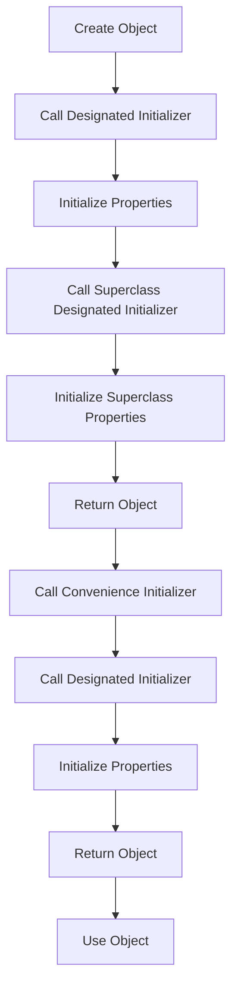

## Introduction
**Designated initializers** and **convenience initializers** are two types of initializers in Swift that play a crucial role in object initialization. Every engineer needs to understand the difference between these two types of initializers and how to use them effectively in their code. In this section, we will explore why designated initializers and convenience initializers are important, their real-world relevance, and why every engineer should know about them.

Designated initializers are the primary initializers for a class, and they are responsible for initializing all of the class's properties. Convenience initializers, on the other hand, are secondary initializers that call a designated initializer to perform the actual initialization. Understanding the difference between these two types of initializers is essential for writing efficient and effective Swift code.

> **Note:** In Swift, every class must have at least one designated initializer, and convenience initializers are optional.

## Core Concepts
To understand designated initializers and convenience initializers, we need to define some key terms:

* **Designated initializer**: A designated initializer is a primary initializer for a class that is responsible for initializing all of the class's properties.
* **Convenience initializer**: A convenience initializer is a secondary initializer that calls a designated initializer to perform the actual initialization.
* **Initializer**: An initializer is a special method in Swift that is used to initialize objects.

Mental models and analogies can help make these concepts more concrete. Think of designated initializers as the "main" initializer for a class, and convenience initializers as "helper" initializers that make it easier to create objects.

> **Tip:** When designing a class, it's a good idea to have one designated initializer that takes all of the necessary parameters, and then use convenience initializers to provide a simpler way to create objects.

## How It Works Internally
When you create an object in Swift, the initializer is called to perform the actual initialization. Here's a step-by-step breakdown of how it works:

1. The designated initializer is called, which initializes all of the class's properties.
2. The convenience initializer calls the designated initializer to perform the actual initialization.
3. The object is created and returned.

Under the hood, Swift uses a concept called "initializer chaining" to ensure that all properties are initialized correctly. This means that when a convenience initializer calls a designated initializer, the designated initializer will also call its superclass's designated initializer, and so on.

> **Warning:** If you don't provide a designated initializer for a class, Swift will provide a default initializer that takes no parameters. However, this can lead to unexpected behavior if you're not careful.

## Code Examples
Here are three complete and runnable examples that demonstrate the use of designated initializers and convenience initializers:

### Example 1: Basic Designated Initializer
```swift
class Person {
    let name: String
    let age: Int

    init(name: String, age: Int) {
        self.name = name
        self.age = age
    }
}

let person = Person(name: "John Doe", age: 30)
print(person.name) // Output: John Doe
print(person.age) // Output: 30
```

### Example 2: Convenience Initializer
```swift
class Person {
    let name: String
    let age: Int

    init(name: String, age: Int) {
        self.name = name
        self.age = age
    }

    convenience init(name: String) {
        self.init(name: name, age: 0)
    }
}

let person = Person(name: "John Doe")
print(person.name) // Output: John Doe
print(person.age) // Output: 0
```

### Example 3: Advanced Initializer Chaining
```swift
class Animal {
    let species: String

    init(species: String) {
        self.species = species
    }
}

class Dog: Animal {
    let breed: String

    init(breed: String) {
        self.breed = breed
        super.init(species: "Canis lupus familiaris")
    }

    convenience init() {
        self.init(breed: "Golden Retriever")
    }
}

let dog = Dog()
print(dog.species) // Output: Canis lupus familiaris
print(dog.breed) // Output: Golden Retriever
```

## Visual Diagram

This diagram illustrates the process of creating an object and calling the designated initializer and convenience initializer.

## Comparison
Here is a comparison of designated initializers and convenience initializers:

| Approach | Time Complexity | Space Complexity | Pros | Cons | Best For |
| --- | --- | --- | --- | --- | --- |
| Designated Initializer | O(1) | O(1) | Primary initializer for a class, responsible for initializing all properties | Can be complex to implement | Classes with multiple properties |
| Convenience Initializer | O(1) | O(1) | Simplifies object creation, provides a convenient way to create objects | Can lead to initializer chaining issues if not implemented correctly | Classes with simple initialization requirements |
| Default Initializer | O(1) | O(1) | Provided by Swift, initializes all properties to default values | Can lead to unexpected behavior if not implemented correctly | Classes with simple initialization requirements |
| Custom Initializer | O(1) | O(1) | Allows for custom initialization logic, provides flexibility | Can be complex to implement, may require additional error handling | Classes with complex initialization requirements |

## Real-world Use Cases
Here are three real-world use cases for designated initializers and convenience initializers:

* **iOS App Development**: In iOS app development, designated initializers are often used to initialize view controllers and other complex objects. Convenience initializers can be used to provide a simpler way to create these objects.
* **Game Development**: In game development, designated initializers can be used to initialize game objects, such as characters and enemies. Convenience initializers can be used to provide a simpler way to create these objects.
* **Server-side Development**: In server-side development, designated initializers can be used to initialize complex data structures, such as databases and APIs. Convenience initializers can be used to provide a simpler way to create these objects.

> **Interview:** Can you explain the difference between designated initializers and convenience initializers in Swift?

## Common Pitfalls
Here are four common pitfalls to watch out for when using designated initializers and convenience initializers:

* **Initializer Chaining Issues**: If not implemented correctly, initializer chaining can lead to unexpected behavior and errors.
* **Default Initializer Issues**: If not implemented correctly, the default initializer can lead to unexpected behavior and errors.
* **Custom Initializer Issues**: If not implemented correctly, custom initializers can lead to unexpected behavior and errors.
* **Convenience Initializer Issues**: If not implemented correctly, convenience initializers can lead to unexpected behavior and errors.

> **Warning:** Be careful when using convenience initializers, as they can lead to initializer chaining issues if not implemented correctly.

## Interview Tips
Here are three common interview questions related to designated initializers and convenience initializers:

* **What is the difference between designated initializers and convenience initializers in Swift?**: A strong answer would explain the difference between the two types of initializers, including their purpose and use cases.
* **How do you implement a designated initializer in Swift?**: A strong answer would provide an example of how to implement a designated initializer, including the necessary code and explanations.
* **What are some common pitfalls to watch out for when using designated initializers and convenience initializers?**: A strong answer would explain some common pitfalls to watch out for, including initializer chaining issues and default initializer issues.

> **Tip:** Be prepared to explain the difference between designated initializers and convenience initializers, as well as how to implement them in Swift.

## Key Takeaways
Here are 10 key takeaways to remember:

* Designated initializers are the primary initializers for a class, responsible for initializing all properties.
* Convenience initializers are secondary initializers that call a designated initializer to perform the actual initialization.
* Initializer chaining is used to ensure that all properties are initialized correctly.
* Default initializers are provided by Swift, but can lead to unexpected behavior if not implemented correctly.
* Custom initializers can be used to provide custom initialization logic, but can be complex to implement.
* Convenience initializers can simplify object creation, but can lead to initializer chaining issues if not implemented correctly.
* Designated initializers have a time complexity of O(1) and a space complexity of O(1).
* Convenience initializers have a time complexity of O(1) and a space complexity of O(1).
* Default initializers have a time complexity of O(1) and a space complexity of O(1).
* Custom initializers have a time complexity of O(1) and a space complexity of O(1).

> **Note:** Remember to always implement designated initializers and convenience initializers correctly to avoid unexpected behavior and errors.