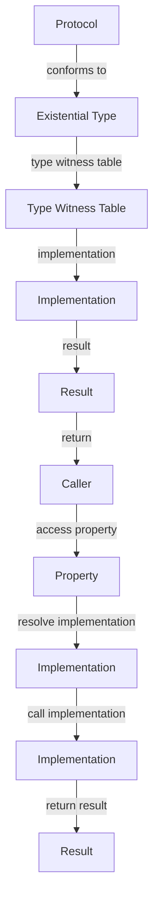

## Introduction
Existential types, introduced in Swift 5.7, are a powerful feature that allows developers to work with protocols in a more flexible and expressive way. An existential type is a type that represents a value of any type that conforms to a specific protocol. This feature is particularly useful when working with protocols that have associated types, as it allows developers to write more generic and reusable code. In this section, we will explore the concept of existential types, their real-world relevance, and why every engineer needs to know about them.

Existential types are useful when you need to work with a collection of objects that conform to a specific protocol, but you don't care about the underlying type of each object. For example, you might have a protocol called `Printable` that has a `print()` method, and you want to create an array of objects that conform to this protocol. With existential types, you can create an array of type `[any Printable]`, which can hold objects of any type that conforms to the `Printable` protocol.

> **Note:** Existential types are not a replacement for generics, but rather a complementary feature that allows for more flexibility and expressiveness in certain situations.

## Core Concepts
To understand existential types, you need to have a solid grasp of protocols and associated types. A protocol is a blueprint of methods, properties, and other requirements that a type can adopt. An associated type is a type that is associated with a protocol, and is used to specify the type of a property or method.

In Swift, a protocol can have associated types, which are types that are associated with the protocol. For example, the `Sequence` protocol has an associated type called `Element`, which represents the type of elements in the sequence.

An existential type is a type that represents a value of any type that conforms to a specific protocol. It is created using the `any` keyword followed by the protocol name. For example, `any Printable` is an existential type that represents a value of any type that conforms to the `Printable` protocol.

> **Tip:** When working with existential types, it's essential to understand the concept of type erasure, which is the process of removing type information at runtime. Type erasure is used to implement existential types, and it allows you to work with objects of different types in a uniform way.

## How It Works Internally
When you create an existential type, Swift uses type erasure to remove the type information at runtime. This means that when you work with an existential type, you don't know the underlying type of the object, and you can only access the properties and methods that are defined in the protocol.

Under the hood, Swift uses a technique called "type witness tables" to implement existential types. A type witness table is a data structure that contains information about the type of an object, including its protocol conformance. When you create an existential type, Swift generates a type witness table for the underlying type, which allows you to access the properties and methods of the protocol.

Here's a step-by-step breakdown of how existential types work:

1. You create an existential type using the `any` keyword followed by the protocol name.
2. Swift generates a type witness table for the underlying type.
3. When you access a property or method of the existential type, Swift uses the type witness table to resolve the correct implementation.
4. The implementation is then called, and the result is returned to the caller.

> **Warning:** When working with existential types, be aware that type erasure can lead to performance overhead, as the runtime needs to resolve the correct implementation of the protocol methods.

## Code Examples
### Example 1: Basic Existential Type
```swift
protocol Printable {
    func print()
}

class Document: Printable {
    func print() {
        print("Printing a document")
    }
}

class Image: Printable {
    func print() {
        print("Printing an image")
    }
}

let documents: [any Printable] = [Document(), Image()]

for document in documents {
    document.print()
}
```
This example demonstrates how to create an existential type `any Printable` and use it to store objects of different types that conform to the `Printable` protocol.

### Example 2: Existential Type with Associated Type
```swift
protocol Sequence {
    associatedtype Element
    func makeIterator() -> Iterator
}

class ArraySequence<Element>: Sequence {
    let elements: [Element]

    func makeIterator() -> Iterator {
        return ArrayIterator(elements: elements)
    }
}

class ArrayIterator<Element>: Iterator {
    let elements: [Element]

    init(elements: [Element]) {
        self.elements = elements
    }

    func next() -> Element? {
        // implementation
    }
}

let sequence: any Sequence = ArraySequence(elements: [1, 2, 3])

for element in sequence.makeIterator() {
    print(element)
}
```
This example demonstrates how to create an existential type `any Sequence` and use it to store objects of different types that conform to the `Sequence` protocol.

### Example 3: Advanced Existential Type with Generic Function
```swift
protocol Printable {
    func print()
}

func printDocuments<T: Printable>(_ documents: [T]) {
    for document in documents {
        document.print()
    }
}

class Document: Printable {
    func print() {
        print("Printing a document")
    }
}

class Image: Printable {
    func print() {
        print("Printing an image")
    }
}

let documents: [any Printable] = [Document(), Image()]

printDocuments(documents)
```
This example demonstrates how to create a generic function that takes an array of existential types and uses it to print the documents.

## Visual Diagram

This diagram illustrates the internal mechanics of existential types, including type witness tables and implementation resolution.

## Comparison
| Approach | Time Complexity | Space Complexity | Pros | Cons | Best For |
|----------|----------------|-----------------|------|------|----------|
| Existential Types | O(1) | O(1) | Flexible, expressive | Performance overhead | Working with protocols and associated types |
| Generics | O(1) | O(1) | Type-safe, efficient | Less flexible | Working with collections and algorithms |
| Type Erasure | O(1) | O(1) | Simple, efficient | Less flexible | Working with legacy code and compatibility |
| Protocol-Oriented Programming | O(1) | O(1) | Flexible, expressive | Steeper learning curve | Working with complex systems and architectures |

## Real-world Use Cases
1. **Apple's Swift Standard Library**: The Swift Standard Library uses existential types to implement collections and algorithms that work with protocols and associated types.
2. **React Native**: React Native uses existential types to implement components that work with different types of data and protocols.
3. **Google's Firebase**: Firebase uses existential types to implement APIs that work with different types of data and protocols.

## Common Pitfalls
1. **Type Erasure Overhead**: Type erasure can lead to performance overhead, as the runtime needs to resolve the correct implementation of the protocol methods.
2. **Existential Type Confusion**: Existential types can be confusing, especially when working with complex protocols and associated types.
3. **Protocol Conformance**: Protocol conformance can be tricky, especially when working with multiple protocols and associated types.
4. **Type Witness Table Overhead**: Type witness tables can lead to performance overhead, as the runtime needs to generate and manage the tables.

## Interview Tips
1. **What is an existential type?**: An existential type is a type that represents a value of any type that conforms to a specific protocol.
2. **How do you create an existential type?**: You create an existential type using the `any` keyword followed by the protocol name.
3. **What is type erasure?**: Type erasure is the process of removing type information at runtime, which is used to implement existential types.

## Key Takeaways
* Existential types are a powerful feature that allows developers to work with protocols in a more flexible and expressive way.
* Existential types use type erasure to remove type information at runtime.
* Type witness tables are used to implement existential types.
* Existential types can lead to performance overhead due to type erasure and type witness table management.
* Existential types are useful when working with protocols and associated types.
* Generics are a complementary feature that allows for more type-safe and efficient code.
* Protocol-oriented programming is a programming paradigm that uses protocols and existential types to write flexible and expressive code.