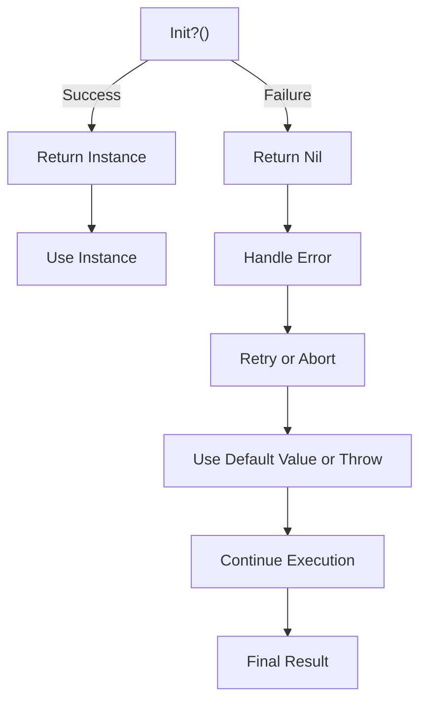

## Introduction
Failable initializers, denoted by `init?()`, are a type of initializer in Swift that may return `nil` if the initialization process fails. This allows for more flexible and robust object creation, as it enables developers to handle initialization errors in a more explicit and controlled manner. Failable initializers are particularly useful when working with external data sources, such as files or network requests, where the data may be incomplete, corrupted, or otherwise invalid.

In real-world applications, failable initializers are commonly used in scenarios where data validation is critical, such as parsing JSON data, loading images, or connecting to databases. By using failable initializers, developers can ensure that their objects are properly initialized and configured before they are used, which helps prevent runtime errors and improves overall code reliability.

> **Tip:** When designing your own classes, consider using failable initializers to handle initialization errors and provide a more robust API for your users.

## Core Concepts
A failable initializer is a special type of initializer that returns an optional value, `Self?`, which can be either `Some` (a valid instance) or `None` (nil). This allows the initializer to indicate whether the initialization process was successful or not. The `init?()` syntax is used to define a failable initializer, and it is typically used in conjunction with a `return nil` statement to indicate failure.

The key terminology to understand when working with failable initializers includes:

* **Failable initializer**: An initializer that may return `nil` if the initialization process fails.
* **Optional return type**: The `Self?` return type, which indicates that the initializer may return either a valid instance or `nil`.
* **Initialization error**: An error that occurs during the initialization process, which can be handled explicitly using failable initializers.

> **Note:** Failable initializers are not the same as throwing initializers, which use the `throws` keyword to propagate errors. While both approaches can be used to handle initialization errors, failable initializers provide a more explicit and controlled way to handle errors.

## How It Works Internally
When a failable initializer is called, the Swift runtime checks whether the initialization process was successful or not. If the initializer returns `nil`, the runtime will not create an instance of the class, and the caller will receive a `nil` value instead. If the initializer returns a valid instance, the runtime will create a new instance of the class and return it to the caller.

The step-by-step process for using a failable initializer is as follows:

1. Define a failable initializer using the `init?()` syntax.
2. Implement the initializer logic, which may involve validating input data, loading external resources, or performing other initialization tasks.
3. If the initialization process fails, return `nil` to indicate failure.
4. If the initialization process succeeds, return a valid instance of the class.

> **Warning:** When using failable initializers, be sure to check for `nil` values after initialization to avoid runtime errors.

## Code Examples
### Example 1: Basic Failable Initializer
```swift
class Person {
    let name: String
    let age: Int

    init?(name: String, age: Int) {
        if age < 0 {
            return nil
        }
        self.name = name
        self.age = age
    }
}

let person = Person(name: "John", age: 30)
if let person = person {
    print("Person initialized successfully: \(person.name), \(person.age)")
} else {
    print("Failed to initialize person")
}
```
### Example 2: Real-World Failable Initializer
```swift
class ImageLoader {
    let imageUrl: URL

    init?(imageUrl: URL) {
        guard let imageData = try? Data(contentsOf: imageUrl) else {
            return nil
        }
        guard let image = UIImage(data: imageData) else {
            return nil
        }
        self.imageUrl = imageUrl
    }
}

let imageLoader = ImageLoader(imageUrl: URL(string: "https://example.com/image.jpg")!)
if let imageLoader = imageLoader {
    print("Image loaded successfully: \(imageLoader.imageUrl)")
} else {
    print("Failed to load image")
}
```
### Example 3: Advanced Failable Initializer
```swift
class JSONParser {
    let jsonData: Data

    init?(jsonData: Data) {
        do {
            let json = try JSONSerialization.jsonObject(with: jsonData, options: [])
            guard let dictionary = json as? [String: Any] else {
                return nil
            }
            self.jsonData = jsonData
        } catch {
            return nil
        }
    }
}

let jsonData = "{\"name\":\"John\",\"age\":30}".data(using: .utf8)!
let jsonParser = JSONParser(jsonData: jsonData)
if let jsonParser = jsonParser {
    print("JSON parsed successfully: \(jsonParser.jsonData)")
} else {
    print("Failed to parse JSON")
}
```
## Visual Diagram

The diagram illustrates the flow of a failable initializer, from the initial call to the final result. The `init?()` function may return either a valid instance or `nil`, depending on the success or failure of the initialization process.

## Comparison
| Approach | Time Complexity | Space Complexity | Pros | Cons | Best For |
| --- | --- | --- | --- | --- | --- |
| Failable Initializer | O(1) | O(1) | Explicit error handling, improved code reliability | Requires manual error handling | Critical initialization tasks, data validation |
| Throwing Initializer | O(1) | O(1) | Propagates errors up the call stack, simplifies error handling | May lead to unhandled errors, less explicit | Non-critical initialization tasks, debugging |
| Optional Return Type | O(1) | O(1) | Provides flexibility in initialization, allows for default values | May lead to nil pointer dereferences, requires manual checking | Optional initialization, default values |
| Forced Unwrapping | O(1) | O(1) | Simplifies code, reduces boilerplate | May lead to runtime errors, less safe | Development, testing, or debugging |

## Real-world Use Cases
1. **JSON Parsing**: Failable initializers can be used to parse JSON data and handle errors explicitly, ensuring that the data is valid and complete before creating objects.
2. **Image Loading**: Failable initializers can be used to load images from external sources, such as URLs or files, and handle errors that may occur during the loading process.
3. **Database Connections**: Failable initializers can be used to establish database connections and handle errors that may occur during the connection process, ensuring that the connection is valid and secure.

> **Interview:** How would you handle initialization errors in a Swift class, and what are the benefits of using failable initializers?

## Common Pitfalls
1. **Forgetting to Check for Nil**: Failing to check for `nil` values after initialization can lead to runtime errors and crashes.
2. **Using Forced Unwrapping**: Using forced unwrapping (`!`) can lead to runtime errors and crashes if the value is `nil`.
3. **Not Handling Errors**: Failing to handle errors explicitly can lead to unhandled errors and crashes.
4. **Using Throwing Initializers Incorrectly**: Using throwing initializers incorrectly can lead to unhandled errors and crashes.

## Interview Tips
1. **What is a failable initializer, and how does it work?**: A failable initializer is an initializer that may return `nil` if the initialization process fails. It provides a way to handle initialization errors explicitly and improves code reliability.
2. **How do you handle initialization errors in a Swift class?**: Initialization errors can be handled using failable initializers, throwing initializers, or optional return types. The choice of approach depends on the specific use case and requirements.
3. **What are the benefits of using failable initializers?**: Failable initializers provide explicit error handling, improve code reliability, and simplify error handling. They are particularly useful in critical initialization tasks and data validation scenarios.

## Key Takeaways
* Failable initializers provide explicit error handling and improve code reliability.
* Failable initializers are particularly useful in critical initialization tasks and data validation scenarios.
* Throwing initializers can be used to propagate errors up the call stack, but may lead to unhandled errors.
* Optional return types provide flexibility in initialization, but may lead to nil pointer dereferences.
* Forced unwrapping can simplify code, but may lead to runtime errors and crashes.
* Initialization errors should be handled explicitly using failable initializers, throwing initializers, or optional return types.
* Failable initializers have a time complexity of O(1) and a space complexity of O(1).
* Throwing initializers have a time complexity of O(1) and a space complexity of O(1).