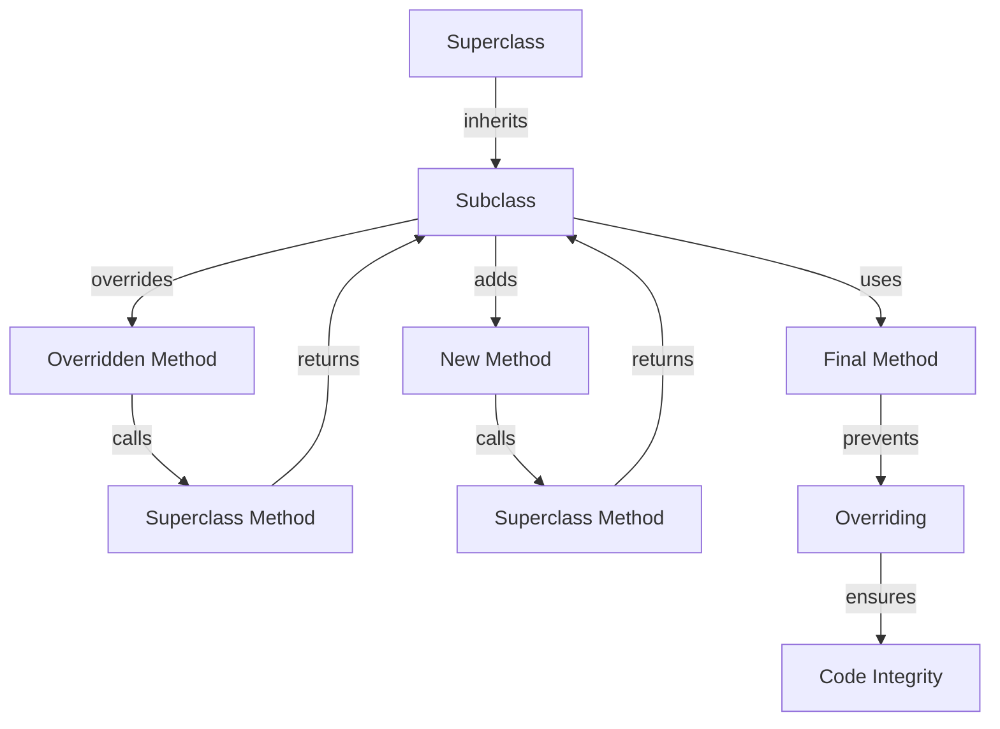

## Introduction
Inheritance is a fundamental concept in object-oriented programming (OOP) that allows one class to inherit the properties and behavior of another class. It is a mechanism for creating a new class from an existing class, where the new class inherits all the fields and methods of the existing class and can also add new fields and methods or override the ones inherited from the existing class. Inheritance is essential in OOP because it enables code reuse, facilitates the creation of a hierarchy of classes, and promotes modularity and maintainability in software design. In this study guide, we will delve into the world of inheritance in Swift, exploring its core concepts, internal mechanics, and best practices, with a focus on the `override`, `final`, and `super` keywords.

## Core Concepts
Inheritance in Swift is based on the following core concepts:
- **Class**: A class is a blueprint or a template that defines the properties and behavior of an object.
- **Inheritance**: Inheritance is the mechanism by which one class can inherit the properties and behavior of another class.
- **Subclass**: A subclass is a class that inherits the properties and behavior of another class, known as the superclass.
- **Superclass**: A superclass is a class that is inherited by another class, known as the subclass.
- **Override**: The `override` keyword is used to provide a specific implementation for a method that is already defined in the superclass.
- **Final**: The `final` keyword is used to prevent a class, method, or property from being overridden or inherited.
- **Super**: The `super` keyword is used to refer to the superclass of a subclass.

## How It Works Internally
When a subclass inherits from a superclass, it inherits all the fields and methods of the superclass. The subclass can then add new fields and methods or override the ones inherited from the superclass. The `override` keyword is used to override a method that is already defined in the superclass. The `final` keyword is used to prevent a class, method, or property from being overridden or inherited. The `super` keyword is used to refer to the superclass of a subclass.

Here's a step-by-step breakdown of how inheritance works internally:
1. The subclass inherits the fields and methods of the superclass.
2. The subclass can add new fields and methods or override the ones inherited from the superclass.
3. The `override` keyword is used to override a method that is already defined in the superclass.
4. The `final` keyword is used to prevent a class, method, or property from being overridden or inherited.
5. The `super` keyword is used to refer to the superclass of a subclass.

> **Note:** Inheritance is a powerful tool in OOP, but it can also lead to tight coupling between classes, which can make the code harder to maintain and extend.

## Code Examples
### Example 1: Basic Inheritance
```swift
// Define a superclass called Vehicle
class Vehicle {
    var color: String

    init(color: String) {
        self.color = color
    }

    func honk() {
        print("Honk!")
    }
}

// Define a subclass called Car that inherits from Vehicle
class Car: Vehicle {
    var numberOfDoors: Int

    init(color: String, numberOfDoors: Int) {
        self.numberOfDoors = numberOfDoors
        super.init(color: color)
    }

    func lockDoors() {
        print("Doors locked!")
    }
}

// Create an instance of Car
let myCar = Car(color: "Red", numberOfDoors: 4)
myCar.honk() // Output: Honk!
myCar.lockDoors() // Output: Doors locked!
```
### Example 2: Overriding a Method
```swift
// Define a superclass called Animal
class Animal {
    func sound() {
        print("The animal makes a sound.")
    }
}

// Define a subclass called Dog that inherits from Animal
class Dog: Animal {
    override func sound() {
        print("The dog barks!")
    }
}

// Create an instance of Dog
let myDog = Dog()
myDog.sound() // Output: The dog barks!
```
### Example 3: Using the Final Keyword
```swift
// Define a superclass called Bird
class Bird {
    final func fly() {
        print("The bird flies!")
    }
}

// Define a subclass called Eagle that inherits from Bird
class Eagle: Bird {
    // Attempting to override the fly method will result in a compiler error
    // override func fly() {
    //     print("The eagle soars!")
    // }
}

// Create an instance of Eagle
let myEagle = Eagle()
myEagle.fly() // Output: The bird flies!
```
> **Warning:** Attempting to override a method that is marked as `final` will result in a compiler error.

## Visual Diagram

The diagram illustrates the inheritance hierarchy and the relationships between the superclass, subclass, and methods.

## Comparison
| Approach | Time Complexity | Space Complexity | Pros | Cons | Best For |
| --- | --- | --- | --- | --- | --- |
| Inheritance | O(1) | O(1) | Code reuse, modularity, maintainability | Tight coupling, complexity | Creating a hierarchy of classes |
| Composition | O(1) | O(1) | Loose coupling, flexibility, scalability | Increased complexity, overhead | Creating complex objects from simpler ones |
| Interface | O(1) | O(1) | Abstraction, polymorphism, testability | Limited functionality, complexity | Defining contracts or interfaces |
| Abstract Class | O(1) | O(1) | Code reuse, modularity, maintainability | Limited instantiation, complexity | Creating a base class for subclasses |

> **Tip:** When choosing an approach, consider the trade-offs between code reuse, modularity, maintainability, and complexity.

## Real-world Use Cases
1. **Apple's UIKit**: Apple's UIKit framework uses inheritance to create a hierarchy of classes for user interface components, such as `UIView`, `UILabel`, and `UIButton`.
2. **Facebook's GraphQL**: Facebook's GraphQL framework uses composition to create complex queries from simpler ones, allowing for flexible and scalable data retrieval.
3. **Amazon's AWS**: Amazon's AWS platform uses interfaces to define contracts for services, such as `S3` and `DynamoDB`, allowing for abstraction and polymorphism.

## Common Pitfalls
1. **Tight Coupling**: Inheritance can lead to tight coupling between classes, making the code harder to maintain and extend.
2. **Overriding**: Overriding a method can lead to unexpected behavior if not done correctly.
3. **Final Methods**: Using the `final` keyword can prevent subclasses from overriding methods, limiting flexibility.
4. **Complexity**: Inheritance and composition can lead to increased complexity, making the code harder to understand and maintain.

> **Interview:** When asked about inheritance, be prepared to discuss its benefits and drawbacks, as well as how to use it effectively in software design.

## Interview Tips
1. **Define Inheritance**: Be able to define inheritance and explain its benefits and drawbacks.
2. **Explain Overriding**: Be able to explain how to override a method and the potential pitfalls.
3. **Discuss Final Methods**: Be able to discuss the use of the `final` keyword and its implications.
4. **Design a Hierarchy**: Be able to design a hierarchy of classes using inheritance and composition.

## Key Takeaways
* Inheritance is a powerful tool in OOP, but it can also lead to tight coupling between classes.
* The `override` keyword is used to provide a specific implementation for a method that is already defined in the superclass.
* The `final` keyword is used to prevent a class, method, or property from being overridden or inherited.
* Composition is an alternative to inheritance, allowing for loose coupling and flexibility.
* Interfaces can be used to define contracts or interfaces, promoting abstraction and polymorphism.
* Inheritance and composition can lead to increased complexity, making the code harder to understand and maintain.
* When choosing an approach, consider the trade-offs between code reuse, modularity, maintainability, and complexity.