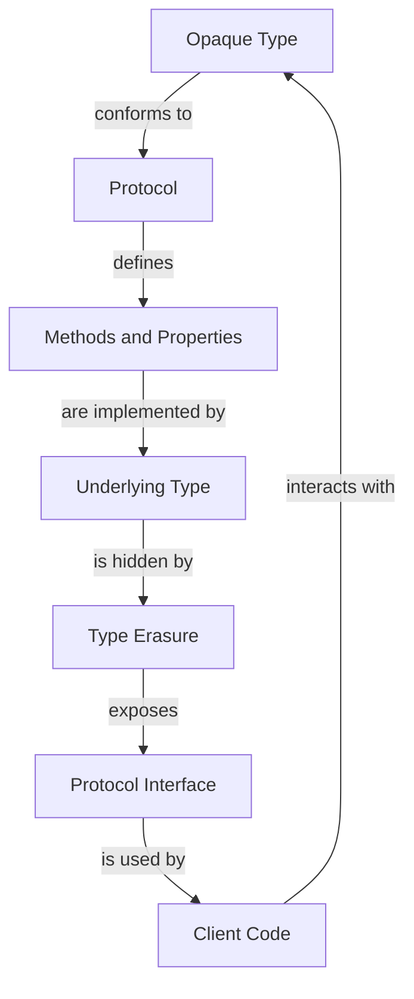

## Introduction
Opaque types, introduced in Swift 5.1, are a feature that allows developers to define a type that conforms to a specific protocol, without exposing the underlying type. This is particularly useful when working with protocols, as it enables the creation of more abstract and flexible APIs. In this section, we will delve into the world of opaque types, exploring their definition, benefits, and real-world applications.

> **Note:** Opaque types are a powerful tool for writing more generic and reusable code, but they can also lead to complexity if not used judiciously.

Opaque types are essential in modern Swift development, as they enable the creation of more modular and maintainable code. By hiding the underlying type, opaque types allow developers to focus on the interface and behavior of an object, rather than its implementation details. This leads to more flexible and adaptable code, which is better suited to the demands of modern software development.

## Core Concepts
To understand opaque types, we need to grasp a few core concepts:

* **Protocols:** A protocol defines a blueprint of methods, properties, and other requirements that a type must adopt.
* **Type erasure:** Type erasure is the process of hiding the underlying type of an object, making it conform to a specific protocol.
* **Opaque type:** An opaque type is a type that conforms to a specific protocol, without exposing the underlying type.

> **Warning:** Opaque types can lead to complexity if not used carefully, as they can make it difficult to understand the underlying type and its behavior.

The key terminology to remember when working with opaque types includes:

* `some Protocol`: This syntax is used to define an opaque type that conforms to a specific protocol.
* `Type Erasure`: The process of hiding the underlying type of an object.

## How It Works Internally
When we define an opaque type, the compiler generates a type-erased wrapper around the underlying type. This wrapper conforms to the specified protocol, and it is responsible for forwarding calls to the underlying type.

Here is a step-by-step breakdown of how opaque types work internally:

1. **Type Definition:** The developer defines an opaque type using the `some Protocol` syntax.
2. **Type Erasure:** The compiler generates a type-erased wrapper around the underlying type.
3. **Protocol Conformance:** The wrapper conforms to the specified protocol.
4. **Call Forwarding:** The wrapper forwards calls to the underlying type.

> **Tip:** When working with opaque types, it's essential to understand the underlying type and its behavior, as this can affect the performance and correctness of the code.

## Code Examples
Here are three complete and runnable examples of using opaque types in Swift:

### Example 1: Basic Opaque Type
```swift
// Define a protocol
protocol Greeter {
    func greet()
}

// Define an opaque type that conforms to the protocol
struct OpaqueGreeter: some Greeter {
    let name: String

    init(name: String) {
        self.name = name
    }

    func greet() {
        print("Hello, \(name)!")
    }
}

// Create an instance of the opaque type
let greeter = OpaqueGreeter(name: "John")

// Use the opaque type
greeter.greet() // Output: Hello, John!
```

### Example 2: Real-World Pattern
```swift
// Define a protocol for a data repository
protocol DataRepository {
    func fetch(data: String) -> [String]
}

// Define an opaque type that conforms to the protocol
class OpaqueDataRepository: some DataRepository {
    let data: [String]

    init(data: [String]) {
        self.data = data
    }

    func fetch(data: String) -> [String] {
        return data.components(separatedBy: ",")
    }
}

// Create an instance of the opaque type
let repository = OpaqueDataRepository(data: ["apple", "banana", "orange"])

// Use the opaque type
let fetchedData = repository.fetch(data: "apple,banana,orange")
print(fetchedData) // Output: ["apple", "banana", "orange"]
```

### Example 3: Advanced Opaque Type
```swift
// Define a protocol for a caching layer
protocol Cache {
    func get(key: String) -> String?
    func set(key: String, value: String)
}

// Define an opaque type that conforms to the protocol
class OpaqueCache: some Cache {
    let cache: [String: String] = [:]

    func get(key: String) -> String? {
        return cache[key]
    }

    func set(key: String, value: String) {
        cache[key] = value
    }
}

// Create an instance of the opaque type
let cache = OpaqueCache()

// Use the opaque type
cache.set(key: "name", value: "John")
if let value = cache.get(key: "name") {
    print(value) // Output: John
}
```

## Visual Diagram

This diagram illustrates the relationship between an opaque type, a protocol, and the underlying type. The opaque type conforms to the protocol, which defines the methods and properties that must be implemented. The underlying type implements these methods and properties, but it is hidden by type erasure. The client code interacts with the opaque type through the protocol interface, without knowing the details of the underlying type.

## Comparison
Here is a comparison of different approaches to achieving type erasure in Swift:

| Approach | Time Complexity | Space Complexity | Pros | Cons | Best For |
| --- | --- | --- | --- | --- | --- |
| Opaque Types | O(1) | O(1) | Easy to use, flexible | Can lead to complexity | General-purpose programming |
| Type Erasure using Generics | O(1) | O(1) | Flexible, reusable | Can be verbose | Advanced programming |
| Type Erasure using Protocols | O(1) | O(1) | Easy to use, flexible | Limited control over type erasure | Simple programming |

## Real-world Use Cases
Here are three real-world use cases for opaque types:

1. **API Design:** Opaque types can be used to define APIs that are flexible and adaptable to different use cases. For example, a social media platform might use an opaque type to represent a user's profile, which can be implemented differently depending on the platform.
2. **Caching:** Opaque types can be used to implement caching layers that are efficient and flexible. For example, a web application might use an opaque type to represent a cache, which can be implemented using different caching strategies.
3. **Data Storage:** Opaque types can be used to define data storage systems that are flexible and adaptable to different use cases. For example, a database might use an opaque type to represent a data record, which can be implemented differently depending on the database schema.

## Common Pitfalls
Here are four common pitfalls to watch out for when using opaque types:

1. **Overusing Opaque Types:** Opaque types can lead to complexity if overused. It's essential to use them judiciously and only when necessary.
2. **Underestimating Type Erasure:** Type erasure can have performance implications, especially if the underlying type is complex. It's essential to understand the performance implications of type erasure.
3. **Ignoring Protocol Conformance:** Opaque types must conform to a protocol, which defines the methods and properties that must be implemented. Ignoring protocol conformance can lead to errors and bugs.
4. **Not Understanding the Underlying Type:** Opaque types hide the underlying type, which can make it difficult to understand the behavior and performance implications of the code. It's essential to understand the underlying type and its behavior.

## Interview Tips
Here are three common interview questions related to opaque types, along with weak and strong answers:

1. **What is an opaque type?**
	* Weak answer: "An opaque type is a type that conforms to a protocol."
	* Strong answer: "An opaque type is a type that conforms to a protocol, without exposing the underlying type. It's used to achieve type erasure and make code more flexible and adaptable."
2. **How do you implement an opaque type?**
	* Weak answer: "You implement an opaque type by defining a protocol and a type that conforms to it."
	* Strong answer: "You implement an opaque type by defining a protocol and a type that conforms to it, using the `some Protocol` syntax. You also need to understand the underlying type and its behavior, as well as the performance implications of type erasure."
3. **What are the benefits and drawbacks of using opaque types?**
	* Weak answer: "The benefits of using opaque types are that they make code more flexible and adaptable. The drawbacks are that they can lead to complexity and performance issues."
	* Strong answer: "The benefits of using opaque types are that they make code more flexible and adaptable, and they enable type erasure. The drawbacks are that they can lead to complexity if overused, and they can have performance implications if not understood properly. However, when used judiciously, opaque types can be a powerful tool for writing more generic and reusable code."

## Key Takeaways
Here are ten key takeaways to remember when working with opaque types:

* Opaque types are used to achieve type erasure and make code more flexible and adaptable.
* Opaque types conform to a protocol, which defines the methods and properties that must be implemented.
* The underlying type is hidden by type erasure, which can make it difficult to understand the behavior and performance implications of the code.
* Opaque types can lead to complexity if overused, and they can have performance implications if not understood properly.
* The `some Protocol` syntax is used to define an opaque type.
* Type erasure is the process of hiding the underlying type of an object, making it conform to a specific protocol.
* Opaque types are essential in modern Swift development, as they enable the creation of more modular and maintainable code.
* Opaque types can be used to define APIs that are flexible and adaptable to different use cases.
* Opaque types can be used to implement caching layers that are efficient and flexible.
* Opaque types can be used to define data storage systems that are flexible and adaptable to different use cases.