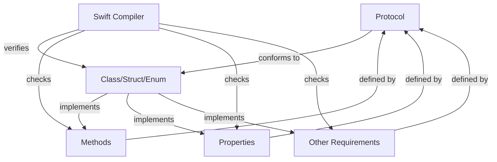

## Introduction
Protocol conformance is a fundamental concept in Swift programming that enables developers to define a blueprint of methods, properties, and other requirements that a class, struct, or enum must adopt. It is essential to understand protocol conformance because it allows for more flexibility and generic code, making it easier to write reusable and maintainable software. In real-world scenarios, protocol conformance is used extensively in iOS and macOS development, where it helps to define the behavior of objects and ensure that they conform to specific standards.

> **Note:** Protocol conformance is not unique to Swift and is also found in other programming languages, such as Java and C#.

Protocol conformance is particularly useful when working with frameworks and libraries, as it allows developers to define a set of requirements that must be met by any class, struct, or enum that conforms to the protocol. This helps to ensure that the code is consistent and follows a specific pattern, making it easier to understand and maintain.

## Core Concepts
To understand protocol conformance, it is essential to grasp the following core concepts:

* **Protocol**: A protocol is a blueprint of methods, properties, and other requirements that a class, struct, or enum must adopt.
* **Conformance**: Conformance refers to the process of adopting a protocol and implementing its requirements.
* **Adoption**: Adoption refers to the process of making a class, struct, or enum conform to a protocol.

Mental models and analogies can help to make these concepts more accessible. For example, think of a protocol as a contract that a class, struct, or enum must sign and fulfill. The contract outlines the requirements that must be met, and the class, struct, or enum must implement these requirements to conform to the protocol.

Key terminology includes:

* **Protocol conformance**: The process of adopting a protocol and implementing its requirements.
* **Protocol adoption**: The process of making a class, struct, or enum conform to a protocol.
* **Conforming type**: A class, struct, or enum that conforms to a protocol.

## How It Works Internally
When a class, struct, or enum conforms to a protocol, it must implement all the requirements defined in the protocol. This includes methods, properties, and any other requirements specified in the protocol.

Here's a step-by-step breakdown of how protocol conformance works internally:

1. **Protocol definition**: A protocol is defined using the `protocol` keyword, followed by the name of the protocol and a list of requirements.
2. **Conformance declaration**: A class, struct, or enum declares its conformance to a protocol using the `: ProtocolName` syntax.
3. **Implementation**: The class, struct, or enum implements all the requirements defined in the protocol.
4. **Verification**: The Swift compiler verifies that the class, struct, or enum conforms to the protocol by checking that it implements all the required methods, properties, and other requirements.

> **Warning:** If a class, struct, or enum does not implement all the requirements defined in a protocol, the Swift compiler will raise an error.

## Code Examples
Here are three complete and runnable code examples that demonstrate protocol conformance in Swift:

### Example 1: Basic Protocol Conformance
```swift
// Define a protocol
protocol Printable {
    func printMessage()
}

// Define a class that conforms to the protocol
class Printer: Printable {
    func printMessage() {
        print("Hello, world!")
    }
}

// Create an instance of the class and call the printMessage method
let printer = Printer()
printer.printMessage()
```

### Example 2: Protocol Conformance with Properties
```swift
// Define a protocol with a property
protocol Person {
    var name: String { get set }
    var age: Int { get set }
}

// Define a class that conforms to the protocol
class Employee: Person {
    var name: String
    var age: Int
    
    init(name: String, age: Int) {
        self.name = name
        self.age = age
    }
}

// Create an instance of the class and access its properties
let employee = Employee(name: "John Doe", age: 30)
print(employee.name)
print(employee.age)
```

### Example 3: Advanced Protocol Conformance with Methods and Properties
```swift
// Define a protocol with methods and properties
protocol Vehicle {
    var make: String { get set }
    var model: String { get set }
    var year: Int { get set }
    
    func startEngine()
    func accelerate()
    func brake()
}

// Define a class that conforms to the protocol
class Car: Vehicle {
    var make: String
    var model: String
    var year: Int
    
    init(make: String, model: String, year: Int) {
        self.make = make
        self.model = model
        self.year = year
    }
    
    func startEngine() {
        print("The engine is starting...")
    }
    
    func accelerate() {
        print("The car is accelerating...")
    }
    
    func brake() {
        print("The car is braking...")
    }
}

// Create an instance of the class and call its methods
let car = Car(make: "Toyota", model: "Camry", year: 2022)
car.startEngine()
car.accelerate()
car.brake()
```

## Visual Diagram


The diagram illustrates the relationship between a protocol, a class/struct/enum, and the Swift compiler. The protocol defines the requirements that the class/struct/enum must implement, and the Swift compiler verifies that the class/struct/enum conforms to the protocol by checking that it implements all the required methods, properties, and other requirements.

## Comparison
Here is a comparison of different approaches to protocol conformance in Swift:

| Approach | Time Complexity | Space Complexity | Pros | Cons | Best For |
| --- | --- | --- | --- | --- | --- |
| Protocol conformance | O(1) | O(1) | Flexible, generic, and reusable code | Can be verbose | Large-scale applications |
| Inheritance | O(1) | O(1) | Simple and easy to understand | Limited flexibility | Small-scale applications |
| Composition | O(1) | O(1) | Flexible and modular | Can be complex | Medium-scale applications |
| Delegate pattern | O(1) | O(1) | Decouples objects and promotes loose coupling | Can be verbose | Applications with complex interactions |

> **Tip:** Choose the approach that best fits the needs of your application, considering factors such as flexibility, scalability, and maintainability.

## Real-world Use Cases
Here are three real-world use cases of protocol conformance in Swift:

1. **iOS development**: Protocol conformance is used extensively in iOS development to define the behavior of objects and ensure that they conform to specific standards. For example, the `UITableViewDataSource` protocol defines the requirements for a data source object that provides data to a table view.
2. **macOS development**: Protocol conformance is also used in macOS development to define the behavior of objects and ensure that they conform to specific standards. For example, the `NSWindowDelegate` protocol defines the requirements for a window delegate object that handles window-related events.
3. **SwiftUI**: Protocol conformance is used in SwiftUI to define the behavior of views and ensure that they conform to specific standards. For example, the `View` protocol defines the requirements for a view object that can be used in a SwiftUI application.

## Common Pitfalls
Here are four common pitfalls to avoid when working with protocol conformance in Swift:

1. **Not implementing all required methods**: If a class, struct, or enum does not implement all the required methods defined in a protocol, the Swift compiler will raise an error.
2. **Not implementing all required properties**: If a class, struct, or enum does not implement all the required properties defined in a protocol, the Swift compiler will raise an error.
3. **Not conforming to the protocol**: If a class, struct, or enum does not conform to a protocol, the Swift compiler will raise an error.
4. **Using the wrong protocol**: If a class, struct, or enum uses the wrong protocol, it may not conform to the required standards, leading to errors or unexpected behavior.

> **Warning:** Be careful when working with protocol conformance to avoid these common pitfalls and ensure that your code is correct and maintainable.

## Interview Tips
Here are three common interview questions related to protocol conformance in Swift, along with tips for answering them:

1. **What is protocol conformance, and how does it work in Swift?**: This question requires a basic understanding of protocol conformance and how it works in Swift. Be prepared to explain the concept of protocol conformance, how it is defined, and how it is used in Swift.
2. **How do you implement a protocol in Swift?**: This question requires a practical understanding of how to implement a protocol in Swift. Be prepared to provide an example of how to define a protocol and implement it in a class, struct, or enum.
3. **What are the benefits and drawbacks of using protocol conformance in Swift?**: This question requires a deeper understanding of the benefits and drawbacks of using protocol conformance in Swift. Be prepared to discuss the advantages of protocol conformance, such as flexibility and reusability, as well as the potential drawbacks, such as verbosity and complexity.

> **Interview:** Be prepared to answer questions about protocol conformance in Swift, and be sure to provide clear and concise examples to demonstrate your understanding of the concept.

## Key Takeaways
Here are the key takeaways from this discussion of protocol conformance in Swift:

* **Protocol conformance is a fundamental concept in Swift**: It allows developers to define a blueprint of methods, properties, and other requirements that a class, struct, or enum must adopt.
* **Protocol conformance is flexible and reusable**: It enables developers to write generic code that can be used in multiple contexts.
* **Protocol conformance is essential for large-scale applications**: It helps to ensure that code is consistent and follows a specific pattern, making it easier to understand and maintain.
* **Protocol conformance can be verbose**: It requires developers to define a protocol and implement it in a class, struct, or enum, which can be time-consuming and error-prone.
* **Protocol conformance is a key aspect of Swift development**: It is used extensively in iOS and macOS development, as well as in SwiftUI, to define the behavior of objects and ensure that they conform to specific standards.
* **Understanding protocol conformance is essential for any Swift developer**: It is a fundamental concept that is used throughout the Swift language, and developers must have a deep understanding of it to write effective and maintainable code.
* **Protocol conformance has a time complexity of O(1)**: It does not depend on the size of the input, making it an efficient approach to defining the behavior of objects.
* **Protocol conformance has a space complexity of O(1)**: It does not require additional memory to store the protocol definition, making it a memory-efficient approach to defining the behavior of objects.
* **Protocol conformance is a key aspect of object-oriented programming in Swift**: It enables developers to define the behavior of objects and ensure that they conform to specific standards, making it easier to write reusable and maintainable code.