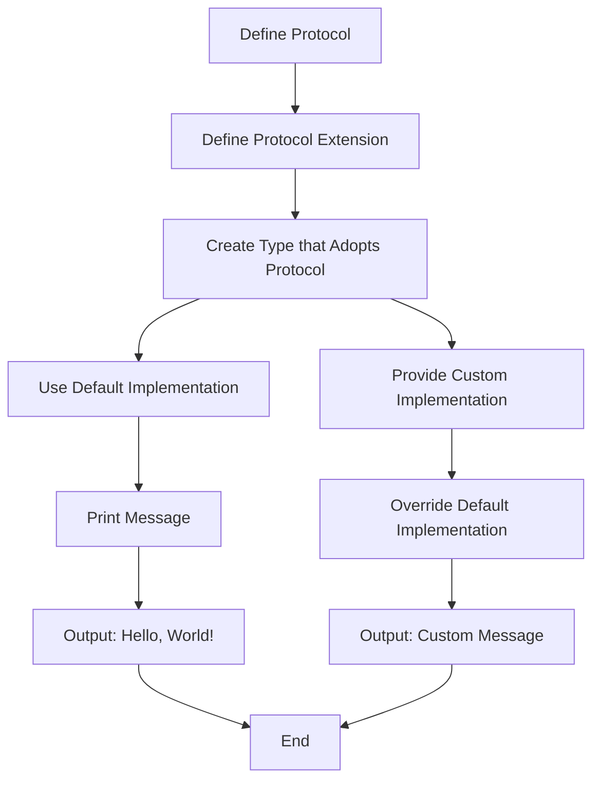

## Introduction
**Protocol extensions** are a powerful feature in Swift that allows developers to add default implementations to protocols. This feature is a game-changer for developers, as it enables them to write more concise and expressive code. In this section, we will explore the world of protocol extensions and their default implementations. We will delve into the concept of protocols, why they matter, and their real-world relevance.

Protocols are a fundamental concept in Swift, and they define a blueprint of methods, properties, and other requirements that a type must adopt. By using protocols, developers can write generic code that can work with multiple types, making it easier to write reusable and maintainable code. However, before Swift 2.0, protocols were limited in their ability to provide default implementations for their methods. This limitation was addressed with the introduction of protocol extensions, which allow developers to add default implementations to protocols.

> **Note:** Protocol extensions are not limited to adding default implementations. They can also be used to add computed properties, initializers, and static methods to protocols.

## Core Concepts
To understand protocol extensions and their default implementations, it's essential to grasp the core concepts of protocols and extensions. A **protocol** is a blueprint of methods, properties, and other requirements that a type must adopt. A **protocol extension** is a way to add new functionality to a protocol without modifying the original protocol definition.

In Swift, a protocol extension is defined using the `extension` keyword followed by the name of the protocol. The extension can contain default implementations for the protocol's methods, as well as other functionality such as computed properties, initializers, and static methods.

> **Tip:** When defining a protocol extension, it's essential to consider the scope of the extension. The extension can be defined globally, or it can be defined within a specific scope, such as a class or struct.

## How It Works Internally
When a type adopts a protocol, it must provide an implementation for all the required methods and properties defined in the protocol. However, if a protocol extension provides a default implementation for a method, the type that adopts the protocol can choose to use the default implementation or provide its own custom implementation.

The process of using a protocol extension is as follows:

1. Define a protocol that specifies the required methods and properties.
2. Define a protocol extension that provides default implementations for some or all of the required methods.
3. Create a type that adopts the protocol.
4. The type can choose to use the default implementations provided by the protocol extension or provide its own custom implementations.

> **Warning:** When using protocol extensions, it's essential to be aware of the potential for method overriding. If a type provides a custom implementation for a method that is also defined in a protocol extension, the custom implementation will take precedence over the default implementation.

## Code Examples
### Example 1: Basic Protocol Extension
```swift
// Define a protocol
protocol Printable {
    func printMessage()
}

// Define a protocol extension
extension Printable {
    func printMessage() {
        print("Hello, World!")
    }
}

// Create a type that adopts the protocol
class Greeter: Printable {
}

// Use the default implementation
let greeter = Greeter()
greeter.printMessage() // Output: Hello, World!
```

### Example 2: Protocol Extension with Computed Property
```swift
// Define a protocol
protocol Person {
    var name: String { get }
}

// Define a protocol extension
extension Person {
    var greeting: String {
        return "Hello, \(name)!"
    }
}

// Create a type that adopts the protocol
class Employee: Person {
    let name: String

    init(name: String) {
        self.name = name
    }
}

// Use the computed property
let employee = Employee(name: "John")
print(employee.greeting) // Output: Hello, John!
```

### Example 3: Protocol Extension with Initializer
```swift
// Define a protocol
protocol Vehicle {
    init(make: String, model: String)
}

// Define a protocol extension
extension Vehicle {
    init(make: String, model: String) {
        // Default implementation
    }
}

// Create a type that adopts the protocol
class Car: Vehicle {
    let make: String
    let model: String

    required init(make: String, model: String) {
        self.make = make
        self.model = model
    }
}

// Use the default initializer
let car = Car(make: "Toyota", model: "Camry")
print(car.make) // Output: Toyota
print(car.model) // Output: Camry
```

## Visual Diagram

The diagram illustrates the process of using a protocol extension. The flowchart starts with defining a protocol, followed by defining a protocol extension. The next step is to create a type that adopts the protocol, which can then use the default implementation or provide a custom implementation.

## Comparison
| Approach | Time Complexity | Space Complexity | Pros | Cons | Best For |
| --- | --- | --- | --- | --- | --- |
| Protocol Extension | O(1) | O(1) | Provides default implementations, promotes code reuse | Can lead to method overriding issues | Small to medium-sized projects |
| Custom Implementation | O(n) | O(n) | Provides custom implementations, avoids method overriding issues | Can lead to code duplication | Large-scale projects |
| Protocol Composition | O(n) | O(n) | Provides a way to compose protocols, promotes code reuse | Can lead to complexity issues | Complex projects |
| Inheritance | O(n) | O(n) | Provides a way to inherit behavior, promotes code reuse | Can lead to tight coupling issues | Object-oriented programming |

## Real-world Use Cases
1. **Apple's Swift Standard Library**: The Swift Standard Library uses protocol extensions to provide default implementations for various protocols, such as `Equatable` and `Comparable`.
2. **RxSwift**: RxSwift uses protocol extensions to provide default implementations for reactive programming protocols, such as `Observable` and `Observer`.
3. **SwiftUI**: SwiftUI uses protocol extensions to provide default implementations for view-related protocols, such as `View` and `ViewModifier`.

> **Interview:** Can you explain how protocol extensions work in Swift? How do they differ from custom implementations?

## Common Pitfalls
1. **Method Overriding Issues**: When using protocol extensions, it's easy to override the default implementation with a custom implementation. This can lead to unexpected behavior and method overriding issues.
2. **Code Duplication**: When using custom implementations, it's easy to duplicate code across multiple types. This can lead to maintenance issues and code rot.
3. **Tight Coupling**: When using inheritance, it's easy to create tight coupling between types. This can lead to rigid and inflexible code.
4. **Complexity Issues**: When using protocol composition, it's easy to create complex and hard-to-understand code. This can lead to debugging issues and code maintenance problems.

## Interview Tips
1. **What is a protocol extension?**: A protocol extension is a way to add default implementations to a protocol.
2. **How do protocol extensions differ from custom implementations?**: Protocol extensions provide default implementations, while custom implementations provide custom behavior.
3. **What are some common pitfalls when using protocol extensions?**: Method overriding issues, code duplication, tight coupling, and complexity issues.

## Key Takeaways
* Protocol extensions provide default implementations for protocols.
* Protocol extensions can be used to promote code reuse and avoid code duplication.
* Protocol extensions can lead to method overriding issues if not used carefully.
* Custom implementations can provide custom behavior, but can lead to code duplication.
* Protocol composition can provide a way to compose protocols, but can lead to complexity issues.
* Inheritance can provide a way to inherit behavior, but can lead to tight coupling issues.
* Time complexity: O(1) for protocol extensions, O(n) for custom implementations.
* Space complexity: O(1) for protocol extensions, O(n) for custom implementations.