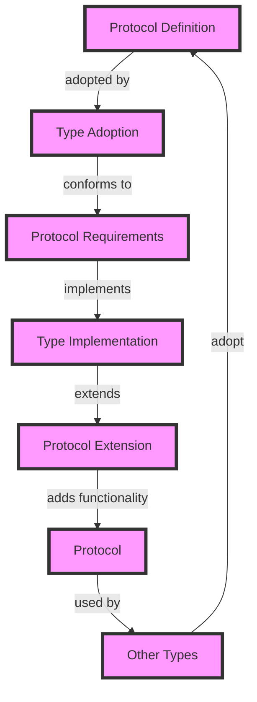

## Introduction
Protocols in Swift are a powerful tool for defining blueprints of methods and properties that can be adopted by classes, structs, and enums. They provide a way to specify a set of requirements that a type must conform to, without providing an implementation. This allows for more flexibility and extensibility in your code. In this section, we will explore the concept of protocols, their importance, and real-world relevance. 
> **Tip:** Protocols are often used to define interfaces or contracts that must be implemented by a type.

Protocols are essential in Swift because they enable you to define a common set of methods and properties that can be shared across multiple types. This promotes code reuse, modularity, and polymorphism. By using protocols, you can write more generic and flexible code that can work with different types, as long as they conform to the protocol.

## Core Concepts
A protocol in Swift is defined using the `protocol` keyword, followed by the name of the protocol and a set of requirements. These requirements can include methods, properties, and initializers. A type can adopt a protocol by using the `:` keyword after its definition, followed by the name of the protocol.

> **Note:** A type can adopt multiple protocols by listing them after the `:` keyword, separated by commas.

Here are some key terms related to protocols:
- **Protocol**: A blueprint of methods and properties that a type can adopt.
- **Conformance**: The process of adopting a protocol and implementing its requirements.
- **Protocol extension**: A way to add functionality to a protocol without modifying its original definition.

## How It Works Internally
When a type adopts a protocol, it must provide an implementation for all the requirements specified in the protocol. This is done by defining the methods and properties required by the protocol.

> **Warning:** If a type adopts a protocol but does not provide an implementation for all its requirements, the compiler will report an error.

Here is a step-by-step breakdown of how protocols work internally:
1. **Definition**: A protocol is defined using the `protocol` keyword, followed by its name and a set of requirements.
2. **Adoption**: A type adopts a protocol by using the `:` keyword after its definition, followed by the name of the protocol.
3. **Conformance**: The type must provide an implementation for all the requirements specified in the protocol.
4. **Protocol extension**: Additional functionality can be added to a protocol using a protocol extension.

## Code Examples
### Example 1: Basic Protocol
```swift
// Define a protocol
protocol Printable {
    func printMessage()
}

// Create a class that adopts the protocol
class Printer: Printable {
    func printMessage() {
        print("Hello, world!")
    }
}

// Create an instance of the class and call the protocol method
let printer = Printer()
printer.printMessage()  // Output: Hello, world!
```

### Example 2: Protocol with Properties
```swift
// Define a protocol with properties
protocol Person {
    var name: String { get set }
    var age: Int { get set }
}

// Create a struct that adopts the protocol
struct Employee: Person {
    var name: String
    var age: Int
    
    init(name: String, age: Int) {
        self.name = name
        self.age = age
    }
}

// Create an instance of the struct and access its properties
let employee = Employee(name: "John Doe", age: 30)
print(employee.name)  // Output: John Doe
print(employee.age)   // Output: 30
```

### Example 3: Advanced Protocol with Initializer
```swift
// Define a protocol with an initializer
protocol Vehicle {
    init(brand: String, model: String)
    func startEngine()
}

// Create a class that adopts the protocol
class Car: Vehicle {
    let brand: String
    let model: String
    
    required init(brand: String, model: String) {
        self.brand = brand
        self.model = model
    }
    
    func startEngine() {
        print("Vroom!")
    }
}

// Create an instance of the class and call the protocol method
let car = Car(brand: "Toyota", model: "Camry")
car.startEngine()  // Output: Vroom!
```

## Visual Diagram

This diagram illustrates the process of protocol definition, adoption, conformance, implementation, and extension. It shows how a type can adopt a protocol, implement its requirements, and extend the protocol with additional functionality.

## Comparison
| Approach | Time Complexity | Space Complexity | Pros | Cons | Best For |
|----------|----------------|-----------------|------|------|----------|
| Protocol | O(1) | O(1) | Flexible, extensible, promotes code reuse | Requires implementation of all requirements | Defining interfaces or contracts |
| Class | O(1) | O(1) | Provides a simple way to define a type | Limited flexibility, cannot be adopted by multiple types | Defining a single type with a fixed implementation |
| Struct | O(1) | O(1) | Provides a simple way to define a value type | Limited flexibility, cannot be adopted by multiple types | Defining a value type with a fixed implementation |
| Enum | O(1) | O(1) | Provides a simple way to define a set of values | Limited flexibility, cannot be adopted by multiple types | Defining a set of values with a fixed implementation |

## Real-world Use Cases
1. **Apple's UIKit**: UIKit is a framework that provides a set of protocols for defining user interface components, such as views, view controllers, and table view cells. These protocols provide a way to define the behavior and appearance of these components in a flexible and extensible way.
2. **SwiftUI**: SwiftUI is a framework that provides a set of protocols for defining user interface components, such as views, view models, and bindings. These protocols provide a way to define the behavior and appearance of these components in a flexible and extensible way.
3. **Core Data**: Core Data is a framework that provides a set of protocols for defining data models, such as entities, attributes, and relationships. These protocols provide a way to define the structure and behavior of these data models in a flexible and extensible way.

## Common Pitfalls
1. **Not implementing all protocol requirements**: If a type adopts a protocol but does not provide an implementation for all its requirements, the compiler will report an error.
2. **Not using protocol extensions**: Protocol extensions provide a way to add functionality to a protocol without modifying its original definition. Not using them can limit the flexibility and extensibility of your code.
3. **Not using protocols to define interfaces**: Protocols provide a way to define interfaces or contracts that must be implemented by a type. Not using them can limit the flexibility and extensibility of your code.
4. **Not using protocols to promote code reuse**: Protocols provide a way to promote code reuse by defining a set of methods and properties that can be shared across multiple types. Not using them can limit the flexibility and extensibility of your code.

## Interview Tips
1. **What is a protocol in Swift?**: A protocol in Swift is a blueprint of methods and properties that a type can adopt.
2. **How do you define a protocol in Swift?**: You define a protocol in Swift using the `protocol` keyword, followed by the name of the protocol and a set of requirements.
3. **What is the difference between a protocol and a class in Swift?**: A protocol is a blueprint of methods and properties that a type can adopt, while a class is a type that provides a specific implementation of these methods and properties.

> **Interview:** When answering interview questions about protocols, be sure to emphasize their importance in promoting code reuse, flexibility, and extensibility. Highlight the benefits of using protocols to define interfaces or contracts, and provide examples of how they can be used in real-world applications.

## Key Takeaways
* Protocols provide a way to define a set of methods and properties that a type can adopt.
* Protocols promote code reuse, flexibility, and extensibility.
* Protocols can be used to define interfaces or contracts that must be implemented by a type.
* Protocol extensions provide a way to add functionality to a protocol without modifying its original definition.
* Protocols can be adopted by multiple types, including classes, structs, and enums.
* Protocols can be used to define data models, such as entities, attributes, and relationships.
* The time complexity of using protocols is O(1), and the space complexity is O(1).
* Protocols are an essential part of Swift's type system, and are used extensively in Apple's frameworks and libraries.