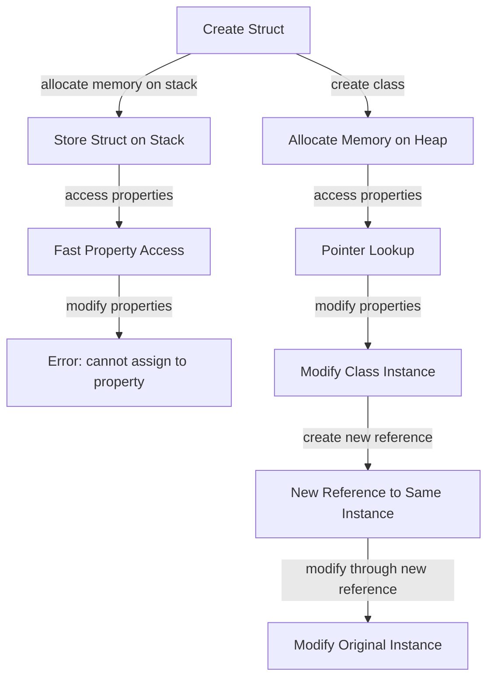

## Introduction
In **Swift**, one of the most fundamental decisions a developer must make when designing their data structures is whether to use a **struct** or a **class**. This decision is crucial because it affects the behavior of the data structure, including how it is stored, passed around, and modified. In this section, we will explore the differences between **structs** and **classes**, and discuss why every engineer needs to understand these concepts. 
> **Note:** In Swift, **structs** are **value types**, while **classes** are **reference types**. This means that when you assign a **struct** to a new variable, it creates a copy of the original value, whereas assigning a **class** to a new variable creates a new reference to the same instance.

## Core Concepts
To understand the differences between **structs** and **classes**, we need to define some key terms:
- **Value type**: A type that is stored as a value, rather than a reference. When you assign a value type to a new variable, it creates a copy of the original value.
- **Reference type**: A type that is stored as a reference to a value, rather than the value itself. When you assign a reference type to a new variable, it creates a new reference to the same instance.
- **Struct**: A **value type** in Swift that is used to define a collection of related values.
- **Class**: A **reference type** in Swift that is used to define a blueprint for creating objects.
> **Warning:** One common mistake is to use **classes** when **structs** would be more suitable, and vice versa. This can lead to unexpected behavior and bugs that are difficult to track down.

## How It Works Internally
When you create a **struct**, Swift allocates memory for the struct on the stack. This means that the struct is stored as a contiguous block of memory, and accessing its properties is very fast. On the other hand, when you create a **class**, Swift allocates memory for the class on the heap. This means that the class is stored as a separate block of memory, and accessing its properties requires a pointer lookup.
> **Tip:** In general, **structs** are more suitable for small, immutable data structures, while **classes** are more suitable for large, mutable data structures.

## Code Examples
### Example 1: Basic Struct
```swift
// Define a simple struct
struct Person {
    let name: String
    let age: Int
}

// Create an instance of the struct
let person = Person(name: "John", age: 30)

// Access the properties of the struct
print(person.name)  // prints "John"
print(person.age)   // prints 30

// Try to modify the struct
// person.name = "Jane"  // error: cannot assign to property: 'name' is a 'let' constant
```
### Example 2: Real-world Class
```swift
// Define a simple class
class BankAccount {
    var balance: Double

    init(initialBalance: Double) {
        balance = initialBalance
    }

    func deposit(amount: Double) {
        balance += amount
    }

    func withdraw(amount: Double) {
        balance -= amount
    }
}

// Create an instance of the class
let account = BankAccount(initialBalance: 1000)

// Access the properties of the class
print(account.balance)  // prints 1000.0

// Modify the class
account.deposit(amount: 500)
print(account.balance)  // prints 1500.0
```
### Example 3: Advanced Struct with Mutating Methods
```swift
// Define a struct with a mutating method
struct Point {
    var x: Double
    var y: Double

    mutating func translate(xOffset: Double, yOffset: Double) {
        x += xOffset
        y += yOffset
    }
}

// Create an instance of the struct
var point = Point(x: 0, y: 0)

// Modify the struct using the mutating method
point.translate(xOffset: 10, yOffset: 20)
print(point.x)  // prints 10.0
print(point.y)  // prints 20.0
```
> **Interview:** Can you explain the difference between a **struct** and a **class** in Swift? How would you decide which one to use in a given situation?

## Visual Diagram

The diagram shows the flow of creating a **struct** versus a **class**, and how they are stored and accessed in memory.

## Comparison
| Approach | Time Complexity | Space Complexity | Pros | Cons | Best For |
|----------|----------------|-----------------|------|------|----------|
| Struct | O(1) | O(1) | Fast, immutable, and thread-safe | Limited to small, fixed-size data | Small, immutable data structures |
| Class | O(1) | O(n) | Flexible, mutable, and can be subclassed | Slower, and may have memory leaks | Large, complex data structures |
| Enum | O(1) | O(1) | Type-safe, and can be used with switch statements | Limited to a fixed set of values | Type-safe, and fixed-set data structures |
| Protocol | O(1) | O(1) | Flexible, and can be used with multiple types | May have performance overhead | Flexible, and multiple-type data structures |

## Real-world Use Cases
- **Apple's Core Animation**: Uses **structs** to represent animation values, such as position and scale.
- **Facebook's Swift SDK**: Uses **classes** to represent complex data structures, such as user profiles and friend lists.
- **Uber's Swift API**: Uses **enums** to represent fixed-set values, such as ride types and payment methods.
> **Tip:** When working with real-world data structures, consider using **structs** for small, immutable data, and **classes** for large, mutable data.

## Common Pitfalls
- **Using classes when structs would be more suitable**: This can lead to unexpected behavior and bugs that are difficult to track down.
- **Using structs when classes would be more suitable**: This can lead to limitations in terms of flexibility and mutability.
- **Not using immutable structs**: This can lead to thread-safety issues and bugs that are difficult to track down.
- **Not using protocols**: This can lead to inflexible and rigid data structures that are difficult to work with.
> **Warning:** One common mistake is to use **classes** when **structs** would be more suitable, and vice versa. This can lead to unexpected behavior and bugs that are difficult to track down.

## Interview Tips
- **What is the difference between a struct and a class in Swift?**: A **struct** is a **value type**, while a **class** is a **reference type**.
- **How would you decide which one to use in a given situation?**: Consider using **structs** for small, immutable data, and **classes** for large, mutable data.
- **Can you explain the concept of immutability in Swift?**: Immutability refers to the idea that a data structure cannot be modified once it is created.
> **Interview:** Can you explain the difference between a **struct** and a **class** in Swift? How would you decide which one to use in a given situation?

## Key Takeaways
* **Structs** are **value types**, while **classes** are **reference types**.
* **Structs** are stored on the stack, while **classes** are stored on the heap.
* **Structs** are faster and more thread-safe, but less flexible than **classes**.
* **Classes** are more flexible and can be subclassed, but may have memory leaks and performance issues.
* **Enums** are type-safe and can be used with switch statements, but are limited to fixed-set values.
* **Protocols** are flexible and can be used with multiple types, but may have performance overhead.
* Immutability is an important concept in Swift, and can help prevent bugs and ensure thread-safety.
* When working with real-world data structures, consider using **structs** for small, immutable data, and **classes** for large, mutable data.