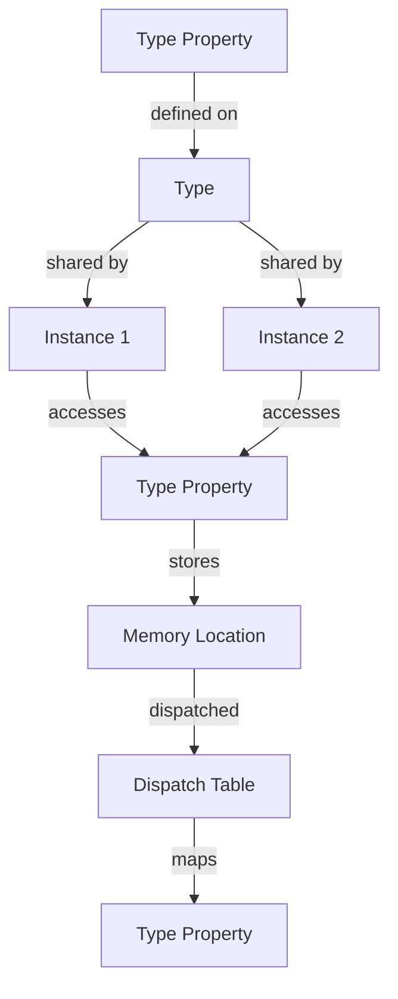

## Introduction
Type properties, also known as static properties or class properties, are a fundamental concept in object-oriented programming (OOP) in Swift. They are used to define properties that belong to a type itself, rather than to an instance of that type. In other words, type properties are shared by all instances of a class, and changes to a type property affect all instances. Type properties are useful when you need to store data that is common to all instances of a class, such as a constant or a cache. **Every engineer needs to know this** because it is a crucial concept in software development, and mastering it will help you write more efficient and scalable code.

## Core Concepts
A type property is a property that is defined on a type, such as a class, struct, or enum. There are two types of type properties in Swift: **static** and **class**. A static property is a property that is defined on a type and is shared by all instances of that type. A class property is a property that is defined on a class and is shared by all instances of that class, but can be overridden by subclasses. **Key terminology** includes:

* **Type property**: a property that belongs to a type itself, rather than to an instance of that type.
* **Static property**: a property that is defined on a type and is shared by all instances of that type.
* **Class property**: a property that is defined on a class and is shared by all instances of that class, but can be overridden by subclasses.

## How It Works Internally
When you define a type property, Swift creates a single instance of that property that is shared by all instances of the type. This means that changes to a type property affect all instances of the type. The internal implementation of type properties is based on the concept of **memory layout**, where the type property is stored in a separate memory location that is shared by all instances of the type. The **execution model** of type properties is based on the concept of **dispatch**, where the type property is accessed through a dispatch table that maps the type property to its memory location.

## Code Examples
### Example 1: Basic Usage
```swift
class Person {
    static let species = "Homo sapiens"
    let name: String

    init(name: String) {
        self.name = name
    }
}

let person = Person(name: "John")
print(Person.species) // prints "Homo sapiens"
```
### Example 2: Real-world Pattern
```swift
class Logger {
    static let logLevel: LogLevel = .debug
    enum LogLevel: Int {
        case debug = 0
        case info = 1
        case warning = 2
        case error = 3
    }

    static func log(_ message: String, level: LogLevel) {
        if level.rawValue >= logLevel.rawValue {
            print(message)
        }
    }
}

Logger.log("This is a debug message", level: .debug) // prints "This is a debug message"
```
### Example 3: Advanced Usage
```swift
class Vehicle {
    static let maxSpeed: Int = 120
    let speed: Int

    init(speed: Int) {
        self.speed = speed
    }

    static func isSpeedValid(_ speed: Int) -> Bool {
        return speed <= maxSpeed
    }
}

let vehicle = Vehicle(speed: 100)
print(Vehicle.isSpeedValid(vehicle.speed)) // prints true
```
> **Note:** In the above examples, we have used type properties to define constants and methods that are shared by all instances of a class.

## Visual Diagram

The above diagram illustrates the concept of type properties and how they are shared by all instances of a type. The type property is stored in a separate memory location that is dispatched through a dispatch table.

## Comparison
| Approach | Time Complexity | Space Complexity | Pros | Cons | Best For |
| --- | --- | --- | --- | --- | --- |
| Static Property | O(1) | O(1) | Easy to implement, shared by all instances | Can be overridden by subclasses | Constants, caches |
| Class Property | O(1) | O(1) | Can be overridden by subclasses, shared by all instances | More complex to implement | Inheritance, polymorphism |
| Instance Property | O(1) | O(n) | Each instance has its own copy, can be modified independently | More memory-intensive, not shared by instances | Unique data, mutable state |
| Global Variable | O(1) | O(1) | Shared by all code, easy to implement | Can be modified by any code, not thread-safe | Global constants, debug flags |

> **Warning:** Be careful when using type properties, as they can be modified by any instance of the type, which can lead to unexpected behavior.

## Real-world Use Cases
1. **Apple's Foundation framework**: uses type properties to define constants and methods that are shared by all instances of a class.
2. **Uber's API**: uses type properties to define API endpoints and methods that are shared by all instances of a class.
3. **Google's Firebase**: uses type properties to define constants and methods that are shared by all instances of a class.

> **Tip:** Use type properties to define constants and methods that are shared by all instances of a class, but be careful when modifying them, as it can affect all instances.

## Common Pitfalls
1. **Modifying a type property unexpectedly**: can affect all instances of the type.
```swift
class Person {
    static var age = 25
}

let person = Person()
Person.age = 30 // modifies the type property, affects all instances
```
2. **Using a type property as a cache**: can lead to unexpected behavior if not implemented correctly.
```swift
class Cache {
    static var cache = [String: String]()

    static func get(_ key: String) -> String? {
        return cache[key]
    }

    static func set(_ key: String, _ value: String) {
        cache[key] = value
    }
}

Cache.set("key", "value")
Cache.get("key") // returns "value"
```
3. **Not considering thread-safety**: can lead to unexpected behavior if not implemented correctly.
```swift
class Counter {
    static var count = 0

    static func increment() {
        count += 1
    }
}

Counter.increment() // modifies the type property, not thread-safe
```
4. **Not using type properties correctly**: can lead to unexpected behavior if not implemented correctly.
```swift
class Person {
    static let species = "Homo sapiens"
}

let person = Person()
person.species // error, species is a type property, not an instance property
```
> **Interview:** What is the difference between a static property and a class property? How would you use them in a real-world scenario?

## Interview Tips
1. **What is the difference between a static property and a class property?**: A static property is a property that is defined on a type and is shared by all instances of that type, while a class property is a property that is defined on a class and is shared by all instances of that class, but can be overridden by subclasses.
2. **How would you use type properties in a real-world scenario?**: I would use type properties to define constants and methods that are shared by all instances of a class, such as API endpoints, cache, or debug flags.
3. **What are some common pitfalls when using type properties?**: Some common pitfalls include modifying a type property unexpectedly, using a type property as a cache, not considering thread-safety, and not using type properties correctly.

## Key Takeaways
* Type properties are shared by all instances of a type.
* Static properties are defined on a type and are shared by all instances of that type.
* Class properties are defined on a class and are shared by all instances of that class, but can be overridden by subclasses.
* Type properties can be used to define constants and methods that are shared by all instances of a class.
* Modifying a type property can affect all instances of the type.
* Using a type property as a cache can lead to unexpected behavior if not implemented correctly.
* Not considering thread-safety can lead to unexpected behavior if not implemented correctly.
* Not using type properties correctly can lead to unexpected behavior if not implemented correctly.
* The time complexity of accessing a type property is O(1).
* The space complexity of a type property is O(1).
* Type properties are useful when you need to store data that is common to all instances of a class, such as a constant or a cache.