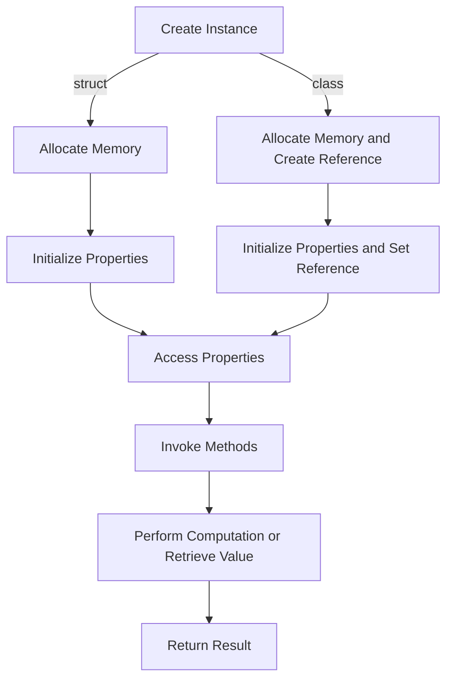

## Introduction
In Swift, `struct` and `class` are two fundamental building blocks for creating custom data types. While they share some similarities, there are key differences between them that determine when to use one over the other. In this section, we will explore the importance of understanding these differences and their real-world relevance. 
> **Note:** Mastering the distinction between `struct` and `class` is crucial for any Swift developer, as it directly impacts the performance, maintainability, and scalability of their code.

In real-world scenarios, the choice between `struct` and `class` can significantly affect the behavior and efficiency of an application. For instance, in a game development project, using `struct` for game objects can improve performance due to their value-type semantics, whereas using `class` for game objects can lead to unnecessary overhead due to their reference-type semantics.

## Core Concepts
To understand when to use `struct` vs `class`, it's essential to grasp the core concepts of value types and reference types.

*   **Value Types:** `struct`, `enum`, and tuples are value types. When you assign a value type to a new variable, a copy of the original value is created, and both variables are independent of each other.
*   **Reference Types:** `class` is a reference type. When you assign a reference type to a new variable, both variables point to the same instance in memory, and changes made through one variable affect the other.

> **Tip:** A simple way to remember the difference is that value types are like physical objects (e.g., a book), where copying the object creates a new, independent instance, whereas reference types are like maps (e.g., a map to a house), where copying the map only creates a new reference to the same location.

Key terminology includes:

*   **Immutability:** The ability of a type to remain unchanged after its creation.
*   **Mutability:** The ability of a type to be modified after its creation.
*   **Identity:** The unique characteristics of a type that distinguish it from others.

## How It Works Internally
When you create a `struct` or `class` in Swift, the compiler generates the necessary code to manage the memory and storage of the type. Here's a step-by-step breakdown of how it works:

1.  **Memory Allocation:** When you create an instance of a `struct` or `class`, the system allocates memory to store the instance's properties and data.
2.  **Initialization:** The `init` method is called to initialize the instance's properties and perform any necessary setup.
3.  **Property Access:** When you access a property of a `struct` or `class`, the system retrieves the value from memory or performs the necessary computation to calculate the value.
4.  **Method Invocation:** When you call a method on a `struct` or `class`, the system invokes the corresponding function, passing the instance's memory address as an implicit parameter (for `class` instances) or the instance itself (for `struct` instances).

> **Warning:** Be cautious when using `class` instances, as they can lead to unexpected behavior due to their reference-type semantics. For example, modifying a `class` instance through one variable can affect other variables that reference the same instance.

## Code Examples

### Example 1: Basic Struct Usage
```swift
// Define a simple struct
struct Point {
    var x: Int
    var y: Int
}

// Create an instance of the struct
var point = Point(x: 1, y: 2)

// Modify the instance
point.x = 10

// Create a new instance by copying the original
var newPoint = point

// Modify the new instance
newPoint.y = 20

// Print the values
print(point) // Output: Point(x: 10, y: 2)
print(newPoint) // Output: Point(x: 10, y: 20)
```

### Example 2: Real-World Class Usage
```swift
// Define a class to represent a bank account
class BankAccount {
    var balance: Double

    init(balance: Double) {
        self.balance = balance
    }

    func deposit(amount: Double) {
        balance += amount
    }

    func withdraw(amount: Double) {
        balance -= amount
    }
}

// Create an instance of the class
var account = BankAccount(balance: 1000)

// Deposit money into the account
account.deposit(amount: 500)

// Withdraw money from the account
account.withdraw(amount: 200)

// Print the final balance
print(account.balance) // Output: 1300.0
```

### Example 3: Advanced Struct Usage with Protocol Conformance
```swift
// Define a protocol for printable objects
protocol Printable {
    func printDescription()
}

// Define a struct that conforms to the protocol
struct Person: Printable {
    var name: String
    var age: Int

    func printDescription() {
        print("Name: \(name), Age: \(age)")
    }
}

// Create an instance of the struct
var person = Person(name: "John Doe", age: 30)

// Print the person's description
person.printDescription() // Output: Name: John Doe, Age: 30
```

## Visual Diagram

This diagram illustrates the process of creating instances of `struct` and `class` types, including memory allocation, initialization, property access, and method invocation.

## Comparison
| Type | Value/Reference | Immutability | Performance |
| --- | --- | --- | --- |
| struct | Value | Mutable/Immutable | Fast |
| class | Reference | Mutable/Immutable | Slow |
| enum | Value | Immutable | Fast |
| tuple | Value | Immutable | Fast |

When deciding between `struct` and `class`, consider the following factors:

*   **Immutability:** If the type should be immutable, use `struct` or `enum`. If the type should be mutable, use `struct` or `class`.
*   **Performance:** If high performance is critical, use `struct` or `enum`. If performance is not a concern, use `class`.
*   **Identity:** If the type should have a unique identity, use `class`. If the type should not have a unique identity, use `struct`.

> **Interview:** Be prepared to explain the differences between `struct` and `class`, including their value-type and reference-type semantics, and provide examples of when to use each.

## Real-world Use Cases

1.  **Game Development:** In game development, using `struct` for game objects can improve performance due to their value-type semantics.
2.  **Financial Applications:** In financial applications, using `class` for bank accounts can provide a unique identity for each account, making it easier to manage transactions and balances.
3.  **Scientific Computing:** In scientific computing, using `struct` for numerical computations can improve performance due to their value-type semantics and lack of overhead.

## Common Pitfalls

1.  **Modifying a Copy:** When using `struct`, modifying a copy of the original instance can lead to unexpected behavior if the original instance is not updated accordingly.
2.  **Sharing Instances:** When using `class`, sharing instances between multiple variables can lead to unexpected behavior if the instances are modified through one variable.
3.  **Using the Wrong Type:** Using the wrong type (e.g., `struct` instead of `class`) can lead to unexpected behavior or performance issues.
4.  **Not Considering Immutability:** Not considering immutability when designing a type can lead to unexpected behavior or performance issues.

> **Warning:** Be cautious when using `class` instances, as they can lead to unexpected behavior due to their reference-type semantics.

## Interview Tips

1.  **What is the difference between `struct` and `class`?**
    *   Weak answer: "They are both used to define custom types, but I'm not sure what the difference is."
    *   Strong answer: "The main difference between `struct` and `class` is their value-type and reference-type semantics. `struct` is a value type, which means that when you assign it to a new variable, a copy of the original value is created. `class` is a reference type, which means that when you assign it to a new variable, both variables point to the same instance in memory."
2.  **When would you use `struct` instead of `class`?**
    *   Weak answer: "I would use `struct` when I want to create a simple type with a few properties."
    *   Strong answer: "I would use `struct` when I want to create a type that should be immutable, or when I need high performance and don't care about the type having a unique identity. For example, in game development, using `struct` for game objects can improve performance due to their value-type semantics."
3.  **How do you handle shared instances of `class` types?**
    *   Weak answer: "I would just use a `struct` instead of a `class` to avoid the problem."
    *   Strong answer: "I would use a combination of `class` and `struct` to handle shared instances. For example, I would use a `class` to represent a bank account, and a `struct` to represent a transaction. This way, I can ensure that each transaction is a separate instance, while still maintaining a unique identity for each bank account."

## Key Takeaways

*   **Value-Type Semantics:** `struct` is a value type, which means that when you assign it to a new variable, a copy of the original value is created.
*   **Reference-Type Semantics:** `class` is a reference type, which means that when you assign it to a new variable, both variables point to the same instance in memory.
*   **Immutability:** Consider immutability when designing a type to ensure that it behaves correctly and performs well.
*   **Performance:** Use `struct` or `enum` for high-performance applications, and `class` for applications where performance is not a concern.
*   **Identity:** Use `class` when a unique identity is required for each instance, and `struct` when a unique identity is not required.
*   **Real-World Applications:** Use `struct` in game development, scientific computing, and other applications where high performance is critical. Use `class` in financial applications, social media platforms, and other applications where a unique identity is required for each instance.
*   **Common Pitfalls:** Be cautious when using `class` instances, as they can lead to unexpected behavior due to their reference-type semantics. Consider immutability and performance when designing a type to ensure that it behaves correctly and performs well.
*   **Interview Preparation:** Be prepared to explain the differences between `struct` and `class`, including their value-type and reference-type semantics, and provide examples of when to use each.