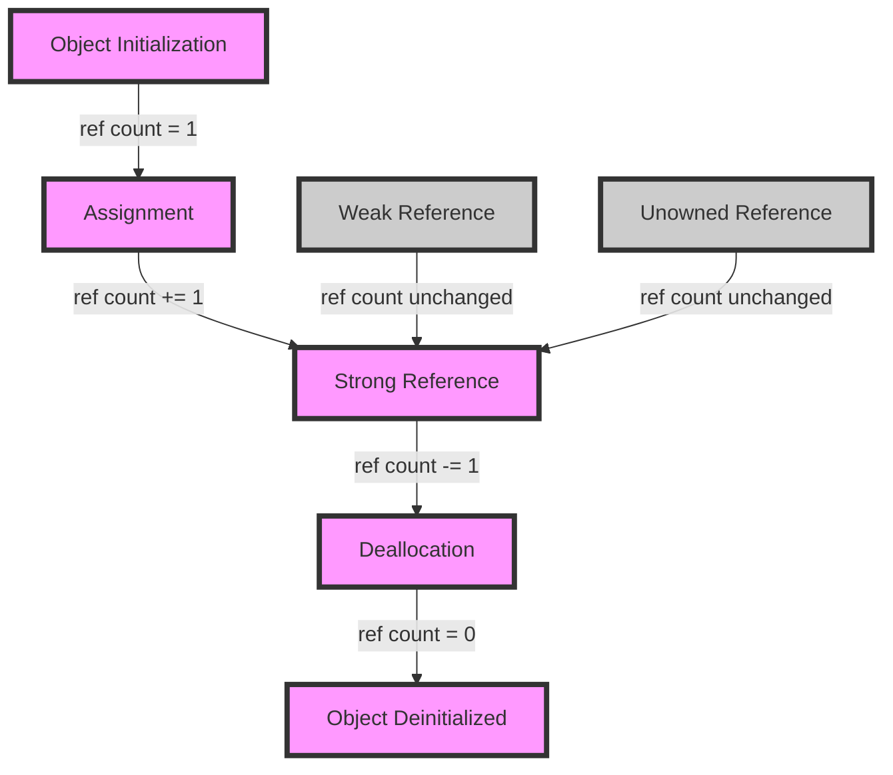

## Introduction
**Automatic Reference Counting (ARC)** is a memory management system used by Apple's Swift programming language to automatically manage the memory used by objects. It is a key feature of the Swift language that eliminates the need for manual memory management using pointers. ARC is designed to provide a safe and efficient way to manage memory, preventing common issues such as memory leaks and dangling pointers. In this section, we will explore the basics of ARC, its importance, and its real-world relevance.

Every engineer working with Swift needs to understand ARC, as it is a fundamental concept in the language. **> Note:** ARC is not a garbage collector, but rather a compile-time feature that inserts memory management code at specific points in the program. This means that ARC is much faster and more efficient than traditional garbage collection.

## Core Concepts
To understand ARC, we need to define some key terms:

* **Reference Counting**: a technique used to keep track of the number of references to an object. When the reference count reaches zero, the object is deallocated.
* **Strong Reference**: a reference that increases the reference count of an object.
* **Weak Reference**: a reference that does not increase the reference count of an object.
* **Unowned Reference**: a reference that does not increase the reference count of an object, but is not optional.

These concepts are crucial to understanding how ARC works. **> Tip:** Think of strong references as "owning" an object, while weak and unowned references are "borrowing" an object.

## How It Works Internally
ARC works by inserting memory management code at specific points in the program. Here is a step-by-step breakdown of how it works:

1. **Compilation**: The Swift compiler analyzes the code and inserts memory management code at specific points.
2. **Initialization**: When an object is initialized, its reference count is set to 1.
3. **Assignment**: When an object is assigned to a new variable, its reference count is incremented.
4. **Deallocation**: When an object's reference count reaches zero, it is deallocated.

**> Warning:** If an object is not properly deallocated, it can lead to memory leaks. This is why understanding ARC is crucial for writing efficient and safe code.

## Code Examples
Here are three complete and runnable code examples that demonstrate the use of ARC:

### Example 1: Basic Usage
```swift
class Person {
    let name: String
    init(name: String) {
        self.name = name
    }
    deinit {
        print("Person deinitialized")
    }
}

var person: Person? = Person(name: "John")
person = nil // Person deinitialized
```
This example demonstrates how ARC works with a simple class. When the `person` variable is set to `nil`, the `Person` object is deallocated.

### Example 2: Strong References
```swift
class Person {
    let name: String
    var friend: Person?
    init(name: String) {
        self.name = name
    }
    deinit {
        print("Person deinitialized")
    }
}

var person1: Person = Person(name: "John")
var person2: Person = Person(name: "Jane")
person1.friend = person2
person2.friend = person1
person1 = Person(name: "Bob") // Person deinitialized
person2 = Person(name: "Alice") // Person deinitialized
```
This example demonstrates how strong references work. When `person1` and `person2` reference each other, they create a strong reference cycle, which prevents them from being deallocated.

### Example 3: Weak References
```swift
class Person {
    let name: String
    weak var friend: Person?
    init(name: String) {
        self.name = name
    }
    deinit {
        print("Person deinitialized")
    }
}

var person1: Person = Person(name: "John")
var person2: Person = Person(name: "Jane")
person1.friend = person2
person2 = Person(name: "Alice") // Person deinitialized
```
This example demonstrates how weak references work. When `person2` is reassigned, the weak reference to it is broken, and the `Person` object is deallocated.

## Visual Diagram

This diagram illustrates the flow of ARC. It shows how objects are initialized, assigned, and deallocated, and how strong, weak, and unowned references affect the reference count.

## Comparison
| Approach | Time Complexity | Space Complexity | Pros | Cons | Best For |
| --- | --- | --- | --- | --- | --- |
| ARC | O(1) | O(1) | Efficient, safe | Can be complex to understand | Most Swift applications |
| Garbage Collection | O(n) | O(n) | Easy to implement | Can be slow, inefficient | Legacy systems, non-real-time applications |
| Manual Memory Management | O(1) | O(1) | Fast, efficient | Error-prone, difficult to implement | Low-level programming, systems programming |
| Smart Pointers | O(1) | O(1) | Efficient, safe | Can be complex to understand | C++ applications, systems programming |

**> Interview:** What is the main difference between ARC and garbage collection? Answer: ARC is a compile-time feature that inserts memory management code, while garbage collection is a runtime feature that periodically frees memory.

## Real-world Use Cases
Here are three production examples of ARC in use:

* **Apple's iOS**: Apple's iOS operating system uses ARC to manage memory in Swift applications.
* **Uber's iOS App**: Uber's iOS app uses ARC to manage memory and prevent crashes.
* **Airbnb's iOS App**: Airbnb's iOS app uses ARC to manage memory and improve performance.

**> Tip:** When working on a large-scale application, use ARC to manage memory and prevent memory leaks.

## Common Pitfalls
Here are four specific mistakes that engineers make when using ARC:

* **Retain Cycles**: When two or more objects strongly reference each other, creating a retain cycle that prevents them from being deallocated.
* **Weak Reference Issues**: When a weak reference is not properly set up, causing the object to be deallocated prematurely.
* **Unowned Reference Issues**: When an unowned reference is not properly set up, causing the object to be deallocated prematurely.
* **Manual Memory Management**: When manual memory management is used instead of ARC, leading to memory leaks and crashes.

**> Warning:** When using ARC, make sure to properly set up weak and unowned references to prevent retain cycles and memory leaks.

## Interview Tips
Here are three common interview questions on ARC, along with weak and strong answers:

* **What is ARC?**: Weak answer: "ARC is a garbage collector." Strong answer: "ARC is a compile-time feature that inserts memory management code to manage memory in Swift applications."
* **How does ARC work?**: Weak answer: "ARC works by periodically freeing memory." Strong answer: "ARC works by inserting memory management code at specific points in the program, such as when an object is initialized or assigned."
* **What is the difference between ARC and garbage collection?**: Weak answer: "ARC and garbage collection are the same thing." Strong answer: "ARC is a compile-time feature that inserts memory management code, while garbage collection is a runtime feature that periodically frees memory."

**> Note:** When answering interview questions on ARC, make sure to emphasize the compile-time nature of ARC and its efficiency and safety benefits.

## Key Takeaways
Here are ten key takeaways from this section on ARC:

* **ARC is a compile-time feature**: ARC inserts memory management code at specific points in the program.
* **ARC is efficient and safe**: ARC prevents memory leaks and crashes by managing memory automatically.
* **Strong references increase the reference count**: Strong references increase the reference count of an object, preventing it from being deallocated.
* **Weak references do not increase the reference count**: Weak references do not increase the reference count of an object, allowing it to be deallocated if necessary.
* **Unowned references do not increase the reference count**: Unowned references do not increase the reference count of an object, allowing it to be deallocated if necessary.
* **ARC is not a garbage collector**: ARC is a compile-time feature that inserts memory management code, not a runtime feature that periodically frees memory.
* **ARC is faster than garbage collection**: ARC is faster and more efficient than garbage collection because it inserts memory management code at compile-time.
* **ARC is safer than manual memory management**: ARC is safer than manual memory management because it prevents memory leaks and crashes.
* **ARC is the default memory management system in Swift**: ARC is the default memory management system in Swift, and it should be used for most applications.
* **Understanding ARC is crucial for writing efficient and safe code**: Understanding ARC is crucial for writing efficient and safe code in Swift, and it is an important topic for any Swift developer to master.