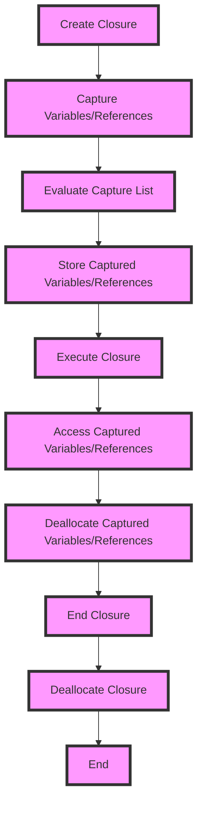

## Introduction
**Capture Lists in Closures** are a fundamental concept in Swift programming, and understanding them is crucial for building robust and memory-efficient applications. A capture list is a way to specify how a closure captures its surrounding context, including variables and references. This concept is essential in Swift because it helps prevent **memory leaks** and **retain cycles**, which can lead to performance issues and crashes. In real-world scenarios, capture lists are used extensively in iOS and macOS development, particularly when working with asynchronous programming, delegates, and notifications.

> **Note:** Capture lists are not unique to Swift; other programming languages, such as C++ and Java, have similar concepts. However, Swift's capture list syntax and behavior are distinct and require a thorough understanding.

## Core Concepts
To grasp capture lists, you need to understand the following key concepts:

* **Closures**: A closure is a self-contained block of code that can capture its surrounding context, including variables and references.
* **Capture**: When a closure captures a variable or reference, it stores a reference to that variable or reference, allowing the closure to access and modify it even after the surrounding scope has ended.
* **Strong Reference**: A strong reference is a reference that prevents the referenced object from being deallocated. In Swift, strong references are the default behavior for variables and properties.
* **Weak Reference**: A weak reference is a reference that does not prevent the referenced object from being deallocated. Weak references are used to avoid retain cycles and memory leaks.
* **Unowned Reference**: An unowned reference is a reference that does not prevent the referenced object from being deallocated, but it assumes that the referenced object will not be deallocated during the lifetime of the closure.

> **Warning:** Using strong references in capture lists can lead to retain cycles and memory leaks, which can cause significant performance issues and crashes.

## How It Works Internally
When a closure captures a variable or reference, Swift creates a strong reference to that variable or reference by default. However, you can modify this behavior by using a capture list. A capture list is a list of variables or references that are captured by the closure, along with the type of reference (strong, weak, or unowned) that should be used.

Here's a step-by-step breakdown of how capture lists work:

1. The closure is created and captures its surrounding context, including variables and references.
2. The capture list is evaluated, and the type of reference (strong, weak, or unowned) is determined for each captured variable or reference.
3. The closure stores the captured variables or references, using the specified type of reference.
4. When the closure is executed, it accesses the captured variables or references using the stored references.

> **Tip:** Use weak references in capture lists when the referenced object has a shorter lifetime than the closure, and use unowned references when the referenced object has the same lifetime as the closure.

## Code Examples
### Example 1: Basic Capture List
```swift
class Person {
    let name: String
    var age: Int

    init(name: String, age: Int) {
        self.name = name
        self.age = age
    }

    func printAge() {
        print("My age is \(age)")
    }
}

let person = Person(name: "John", age: 30)

let closure = { [weak person] in
    person?.printAge()
}

closure()
```
In this example, the closure captures the `person` variable using a weak reference. This ensures that the closure does not prevent the `person` object from being deallocated.

### Example 2: Real-World Pattern
```swift
class ViewController: UIViewController {
    var timer: Timer?

    override func viewDidLoad() {
        super.viewDidLoad()

        timer = Timer.scheduledTimer(withTimeInterval: 1.0, repeats: true) { [weak self] timer in
            self?.updateTimer()
        }
    }

    func updateTimer() {
        print("Timer updated")
    }
}
```
In this example, the `timer` closure captures the `self` reference using a weak reference. This ensures that the closure does not prevent the `ViewController` object from being deallocated when the timer is invalidated.

### Example 3: Advanced Capture List
```swift
class Node {
    let value: Int
    var next: Node?

    init(value: Int) {
        self.value = value
        self.next = nil
    }
}

let node1 = Node(value: 1)
let node2 = Node(value: 2)
node1.next = node2

let closure = { [unowned node1] in
    print("Node 1 value: \(node1.value)")
}

closure()
```
In this example, the closure captures the `node1` variable using an unowned reference. This assumes that the `node1` object will not be deallocated during the lifetime of the closure.

## Visual Diagram

This diagram illustrates the process of creating a closure, capturing variables/references, evaluating the capture list, storing captured variables/references, executing the closure, accessing captured variables/references, deallocating captured variables/references, and ending the closure.

## Comparison
| Approach | Time Complexity | Space Complexity | Pros | Cons | Best For |
| --- | --- | --- | --- | --- | --- |
| Strong Reference | O(1) | O(n) | Easy to implement, no additional overhead | Can lead to retain cycles and memory leaks | Simple closures with short lifetimes |
| Weak Reference | O(1) | O(n) | Prevents retain cycles and memory leaks, easy to implement | Can lead to unexpected behavior if not used carefully | Closures with long lifetimes, asynchronous programming |
| Unowned Reference | O(1) | O(n) | Prevents retain cycles and memory leaks, assumes referenced object has same lifetime as closure | Can lead to crashes if referenced object is deallocated prematurely | Closures with same lifetime as referenced object |

## Real-world Use Cases
1. **iOS Development**: Capture lists are used extensively in iOS development, particularly when working with asynchronous programming, delegates, and notifications.
2. **macOS Development**: Capture lists are also used in macOS development, particularly when working with asynchronous programming, delegates, and notifications.
3. **SwiftUI**: Capture lists are used in SwiftUI to handle asynchronous programming, such as fetching data from a network or updating the UI.

## Common Pitfalls
1. **Retain Cycles**: Using strong references in capture lists can lead to retain cycles and memory leaks.
2. **Unexpected Behavior**: Using weak references in capture lists can lead to unexpected behavior if not used carefully.
3. **Crashes**: Using unowned references in capture lists can lead to crashes if the referenced object is deallocated prematurely.
4. **Memory Leaks**: Using strong references in capture lists can lead to memory leaks if not used carefully.

> **Interview:** What is the difference between a weak reference and an unowned reference in Swift? How would you use them in a capture list?

## Interview Tips
1. **Understand the Basics**: Make sure you understand the basics of capture lists, including strong, weak, and unowned references.
2. **Real-World Scenarios**: Be prepared to answer questions about real-world scenarios, such as using capture lists in iOS development or SwiftUI.
3. **Common Pitfalls**: Be prepared to answer questions about common pitfalls, such as retain cycles and memory leaks.

## Key Takeaways
* **Use Weak References**: Use weak references in capture lists to prevent retain cycles and memory leaks.
* **Use Unowned References**: Use unowned references in capture lists when the referenced object has the same lifetime as the closure.
* **Avoid Strong References**: Avoid using strong references in capture lists, as they can lead to retain cycles and memory leaks.
* **Understand the Basics**: Understand the basics of capture lists, including strong, weak, and unowned references.
* **Real-World Scenarios**: Be prepared to answer questions about real-world scenarios, such as using capture lists in iOS development or SwiftUI.
* **Common Pitfalls**: Be prepared to answer questions about common pitfalls, such as retain cycles and memory leaks.
* **Time Complexity**: The time complexity of using capture lists is O(1), as it only involves storing and accessing captured variables/references.
* **Space Complexity**: The space complexity of using capture lists is O(n), as it involves storing captured variables/references.