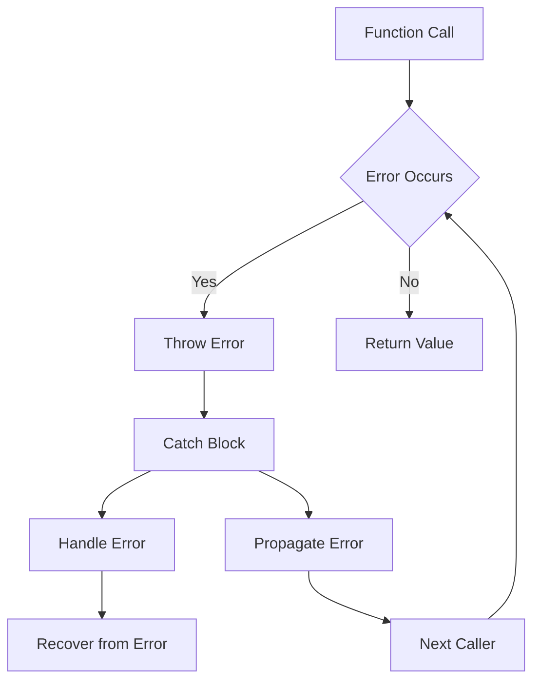

## Introduction
Error handling is a crucial aspect of software development, allowing developers to anticipate and manage potential errors that may occur during the execution of their code. In Swift, error handling is achieved through the use of `throws`, `try`, `catch`, `try?`, and `try!`. These keywords enable developers to write robust and reliable code that can handle errors in a predictable and controlled manner. **Error handling is essential** in real-world applications, as it helps prevent crashes, data corruption, and other unexpected behavior. Every engineer needs to understand error handling to write high-quality, production-ready code.

## Core Concepts
Error handling in Swift involves several key concepts:
- **Error**: An error is an instance of a type that conforms to the `Error` protocol, which represents a problem that occurred during the execution of a function or method.
- **Throwing**: A function or method can throw an error using the `throws` keyword, indicating that it may fail and return an error instead of a normal value.
- **Try**: The `try` keyword is used to call a function or method that throws an error, allowing the caller to handle the error if it occurs.
- **Catch**: The `catch` keyword is used to handle an error that was thrown by a function or method, allowing the caller to recover from the error and continue executing.
- **Try?**: The `try?` keyword is used to call a function or method that throws an error, but returns an optional value instead of throwing the error.
- **Try!**: The `try!` keyword is used to call a function or method that throws an error, but assumes that the error will not occur and crashes if it does.

## How It Works Internally
When a function or method throws an error, the following steps occur:
1. The function or method creates an instance of an error type that conforms to the `Error` protocol.
2. The function or method throws the error using the `throws` keyword.
3. The caller of the function or method catches the error using the `catch` keyword.
4. The caller can then handle the error and recover from it, or propagate it to the next caller.

> **Note:** Error handling in Swift is based on a concept called "deferred error handling", which means that errors are not handled immediately when they occur, but rather are propagated up the call stack until they are caught by a `catch` block.

## Code Examples
### Example 1: Basic Error Handling
```swift
// Define a custom error type
enum MathError: Error {
    case divisionByZero
}

// Define a function that throws an error
func divide(_ a: Int, _ b: Int) throws -> Int {
    if b == 0 {
        throw MathError.divisionByZero
    }
    return a / b
}

// Call the function and catch the error
do {
    let result = try divide(10, 0)
    print("Result: \(result)")
} catch {
    print("Error: \(error)")
}
```
### Example 2: Real-World Pattern
```swift
// Define a function that throws an error
func readFile(_ filename: String) throws -> String {
    // Simulate a file read operation
    if filename == "nonexistent" {
        throw NSError(domain: "FileError", code: 404, userInfo: nil)
    }
    return "File contents"
}

// Call the function and catch the error
do {
    let contents = try readFile("example.txt")
    print("File contents: \(contents)")
} catch let error as NSError {
    print("Error: \(error.domain) \(error.code)")
}
```
### Example 3: Advanced Error Handling
```swift
// Define a custom error type with a nested error
enum NetworkError: Error {
    case connectionFailed(Error)
    case timeout
}

// Define a function that throws a nested error
func fetchData(_ url: URL) throws -> Data {
    // Simulate a network request
    if url.absoluteString == "https://example.com/nonexistent" {
        throw NetworkError.connectionFailed(NSError(domain: "NetworkError", code: 404, userInfo: nil))
    }
    return Data()
}

// Call the function and catch the nested error
do {
    let data = try fetchData(URL(string: "https://example.com/nonexistent")!)
    print("Data: \(data)")
} catch NetworkError.connectionFailed(let error) {
    print("Connection failed: \(error)")
} catch {
    print("Error: \(error)")
}
```
> **Warning:** Using `try!` can lead to crashes if the error is not handled properly. It is recommended to use `try` or `try?` instead.

## Visual Diagram

The diagram illustrates the flow of error handling in Swift, from the initial function call to the handling of the error by the caller.

## Comparison
| Approach | Time Complexity | Space Complexity | Pros | Cons | Best For |
| --- | --- | --- | --- | --- | --- |
| Try-Catch | O(1) | O(1) | Simple to use, flexible | Can be slow, verbose | General error handling |
| Try? | O(1) | O(1) | Convenient, concise | Limited error handling | Optional values, simple errors |
| Try! | O(1) | O(1) | Fast, concise | Crashes if error occurs | Performance-critical code, no error handling |
| Deferred Error Handling | O(n) | O(n) | Flexible, composable | Complex, error-prone | Large-scale applications, complex error handling |

> **Tip:** Use `try` and `catch` for general error handling, `try?` for optional values and simple errors, and `try!` for performance-critical code with no error handling.

## Real-world Use Cases
1. **Apple's Swift Documentation**: Apple uses error handling extensively in their Swift documentation, including examples of `try`, `catch`, and `try?`.
2. **GitHub's Swift Client**: GitHub's Swift client uses error handling to handle API errors and exceptions, including `try` and `catch` blocks.
3. **Dropbox's Swift SDK**: Dropbox's Swift SDK uses error handling to handle file upload and download errors, including `try?` and `try!` blocks.

## Common Pitfalls
1. **Not handling errors**: Failing to handle errors can lead to crashes and unexpected behavior.
```swift
// WRONG
func divide(_ a: Int, _ b: Int) -> Int {
    return a / b
}

// RIGHT
func divide(_ a: Int, _ b: Int) throws -> Int {
    if b == 0 {
        throw MathError.divisionByZero
    }
    return a / b
}
```
2. **Using try! excessively**: Using `try!` excessively can lead to crashes and make error handling more difficult.
```swift
// WRONG
func fetchData(_ url: URL) -> Data {
    return try! Data(contentsOf: url)
}

// RIGHT
func fetchData(_ url: URL) throws -> Data {
    return try Data(contentsOf: url)
}
```
3. **Not propagating errors**: Failing to propagate errors can lead to silent failures and make debugging more difficult.
```swift
// WRONG
func fetchData(_ url: URL) -> Data? {
    do {
        return try Data(contentsOf: url)
    } catch {
        return nil
    }
}

// RIGHT
func fetchData(_ url: URL) throws -> Data {
    return try Data(contentsOf: url)
}
```
4. **Not handling nested errors**: Failing to handle nested errors can lead to unexpected behavior and make error handling more difficult.
```swift
// WRONG
func fetchData(_ url: URL) throws -> Data {
    return try Data(contentsOf: url)
}

// RIGHT
func fetchData(_ url: URL) throws -> Data {
    do {
        return try Data(contentsOf: url)
    } catch let error as NSError {
        throw NetworkError.connectionFailed(error)
    }
}
```
> **Interview:** Can you explain the difference between `try`, `try?`, and `try!` in Swift?

## Interview Tips
1. **Be prepared to explain error handling concepts**: Be prepared to explain the basics of error handling, including `try`, `catch`, and `throw`.
2. **Know how to handle errors in Swift**: Know how to handle errors in Swift, including using `try`, `catch`, and `try?`.
3. **Understand the trade-offs of different error handling approaches**: Understand the trade-offs of different error handling approaches, including `try`, `try?`, and `try!`.

## Key Takeaways
* **Error handling is essential** in Swift development.
* **Try-Catch** is the most common error handling approach in Swift.
* **Try?** is a convenient and concise way to handle optional values and simple errors.
* **Try!** is a fast and concise way to handle errors, but can lead to crashes if not used carefully.
* **Deferred error handling** is a flexible and composable approach to error handling, but can be complex and error-prone.
* **Error handling is a critical aspect of software development**, and should be taken seriously.
* **Swift's error handling system** is based on a concept called "deferred error handling", which means that errors are not handled immediately when they occur, but rather are propagated up the call stack until they are caught by a `catch` block.
* **Error handling should be used consistently throughout an application**, to ensure that errors are handled predictably and reliably.