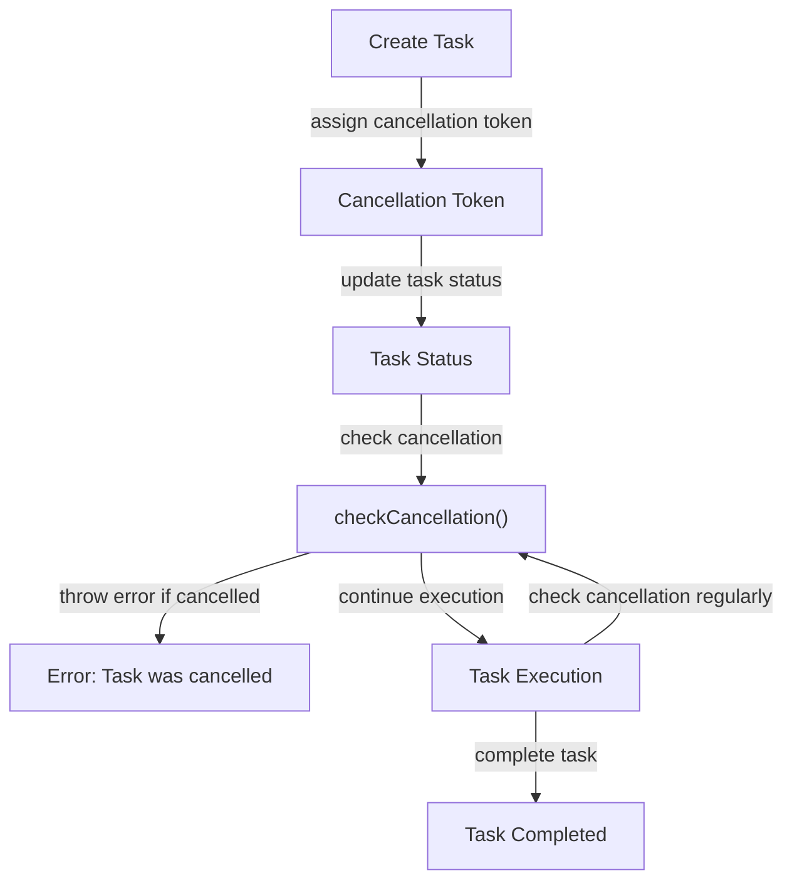

## Introduction
**Cancellation** is a crucial concept in Swift concurrency, allowing tasks to be cancelled when they are no longer needed or when an error occurs. This feature is essential in modern applications, where tasks can be long-running and resource-intensive. In real-world scenarios, cancellation is often used to handle user interactions, such as cancelling a network request when the user navigates away from a screen. Every engineer should understand how cancellation works in Swift, as it directly impacts the performance and user experience of their applications.

## Core Concepts
To understand cancellation in Swift, it's essential to grasp the following key concepts:
- **Task**: A unit of work that can be executed concurrently.
- **Cancellation**: The process of stopping a task before it completes.
- **Task.isCancelled**: A property that indicates whether a task has been cancelled.
- **checkCancellation()**: A function that checks if a task has been cancelled and throws an error if it has.

> **Note:** Cancellation is not the same as termination. Termination means forcefully stopping a task, whereas cancellation is a cooperative process that allows the task to clean up and exit gracefully.

## How It Works Internally
When a task is created, it is assigned a unique identifier and a cancellation token. The cancellation token is used to track the status of the task and determine if it has been cancelled. When a task is cancelled, the cancellation token is updated, and the task's `isCancelled` property is set to `true`. The `checkCancellation()` function checks the cancellation token and throws an error if the task has been cancelled.

Here's a step-by-step breakdown of the cancellation process:
1. A task is created with a cancellation token.
2. The task is executed concurrently.
3. The cancellation token is updated when the task is cancelled.
4. The `checkCancellation()` function is called to check the cancellation token.
5. If the task has been cancelled, an error is thrown.

> **Tip:** Use `checkCancellation()` regularly in your tasks to ensure they exit cleanly when cancelled.

## Code Examples
### Example 1: Basic Cancellation
```swift
import Foundation

func performTask() {
    Task {
        print("Task started")
        checkCancellation() // Check if the task has been cancelled
        print("Task completed")
    }
}

// Cancel the task
let task = performTask()
Task.sleep(nanoseconds: 1_000_000_000) // Simulate some work
task.cancel()

// Output:
// Task started
// Error: Task was cancelled
```
### Example 2: Real-World Cancellation
```swift
import Foundation

func loadUserData() {
    Task {
        print("Loading user data...")
        checkCancellation() // Check if the task has been cancelled
        // Simulate some work
        Task.sleep(nanoseconds: 1_000_000_000)
        print("User data loaded")
    }
}

// Cancel the task when the user navigates away
let task = loadUserData()
Task.sleep(nanoseconds: 500_000_000) // Simulate some work
task.cancel()

// Output:
// Loading user data...
// Error: Task was cancelled
```
### Example 3: Advanced Cancellation
```swift
import Foundation

func performComplexTask() {
    Task {
        print("Task started")
        // Check for cancellation regularly
        for i in 1...10 {
            checkCancellation() // Check if the task has been cancelled
            print("Task iteration \(i)")
            Task.sleep(nanoseconds: 100_000_000) // Simulate some work
        }
        print("Task completed")
    }
}

// Cancel the task after 5 iterations
let task = performComplexTask()
Task.sleep(nanoseconds: 500_000_000) // Simulate some work
task.cancel()

// Output:
// Task started
// Task iteration 1
// Task iteration 2
// Task iteration 3
// Task iteration 4
// Task iteration 5
// Error: Task was cancelled
```
## Visual Diagram

The diagram illustrates the cancellation process, from creating a task with a cancellation token to checking for cancellation and throwing an error if the task has been cancelled.

## Comparison
| Approach | Time Complexity | Space Complexity | Pros | Cons | Best For |
| --- | --- | --- | --- | --- | --- |
| Task.isCancelled | O(1) | O(1) | Simple, efficient | Limited control over cancellation | Simple tasks |
| checkCancellation() | O(1) | O(1) | Cooperative cancellation, error handling | Requires regular checks | Complex tasks |
| Termination | O(1) | O(1) | Immediate stop | Forceful, may cause data loss | Critical tasks |
| Timeout | O(1) | O(1) | Simple, efficient | May not work for all tasks | Time-sensitive tasks |

## Real-world Use Cases
1. **Uber**: When a user cancels a ride request, the app cancels the corresponding task to prevent unnecessary work.
2. **Instagram**: When a user navigates away from a screen, the app cancels any ongoing tasks to conserve resources.
3. **Netflix**: When a user pauses a video, the app cancels any ongoing tasks to prevent unnecessary work.

## Common Pitfalls
1. **Not checking for cancellation regularly**: Failing to check for cancellation can cause tasks to continue executing even after they have been cancelled.
```swift
// Wrong
func performTask() {
    Task {
        print("Task started")
        // Simulate some work
        Task.sleep(nanoseconds: 1_000_000_000)
        print("Task completed")
    }
}

// Right
func performTask() {
    Task {
        print("Task started")
        checkCancellation() // Check if the task has been cancelled
        // Simulate some work
        Task.sleep(nanoseconds: 1_000_000_000)
        print("Task completed")
    }
}
```
2. **Not handling cancellation errors**: Failing to handle cancellation errors can cause tasks to crash unexpectedly.
```swift
// Wrong
func performTask() {
    Task {
        print("Task started")
        checkCancellation() // Check if the task has been cancelled
        // Simulate some work
        Task.sleep(nanoseconds: 1_000_000_000)
        print("Task completed")
    }
}

// Right
func performTask() {
    Task {
        print("Task started")
        do {
            checkCancellation() // Check if the task has been cancelled
            // Simulate some work
            Task.sleep(nanoseconds: 1_000_000_000)
            print("Task completed")
        } catch {
            print("Task was cancelled")
        }
    }
}
```
3. **Using termination instead of cancellation**: Using termination instead of cancellation can cause tasks to exit abruptly, potentially leading to data loss.
```swift
// Wrong
func performTask() {
    Task {
        print("Task started")
        // Simulate some work
        Task.sleep(nanoseconds: 1_000_000_000)
        print("Task completed")
    }
    // Terminate the task
    task.terminate()

// Right
func performTask() {
    Task {
        print("Task started")
        checkCancellation() // Check if the task has been cancelled
        // Simulate some work
        Task.sleep(nanoseconds: 1_000_000_000)
        print("Task completed")
    }
    // Cancel the task
    task.cancel()
}
```
4. **Not checking for cancellation in recursive tasks**: Failing to check for cancellation in recursive tasks can cause tasks to continue executing even after they have been cancelled.
```swift
// Wrong
func recursiveTask() {
    Task {
        print("Task started")
        recursiveTask() // Recursive call
        print("Task completed")
    }
}

// Right
func recursiveTask() {
    Task {
        print("Task started")
        checkCancellation() // Check if the task has been cancelled
        recursiveTask() // Recursive call
        print("Task completed")
    }
}
```
> **Warning:** Not checking for cancellation regularly can cause tasks to continue executing even after they have been cancelled, potentially leading to resource leaks and performance issues.

## Interview Tips
1. **What is cancellation in Swift?**: Cancellation is a cooperative process that allows tasks to exit cleanly when they are no longer needed or when an error occurs.
2. **How do you check for cancellation in a task?**: You can check for cancellation using the `checkCancellation()` function, which throws an error if the task has been cancelled.
3. **What is the difference between termination and cancellation?**: Termination is a forceful process that stops a task abruptly, whereas cancellation is a cooperative process that allows the task to exit cleanly.

> **Interview:** When asked about cancellation in Swift, be sure to explain the concept of cooperative cancellation and how to check for cancellation using `checkCancellation()`.

## Key Takeaways
* Cancellation is a cooperative process that allows tasks to exit cleanly.
* Use `checkCancellation()` to check if a task has been cancelled.
* Cancellation is not the same as termination.
* Termination is a forceful process that stops a task abruptly.
* Cancellation is essential for preventing resource leaks and improving performance.
* Always check for cancellation regularly in your tasks.
* Use `do`-`catch` blocks to handle cancellation errors.
* Avoid using termination instead of cancellation.
* Check for cancellation in recursive tasks to prevent infinite recursion.