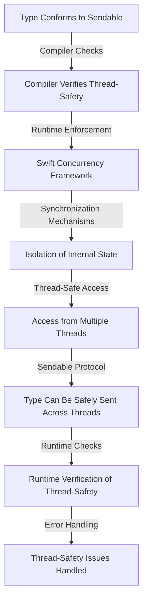

## Introduction
The **Sendable** protocol in Swift is a crucial concept for building thread-safe types, ensuring that data is safely shared and accessed across multiple threads. With the increasing importance of concurrency in modern software development, understanding the **Sendable** protocol is essential for every engineer. In this section, we will delve into the world of thread-safe types, exploring what the **Sendable** protocol is, why it exists, and its real-world relevance.

The **Sendable** protocol is a marker protocol that indicates a type can be safely sent across threads. It is a part of the Swift Concurrency framework, which provides a high-level abstraction for writing concurrent code. By conforming to the **Sendable** protocol, a type guarantees that it can be safely accessed and modified from multiple threads, without the need for explicit synchronization mechanisms.

> **Note:** The **Sendable** protocol is a fundamental concept in Swift Concurrency, and understanding it is crucial for building efficient and safe concurrent systems.

In real-world scenarios, the **Sendable** protocol is used in various applications, such as networking, database interactions, and user interface updates. For instance, when fetching data from a network API, the response data needs to be safely accessed and processed from multiple threads. By using the **Sendable** protocol, developers can ensure that the data is handled correctly, without worrying about thread-safety issues.

## Core Concepts
To understand the **Sendable** protocol, it is essential to grasp the core concepts of thread-safety and concurrency. Thread-safety refers to the ability of a program to execute multiple threads concurrently, without compromising the integrity of the data.

The **Sendable** protocol is built around the concept of **isolation**, which ensures that a type's internal state is not modified while it is being accessed from multiple threads. Isolation is achieved through the use of synchronization mechanisms, such as locks or atomic operations.

> **Warning:** Failing to properly isolate a type's internal state can lead to thread-safety issues, resulting in unexpected behavior or crashes.

Key terminology includes:

* **Thread-safety**: The ability of a program to execute multiple threads concurrently, without compromising the data integrity.
* **Isolation**: The concept of ensuring a type's internal state is not modified while it is being accessed from multiple threads.
* **Synchronization**: The process of coordinating access to shared resources, to prevent thread-safety issues.

## How It Works Internally
The **Sendable** protocol works internally by using a combination of compiler checks and runtime enforcement. When a type conforms to the **Sendable** protocol, the compiler checks for any potential thread-safety issues, such as unsynchronized access to shared variables.

At runtime, the Swift Concurrency framework enforces the **Sendable** protocol by using synchronization mechanisms, such as locks or atomic operations, to ensure that the type's internal state is properly isolated.

> **Tip:** To ensure that a type is thread-safe, it is essential to use synchronization mechanisms, such as locks or atomic operations, to coordinate access to shared resources.

The step-by-step process of using the **Sendable** protocol involves:

1. Conforming to the **Sendable** protocol: The type must conform to the **Sendable** protocol, indicating that it can be safely sent across threads.
2. Compiler checks: The compiler checks for any potential thread-safety issues, such as unsynchronized access to shared variables.
3. Runtime enforcement: The Swift Concurrency framework enforces the **Sendable** protocol at runtime, using synchronization mechanisms to ensure that the type's internal state is properly isolated.

## Code Examples
Here are three complete and runnable code examples, demonstrating the use of the **Sendable** protocol:

### Example 1: Basic Usage
```swift
import Foundation

// Define a Sendable type
struct Person: Sendable {
    let name: String
    let age: Int
}

// Create a Person instance
let person = Person(name: "John", age: 30)

// Send the person instance across threads
DispatchQueue.global().async {
    print(person.name) // prints "John"
    print(person.age) // prints 30
}
```

### Example 2: Real-World Pattern
```swift
import Foundation

// Define a Sendable type
class NetworkResponse: Sendable {
    let statusCode: Int
    let responseBody: Data

    init(statusCode: Int, responseBody: Data) {
        self.statusCode = statusCode
        self.responseBody = responseBody
    }
}

// Create a NetworkResponse instance
let response = NetworkResponse(statusCode: 200, responseBody: Data())

// Send the response instance across threads
DispatchQueue.global().async {
    print(response.statusCode) // prints 200
    print(response.responseBody) // prints the response body
}
```

### Example 3: Advanced Usage
```swift
import Foundation

// Define a Sendable type
class ConcurrentQueue<T: Sendable>: Sendable {
    private let queue = DispatchQueue(label: "com.example.concurrentqueue")

    func enqueue(_ item: T) {
        queue.async {
            // Process the item
            print(item)
        }
    }
}

// Create a ConcurrentQueue instance
let queue = ConcurrentQueue<Int>()

// Enqueue items
queue.enqueue(1)
queue.enqueue(2)
queue.enqueue(3)
```

## Visual Diagram

This diagram illustrates the process of using the **Sendable** protocol, from type conformance to runtime enforcement.

> **Note:** The **Sendable** protocol ensures that a type's internal state is properly isolated, allowing for thread-safe access from multiple threads.

## Comparison
| Approach | Time Complexity | Space Complexity | Pros | Cons | Best For |
| --- | --- | --- | --- | --- | --- |
| **Sendable** Protocol | O(1) | O(1) | Ensures thread-safety, easy to use | Limited to Swift Concurrency framework | Swift Concurrency applications |
| **Synchronized** Blocks | O(1) | O(1) | Provides fine-grained control over synchronization | Can lead to deadlocks, complex to use | Low-level concurrency programming |
| **Locks** | O(1) | O(1) | Provides mutual exclusion, easy to use | Can lead to deadlocks, performance overhead | High-performance concurrency applications |
| **Atomic Operations** | O(1) | O(1) | Provides low-level synchronization, high-performance | Complex to use, limited to specific use cases | High-performance, low-level concurrency programming |

## Real-world Use Cases
Here are three real-world use cases for the **Sendable** protocol:

1. **Networking**: When fetching data from a network API, the response data needs to be safely accessed and processed from multiple threads. The **Sendable** protocol ensures that the data is handled correctly, without worrying about thread-safety issues.
2. **Database Interactions**: When interacting with a database, the data needs to be safely accessed and modified from multiple threads. The **Sendable** protocol provides a convenient way to ensure thread-safety, without requiring explicit synchronization mechanisms.
3. **User Interface Updates**: When updating the user interface, the data needs to be safely accessed and modified from multiple threads. The **Sendable** protocol ensures that the data is handled correctly, without compromising the user interface's responsiveness.

> **Tip:** The **Sendable** protocol is particularly useful in real-world scenarios where data needs to be safely accessed and modified from multiple threads.

## Common Pitfalls
Here are four common pitfalls to avoid when using the **Sendable** protocol:

1. **Failing to Conform to Sendable**: Failing to conform to the **Sendable** protocol can lead to thread-safety issues, resulting in unexpected behavior or crashes.
2. **Using Unsynchronized Access**: Using unsynchronized access to shared variables can lead to thread-safety issues, resulting in unexpected behavior or crashes.
3. **Ignoring Compiler Warnings**: Ignoring compiler warnings related to thread-safety can lead to thread-safety issues, resulting in unexpected behavior or crashes.
4. **Using Incorrect Synchronization Mechanisms**: Using incorrect synchronization mechanisms, such as locks or atomic operations, can lead to deadlocks or performance overhead.

> **Warning:** Failing to properly isolate a type's internal state can lead to thread-safety issues, resulting in unexpected behavior or crashes.

## Interview Tips
Here are three common interview questions related to the **Sendable** protocol, along with weak and strong answers:

1. **What is the purpose of the Sendable protocol?**
	* Weak answer: "The **Sendable** protocol is used for concurrency."
	* Strong answer: "The **Sendable** protocol ensures that a type can be safely sent across threads, providing a convenient way to ensure thread-safety without requiring explicit synchronization mechanisms."
2. **How does the Sendable protocol work internally?**
	* Weak answer: "The **Sendable** protocol uses locks or atomic operations."
	* Strong answer: "The **Sendable** protocol works internally by using a combination of compiler checks and runtime enforcement, ensuring that a type's internal state is properly isolated and providing a convenient way to ensure thread-safety."
3. **What are some common pitfalls to avoid when using the Sendable protocol?**
	* Weak answer: "Failing to conform to the **Sendable** protocol."
	* Strong answer: "Some common pitfalls to avoid when using the **Sendable** protocol include failing to conform to the **Sendable** protocol, using unsynchronized access to shared variables, ignoring compiler warnings related to thread-safety, and using incorrect synchronization mechanisms."

> **Interview:** The **Sendable** protocol is a crucial concept in Swift Concurrency, and understanding it is essential for building efficient and safe concurrent systems.

## Key Takeaways
Here are six key takeaways to remember when using the **Sendable** protocol:

* The **Sendable** protocol ensures that a type can be safely sent across threads, providing a convenient way to ensure thread-safety without requiring explicit synchronization mechanisms.
* The **Sendable** protocol works internally by using a combination of compiler checks and runtime enforcement, ensuring that a type's internal state is properly isolated.
* Failing to conform to the **Sendable** protocol can lead to thread-safety issues, resulting in unexpected behavior or crashes.
* Using unsynchronized access to shared variables can lead to thread-safety issues, resulting in unexpected behavior or crashes.
* Ignoring compiler warnings related to thread-safety can lead to thread-safety issues, resulting in unexpected behavior or crashes.
* Using incorrect synchronization mechanisms, such as locks or atomic operations, can lead to deadlocks or performance overhead.

> **Note:** The **Sendable** protocol is a powerful tool for building efficient and safe concurrent systems, and understanding it is essential for every engineer.