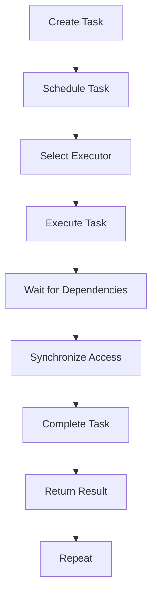

## Introduction
**Swift Concurrency** and **GCD/OperationQueue** are two fundamental concepts in iOS development that enable developers to write efficient, concurrent, and asynchronous code. Concurrency allows multiple tasks to run simultaneously, improving the overall performance and responsiveness of an app. In this study guide, we will delve into the world of Swift Concurrency and compare it with GCD/OperationQueue, exploring their strengths, weaknesses, and use cases.

> **Note:** Understanding concurrency is crucial for building scalable and efficient apps, as it allows developers to take full advantage of multi-core processors and asynchronous programming.

## Core Concepts
To grasp Swift Concurrency and GCD/OperationQueue, it's essential to understand the following core concepts:

* **Concurrency**: The ability of a program to execute multiple tasks simultaneously, improving responsiveness and performance.
* **Parallelism**: A type of concurrency where multiple tasks are executed simultaneously on multiple cores or processors.
* **Asynchronous programming**: A programming paradigm where tasks are executed independently, without blocking the main thread.
* **Synchronization**: The process of coordinating access to shared resources in a concurrent environment.

> **Warning:** Failing to properly synchronize access to shared resources can lead to data corruption, crashes, and other concurrency-related issues.

## How It Works Internally
Swift Concurrency is built on top of the **Swift Runtime**, which provides a high-level abstraction for concurrent programming. The runtime manages the creation, execution, and synchronization of tasks, ensuring that they are executed efficiently and safely.

GCD/OperationQueue, on the other hand, is a lower-level API that provides a more fine-grained control over concurrency. GCD (Grand Central Dispatch) is a framework that allows developers to execute tasks asynchronously, while OperationQueue is a higher-level abstraction that provides a more convenient and flexible way to manage concurrent tasks.

Here's a step-by-step breakdown of how Swift Concurrency works internally:

1. **Task creation**: The developer creates a task using the `Task` struct, specifying the code to be executed and any dependencies.
2. **Task scheduling**: The task is scheduled to run on a specific **executor**, which is responsible for executing the task.
3. **Executor selection**: The runtime selects an executor to run the task, taking into account factors such as the task's priority, dependencies, and the availability of resources.
4. **Task execution**: The executor executes the task, which may involve executing other tasks or waiting for dependencies to complete.
5. **Synchronization**: The runtime ensures that access to shared resources is properly synchronized, using mechanisms such as locks, semaphores, or other synchronization primitives.

> **Tip:** Using Swift Concurrency can simplify concurrent programming, as it provides a high-level abstraction that hides many of the underlying complexities.

## Code Examples
Here are three complete and runnable code examples that demonstrate the use of Swift Concurrency and GCD/OperationQueue:

**Example 1: Basic Swift Concurrency**
```swift
import Foundation

func performTask(_ task: String) {
    print("Starting task: \(task)")
    // Simulate some work
    Thread.sleep(forTimeInterval: 1)
    print("Finished task: \(task)")
}

let task1 = Task {
    performTask("Task 1")
}

let task2 = Task {
    performTask("Task 2")
}

// Wait for both tasks to complete
task1.wait()
task2.wait()
```

**Example 2: GCD/OperationQueue**
```swift
import Foundation

let queue = OperationQueue()

func performTask(_ task: String) {
    print("Starting task: \(task)")
    // Simulate some work
    Thread.sleep(forTimeInterval: 1)
    print("Finished task: \(task)")
}

let operation1 = BlockOperation {
    performTask("Task 1")
}

let operation2 = BlockOperation {
    performTask("Task 2")
}

queue.addOperation(operation1)
queue.addOperation(operation2)
```

**Example 3: Advanced Swift Concurrency**
```swift
import Foundation

func performTask(_ task: String) -> String {
    print("Starting task: \(task)")
    // Simulate some work
    Thread.sleep(forTimeInterval: 1)
    print("Finished task: \(task)")
    return "Task \(task) completed"
}

let task1 = Task {
    let result1 = performTask("Task 1")
    print("Result 1: \(result1)")
}

let task2 = Task {
    let result2 = performTask("Task 2")
    print("Result 2: \(result2)")
}

// Wait for both tasks to complete
task1.wait()
task2.wait()
```

## Visual Diagram

This diagram illustrates the high-level workflow of Swift Concurrency, from creating a task to executing it and returning the result.

> **Note:** The diagram simplifies the underlying complexities of Swift Concurrency, but it provides a good mental model for understanding the overall workflow.

## Comparison
| Approach | Time Complexity | Space Complexity | Pros | Cons | Best For |
| --- | --- | --- | --- | --- | --- |
| Swift Concurrency | O(1) | O(1) | High-level abstraction, easy to use, efficient | Limited control over underlying threads | Most concurrent programming tasks |
| GCD/OperationQueue | O(1) | O(1) | Fine-grained control over threads, flexible | More complex to use, error-prone | Low-level concurrent programming, custom thread management |
| NSRunLoop | O(n) | O(n) | Easy to use, built-in support for networking | Limited control over threads, not suitable for CPU-intensive tasks | Networking, I/O-bound tasks |
| pthreads | O(1) | O(1) | Low-level control over threads, portable | Error-prone, complex to use | Custom thread management, low-level programming |

## Real-world Use Cases
Here are three real-world use cases for Swift Concurrency and GCD/OperationQueue:

1. **Image processing**: A photo editing app uses Swift Concurrency to execute multiple image processing tasks concurrently, improving the overall performance and responsiveness of the app.
2. **Networking**: A social media app uses GCD/OperationQueue to manage concurrent network requests, ensuring that the app remains responsive and efficient even when handling multiple requests simultaneously.
3. **Data processing**: A data analytics app uses Swift Concurrency to execute complex data processing tasks, such as data aggregation and filtering, in a concurrent and efficient manner.

> **Interview:** When asked about concurrency in an interview, be prepared to explain the differences between Swift Concurrency and GCD/OperationQueue, as well as provide examples of how you would use each approach in a real-world scenario.

## Common Pitfalls
Here are four common pitfalls to avoid when using Swift Concurrency and GCD/OperationQueue:

1. **Deadlocks**: Failing to properly synchronize access to shared resources can lead to deadlocks, which can cause the app to freeze or crash.
2. **Starvation**: Failing to prioritize tasks correctly can lead to starvation, where one task is unable to execute due to other tasks holding onto resources.
3. **Livelocks**: Failing to properly manage dependencies between tasks can lead to livelocks, where tasks are unable to complete due to cyclical dependencies.
4. **Data corruption**: Failing to properly synchronize access to shared resources can lead to data corruption, which can cause the app to produce incorrect results or crash.

> **Warning:** Concurrency-related issues can be difficult to debug and diagnose, so it's essential to follow best practices and use the right tools to manage concurrent programming.

## Interview Tips
Here are three common interview questions related to Swift Concurrency and GCD/OperationQueue, along with some tips on how to answer them:

1. **What is the difference between Swift Concurrency and GCD/OperationQueue?**
	* Weak answer: "Swift Concurrency is a high-level abstraction, while GCD/OperationQueue is a low-level API."
	* Strong answer: "Swift Concurrency provides a high-level abstraction for concurrent programming, while GCD/OperationQueue provides a more fine-grained control over threads and concurrency. Swift Concurrency is easier to use and more efficient, but GCD/OperationQueue provides more flexibility and control."
2. **How do you handle concurrency-related issues, such as deadlocks and starvation?**
	* Weak answer: "I use locks and semaphores to synchronize access to shared resources."
	* Strong answer: "I use a combination of locks, semaphores, and other synchronization primitives to manage concurrency-related issues. I also follow best practices, such as using Swift Concurrency and GCD/OperationQueue, to minimize the risk of concurrency-related issues."
3. **Can you provide an example of how you would use Swift Concurrency in a real-world scenario?**
	* Weak answer: "I would use Swift Concurrency to execute multiple tasks concurrently, such as image processing and networking."
	* Strong answer: "I would use Swift Concurrency to execute multiple tasks concurrently, such as image processing and networking. For example, I would use Swift Concurrency to execute multiple image processing tasks concurrently, improving the overall performance and responsiveness of the app. I would also use GCD/OperationQueue to manage concurrent network requests, ensuring that the app remains responsive and efficient even when handling multiple requests simultaneously."

## Key Takeaways
Here are ten key takeaways to remember when using Swift Concurrency and GCD/OperationQueue:

* **Use Swift Concurrency for high-level concurrent programming**: Swift Concurrency provides a high-level abstraction for concurrent programming, making it easier to write efficient and concurrent code.
* **Use GCD/OperationQueue for low-level concurrent programming**: GCD/OperationQueue provides a more fine-grained control over threads and concurrency, making it suitable for low-level concurrent programming.
* **Follow best practices for concurrency-related issues**: Follow best practices, such as using locks and semaphores, to minimize the risk of concurrency-related issues.
* **Use synchronization primitives to manage concurrency**: Use synchronization primitives, such as locks and semaphores, to manage concurrency-related issues.
* **Prioritize tasks correctly**: Prioritize tasks correctly to avoid starvation and livelocks.
* **Use Swift Concurrency for CPU-intensive tasks**: Swift Concurrency is suitable for CPU-intensive tasks, such as image processing and data processing.
* **Use GCD/OperationQueue for I/O-bound tasks**: GCD/OperationQueue is suitable for I/O-bound tasks, such as networking and disk I/O.
* **Avoid deadlocks and starvation**: Avoid deadlocks and starvation by following best practices and using the right tools to manage concurrent programming.
* **Test and debug concurrent code thoroughly**: Test and debug concurrent code thoroughly to ensure that it is correct and efficient.
* **Use the right tools to manage concurrent programming**: Use the right tools, such as Swift Concurrency and GCD/OperationQueue, to manage concurrent programming and minimize the risk of concurrency-related issues.