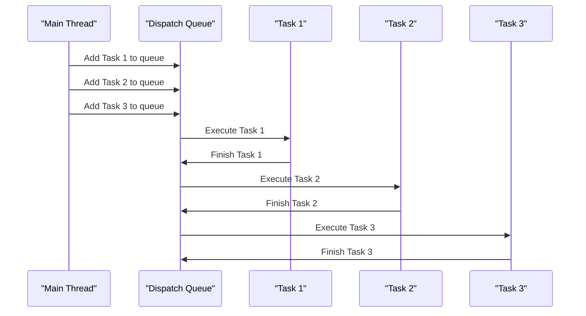

## Introduction
Creating concurrent work is a fundamental concept in software development that allows multiple tasks to be executed simultaneously, improving the overall performance and responsiveness of an application. In the context of Swift, concurrency is achieved through the use of **Grand Central Dispatch (GCD)** and **async/await**. Real-world relevance of concurrency can be seen in applications such as web browsers, where multiple tabs are loaded concurrently, and social media platforms, where multiple requests are sent to the server concurrently. Every engineer needs to know about concurrency because it is a crucial aspect of building scalable and efficient software systems.

## Core Concepts
- **Concurrency**: The ability of a program to execute multiple tasks simultaneously, improving the overall performance and responsiveness of the application.
- **Parallelism**: The ability of a program to execute multiple tasks simultaneously, using multiple processing units or cores.
- **Thread**: A separate flow of execution in a program, which can run concurrently with other threads.
- **Queue**: A data structure that follows the First-In-First-Out (FIFO) principle, used to manage tasks in a concurrent program.
- **Synchronization**: The process of coordinating access to shared resources in a concurrent program, to prevent data corruption and other concurrency-related issues.

> **Note:** Concurrency is not the same as parallelism. While parallelism refers to the simultaneous execution of multiple tasks on multiple processing units, concurrency refers to the ability of a program to switch between multiple tasks quickly, creating the illusion of simultaneous execution.

## How It Works Internally
When a concurrent task is created in Swift, the following steps occur:
1. The task is added to a queue, which is a data structure that follows the FIFO principle.
2. The queue is managed by a **dispatch queue**, which is responsible for executing the tasks in the queue.
3. The dispatch queue executes the tasks concurrently, using multiple threads or processing units.
4. The tasks are executed in a **serial** or **concurrent** manner, depending on the type of queue used.
5. The tasks are synchronized using **locks** or **semaphores**, to prevent data corruption and other concurrency-related issues.

> **Warning:** Concurrency can lead to **deadlocks**, **livelocks**, and **starvation**, if not managed properly. Deadlocks occur when two or more threads are blocked indefinitely, waiting for each other to release a resource. Livelocks occur when two or more threads are unable to proceed, due to continuous attempts to acquire a resource. Starvation occurs when a thread is unable to access a shared resource, due to other threads holding onto it for an extended period.

## Code Examples
### Example 1: Basic Concurrency using GCD
```swift
import Foundation

// Create a dispatch queue
let queue = DispatchQueue(label: "com.example.concurrentqueue")

// Add a task to the queue
queue.async {
    print("Task 1 started")
    // Simulate some work
    Thread.sleep(forTimeInterval: 2)
    print("Task 1 finished")
}

// Add another task to the queue
queue.async {
    print("Task 2 started")
    // Simulate some work
    Thread.sleep(forTimeInterval: 1)
    print("Task 2 finished")
}
```
### Example 2: Concurrent Programming using async/await
```swift
import Foundation

// Define an asynchronous function
func performTask(_ taskName: String) async {
    print("\(taskName) started")
    // Simulate some work
    try? await Task.sleep(nanoseconds: 2_000_000_000)
    print("\(taskName) finished")
}

// Create a task group
Task {
    await performTask("Task 1")
    await performTask("Task 2")
}
```
### Example 3: Advanced Concurrency using async/await and Task Group
```swift
import Foundation

// Define an asynchronous function
func performTask(_ taskName: String) async {
    print("\(taskName) started")
    // Simulate some work
    try? await Task.sleep(nanoseconds: 2_000_000_000)
    print("\(taskName) finished")
}

// Create a task group
Task {
    async let task1 = performTask("Task 1")
    async let task2 = performTask("Task 2")
    async let task3 = performTask("Task 3")
    
    // Wait for all tasks to complete
    await [task1, task2, task3]
}
```
> **Tip:** When using async/await, it's essential to use **try**-**catch** blocks to handle any errors that may occur during the execution of the asynchronous function.

## Visual Diagram

The diagram illustrates the execution of multiple tasks concurrently using a dispatch queue.

## Comparison
| Approach | Time Complexity | Space Complexity | Pros | Cons | Best For |
| --- | --- | --- | --- | --- | --- |
| GCD | O(1) | O(1) | Easy to use, high-level API | Limited control over threads | Simple concurrent tasks |
| async/await | O(1) | O(1) | Modern, high-level API, easy to use | Limited control over threads | Complex concurrent tasks |
| Threads | O(n) | O(n) | Low-level control over threads | Error-prone, difficult to use | Real-time systems, embedded systems |
| Locks | O(1) | O(1) | Simple, easy to use | Can lead to deadlocks, livelocks | Synchronizing access to shared resources |

## Real-world Use Cases
1. **Web Browsers**: Web browsers use concurrency to load multiple web pages simultaneously, improving the overall browsing experience.
2. **Social Media Platforms**: Social media platforms use concurrency to send multiple requests to the server simultaneously, improving the overall responsiveness of the application.
3. **Video Editing Software**: Video editing software uses concurrency to perform multiple tasks simultaneously, such as rendering video, audio, and effects.

> **Interview:** When asked about concurrency in an interview, be prepared to explain the difference between concurrency and parallelism, and provide examples of how concurrency is used in real-world applications.

## Common Pitfalls
1. **Deadlocks**: Deadlocks can occur when two or more threads are blocked indefinitely, waiting for each other to release a resource.
2. **Livelocks**: Livelocks can occur when two or more threads are unable to proceed, due to continuous attempts to acquire a resource.
3. **Starvation**: Starvation can occur when a thread is unable to access a shared resource, due to other threads holding onto it for an extended period.
4. **Data Corruption**: Data corruption can occur when multiple threads access shared data simultaneously, without proper synchronization.

> **Warning:** When using concurrency, it's essential to use synchronization mechanisms, such as locks or semaphores, to prevent data corruption and other concurrency-related issues.

## Interview Tips
1. **Explain the difference between concurrency and parallelism**: Be prepared to explain the difference between concurrency and parallelism, and provide examples of how concurrency is used in real-world applications.
2. **Describe how to use GCD**: Be prepared to describe how to use GCD to perform concurrent tasks, and provide examples of how to use it in real-world applications.
3. **Explain how to use async/await**: Be prepared to explain how to use async/await to perform concurrent tasks, and provide examples of how to use it in real-world applications.

## Key Takeaways
* Concurrency is the ability of a program to execute multiple tasks simultaneously, improving the overall performance and responsiveness of the application.
* Parallelism is the ability of a program to execute multiple tasks simultaneously, using multiple processing units or cores.
* GCD is a high-level API for performing concurrent tasks, while async/await is a modern, high-level API for performing concurrent tasks.
* Threads are a low-level API for performing concurrent tasks, but can be error-prone and difficult to use.
* Locks and semaphores are synchronization mechanisms used to prevent data corruption and other concurrency-related issues.
* Deadlocks, livelocks, and starvation are common pitfalls that can occur when using concurrency.
* Concurrency is used in real-world applications, such as web browsers, social media platforms, and video editing software.