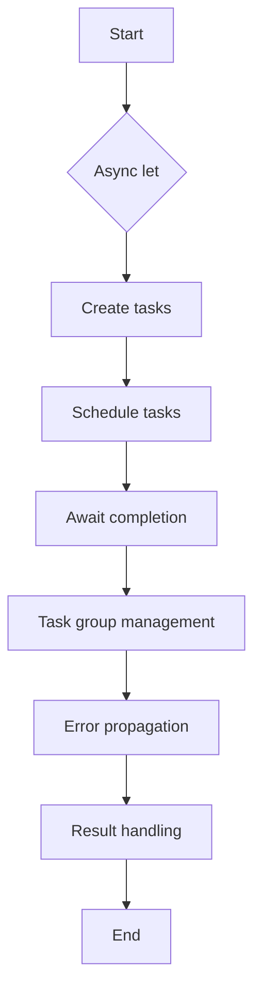

## Introduction
**Async let** is a powerful feature in Swift that allows for parallel async calls, enabling developers to write more efficient and scalable concurrent code. It is a part of the Swift Concurrency framework, which provides a high-level abstraction for working with asynchronous programming. In this section, we will delve into the world of async let, exploring its benefits, real-world relevance, and why every engineer needs to know about it. 
> **Note:** Async let is particularly useful when dealing with I/O-bound operations, such as making multiple API requests or reading from a database.

In real-world applications, async let can be used to improve the performance and responsiveness of an app. For instance, when fetching data from multiple APIs, async let can be used to make parallel requests, reducing the overall latency and improving the user experience. 
> **Tip:** When using async let, it's essential to handle errors properly to avoid crashes or unexpected behavior.

## Core Concepts
To understand async let, it's crucial to grasp the underlying concepts of asynchronous programming in Swift. Here are some key terms and definitions:
* **Async**: Short for asynchronous, async refers to the ability of a program to execute multiple tasks concurrently, without blocking each other.
* **Await**: A keyword used to suspend the execution of a task until a specific condition is met, such as the completion of an async operation.
* **Async let**: A syntax feature that allows defining multiple async operations and awaiting their completion.

A mental model for async let is to think of it as a way to create a "parallel pipeline" for async operations. By using async let, you can define multiple async operations and await their completion, allowing the program to execute other tasks concurrently.
> **Warning:** When using async let, be cautious of deadlocks, which can occur when two or more tasks are waiting for each other to complete.

## How It Works Internally
Under the hood, async let uses the Swift Concurrency framework to create a task group, which manages the execution of multiple async operations. Here's a step-by-step breakdown of how it works:
1. **Task creation**: When you use async let, a new task is created for each async operation.
2. **Task scheduling**: The tasks are scheduled to run concurrently, using the Swift Concurrency framework.
3. **Awaiting completion**: The program awaits the completion of each task, using the await keyword.
4. **Task group management**: The task group manages the execution of the tasks, ensuring that they are executed in parallel and that errors are propagated correctly.

The time complexity of async let is O(1), since it creates a fixed number of tasks, regardless of the input size. The space complexity is also O(1), since it uses a fixed amount of memory to store the task group and the async operations.
> **Interview:** When asked about the time and space complexity of async let, be sure to explain that it creates a fixed number of tasks and uses a fixed amount of memory, resulting in O(1) complexity.

## Code Examples
Here are three complete and runnable examples of using async let in Swift:
### Example 1: Basic Usage
```swift
import Foundation

func main() async {
    async let task1 = performTask1()
    async let task2 = performTask2()
    
    let result1 = await task1
    let result2 = await task2
    
    print("Result 1: \(result1)")
    print("Result 2: \(result2)")
}

func performTask1() async -> String {
    // Simulate some work
    try? await Task.sleep(nanoseconds: 1_000_000_000)
    return "Task 1 completed"
}

func performTask2() async -> String {
    // Simulate some work
    try? await Task.sleep(nanoseconds: 2_000_000_000)
    return "Task 2 completed"
}

Task {
    await main()
}
```
This example demonstrates the basic usage of async let, creating two tasks and awaiting their completion.

### Example 2: Real-World Pattern
```swift
import Foundation

func fetchUserData() async -> [String: String] {
    async let task1 = fetchProfileData()
    async let task2 = fetchSettingsData()
    
    let profileData = await task1
    let settingsData = await task2
    
    return ["profile": profileData, "settings": settingsData]
}

func fetchProfileData() async -> String {
    // Simulate some work
    try? await Task.sleep(nanoseconds: 1_000_000_000)
    return "Profile data fetched"
}

func fetchSettingsData() async -> String {
    // Simulate some work
    try? await Task.sleep(nanoseconds: 2_000_000_000)
    return "Settings data fetched"
}

Task {
    let userData = await fetchUserData()
    print("User data: \(userData)")
}
```
This example demonstrates a real-world pattern of using async let to fetch multiple pieces of data concurrently.

### Example 3: Advanced Usage
```swift
import Foundation

func fetchMultiplePages() async -> [[String: String]] {
    async let task1 = fetchPage1()
    async let task2 = fetchPage2()
    async let task3 = fetchPage3()
    
    let page1 = await task1
    let page2 = await task2
    let page3 = await task3
    
    return [page1, page2, page3]
}

func fetchPage1() async -> [String: String] {
    // Simulate some work
    try? await Task.sleep(nanoseconds: 1_000_000_000)
    return ["page1": "Page 1 data"]
}

func fetchPage2() async -> [String: String] {
    // Simulate some work
    try? await Task.sleep(nanoseconds: 2_000_000_000)
    return ["page2": "Page 2 data"]
}

func fetchPage3() async -> [String: String] {
    // Simulate some work
    try? await Task.sleep(nanoseconds: 3_000_000_000)
    return ["page3": "Page 3 data"]
}

Task {
    let pages = await fetchMultiplePages()
    print("Pages: \(pages)")
}
```
This example demonstrates an advanced usage of async let, creating multiple tasks and awaiting their completion.

## Visual Diagram

This diagram illustrates the internal workings of async let, from creating tasks to awaiting their completion and handling errors.

> **Note:** The diagram shows the main components involved in async let, including task creation, scheduling, awaiting completion, and error propagation.

## Comparison
Here's a comparison of async let with other concurrency features in Swift:
| Approach | Time Complexity | Space Complexity | Pros | Cons | Best For |
| --- | --- | --- | --- | --- | --- |
| Async let | O(1) | O(1) | Easy to use, parallel execution | Limited control over task scheduling | I/O-bound operations |
| Task groups | O(1) | O(1) | Fine-grained control over task scheduling | More complex to use | CPU-bound operations |
| Dispatch queues | O(1) | O(1) | Low-level control over concurrency | Error-prone, complex to use | Low-level concurrency |
| Operations queues | O(1) | O(1) | Easy to use, high-level concurrency | Limited control over task scheduling | High-level concurrency |

> **Tip:** When choosing a concurrency approach, consider the trade-offs between ease of use, control over task scheduling, and performance.

## Real-world Use Cases
Here are three real-world use cases for async let:
1. **API request batching**: Using async let to batch multiple API requests and await their completion, reducing the overall latency and improving the user experience.
2. **Data processing pipelines**: Creating a pipeline of data processing tasks using async let, allowing for parallel execution and efficient data processing.
3. **Image processing**: Using async let to process multiple images concurrently, improving the performance and responsiveness of an image processing app.

> **Interview:** When asked about real-world use cases for async let, be sure to provide concrete examples and explain the benefits of using async let in each scenario.

## Common Pitfalls
Here are four common pitfalls to watch out for when using async let:
1. **Deadlocks**: When two or more tasks are waiting for each other to complete, causing a deadlock.
2. **Error propagation**: Failing to handle errors properly, leading to crashes or unexpected behavior.
3. **Task starvation**: When one task dominates the execution, causing other tasks to starve and reducing overall performance.
4. **Over-parallelization**: Creating too many tasks, leading to decreased performance and increased memory usage.

> **Warning:** Be cautious of these common pitfalls and take steps to avoid them, such as using error handling and task scheduling mechanisms.

## Interview Tips
Here are three common interview questions related to async let, along with weak and strong answers:
1. **What is async let?**
	* Weak answer: "Async let is a syntax feature for concurrency."
	* Strong answer: "Async let is a syntax feature that allows defining multiple async operations and awaiting their completion, enabling parallel execution and improving performance."
2. **How does async let work internally?**
	* Weak answer: "Async let creates tasks and awaits their completion."
	* Strong answer: "Async let creates a task group, schedules tasks, awaits their completion, and handles errors, using the Swift Concurrency framework to manage the execution of tasks."
3. **What are some use cases for async let?**
	* Weak answer: "Async let is used for concurrency."
	* Strong answer: "Async let is used for I/O-bound operations, such as API request batching, data processing pipelines, and image processing, where parallel execution can improve performance and responsiveness."

> **Interview:** When answering interview questions related to async let, be sure to provide clear and concise explanations, highlighting your understanding of the underlying concepts and mechanisms.

## Key Takeaways
Here are ten key takeaways to remember about async let:
* **Async let is a syntax feature for concurrency**: It allows defining multiple async operations and awaiting their completion.
* **Async let creates a task group**: It schedules tasks, awaits their completion, and handles errors.
* **Async let is used for I/O-bound operations**: It improves performance and responsiveness by parallelizing I/O-bound operations.
* **Async let has a time complexity of O(1)**: It creates a fixed number of tasks, regardless of the input size.
* **Async let has a space complexity of O(1)**: It uses a fixed amount of memory to store the task group and async operations.
* **Async let is easy to use**: It provides a high-level abstraction for concurrency, making it accessible to developers.
* **Async let requires error handling**: It's essential to handle errors properly to avoid crashes or unexpected behavior.
* **Async let can be used with other concurrency features**: It can be combined with task groups, dispatch queues, and operations queues to achieve more complex concurrency scenarios.
* **Async let is a powerful tool for improving performance**: It can significantly improve the performance and responsiveness of an app by parallelizing I/O-bound operations.
* **Async let requires careful consideration of concurrency trade-offs**: It's essential to weigh the benefits of parallel execution against the potential drawbacks, such as increased complexity and memory usage.