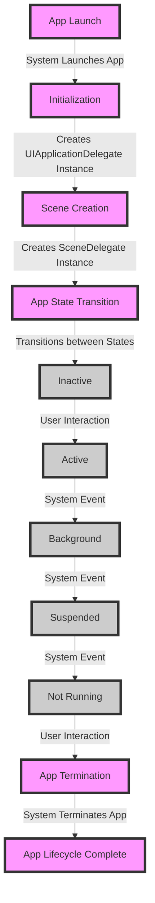

## Introduction
The **App Lifecycle** is a crucial concept in iOS development, governing how an app is launched, runs, and terminates. It's essential to understand the app lifecycle to manage resources, handle user interactions, and ensure a seamless user experience. In this topic, we'll delve into the **UIApplicationDelegate** and **@main** attributes, exploring their roles in the app lifecycle. Real-world relevance can be seen in apps like Instagram, where a well-managed app lifecycle ensures smooth navigation and efficient resource utilization.

> **Note:** A deep understanding of the app lifecycle is vital for developing robust, performance-oriented iOS apps.

## Core Concepts
Let's define the key terms and concepts related to the app lifecycle:

* **UIApplicationDelegate**: A protocol that provides methods for managing the app's lifecycle, such as launch, termination, and low-memory warnings.
* **@main**: An attribute that indicates the entry point of an app, marking the main function where the app's execution begins.
* **SceneDelegate**: A delegate that manages the lifecycle of a scene, which represents a single instance of an app's UI.
* **App State**: The current state of an app, such as **Not Running**, **Inactive**, **Active**, **Background**, or **Suspended**.

> **Tip:** To better understand the app lifecycle, visualize it as a state machine, where the app transitions between different states in response to user interactions and system events.

## How It Works Internally
Here's a step-by-step breakdown of the app lifecycle:

1. **Launch**: The user taps the app's icon, and the system launches the app.
2. **Initialization**: The app's main function is called, and the **UIApplicationDelegate** instance is created.
3. **Scene Creation**: The system creates a scene, and the **SceneDelegate** instance is created.
4. **App State Transition**: The app transitions between different states, such as **Inactive** to **Active**, in response to user interactions and system events.
5. **Termination**: The user closes the app, and the system terminates the app.

> **Warning:** Failing to properly manage the app lifecycle can lead to crashes, memory leaks, and poor performance.

## Code Examples
### Example 1: Basic App Lifecycle Management
```swift
import UIKit

@main
class AppDelegate: UIResponder, UIApplicationDelegate {
    func application(_ application: UIApplication, didFinishLaunchingWithOptions launchOptions: [UIApplication.LaunchOptionsKey: Any]?) -> Bool {
        // Initialize app resources and settings
        return true
    }
    
    func applicationWillResignActive(_ application: UIApplication) {
        // Prepare for app deactivation
    }
    
    func applicationDidEnterBackground(_ application: UIApplication) {
        // Save app state and release resources
    }
    
    func applicationWillEnterForeground(_ application: UIApplication) {
        // Restore app state and acquire resources
    }
    
    func applicationDidBecomeActive(_ application: UIApplication) {
        // Resume app activity
    }
}

```
### Example 2: Scene-Based App Lifecycle Management
```swift
import UIKit

@main
class AppDelegate: UIResponder, UIApplicationDelegate {
    func application(_ application: UIApplication, configurationForConnecting scene: UIScene, options: UIScene.ConnectionOptions) -> UISceneConfiguration {
        // Create and configure the scene
        let sceneConfig = UISceneConfiguration(name: "Main", sessionClass: nil)
        return sceneConfig
    }
}

class SceneDelegate: UIResponder, UIWindowSceneDelegate {
    func windowScene(_ windowScene: UIWindowScene, performActionFor shortcutItem: UIApplicationShortcutItem, completionHandler: (Bool) -> Void) {
        // Handle shortcut item actions
    }
    
    func scene(_ scene: UIScene, willConnectTo session: UISceneSession, options: UIScene.ConnectionOptions) {
        // Connect to the scene session
    }
    
    func sceneDidDisconnect(_ scene: UIScene) {
        // Disconnect from the scene session
    }
    
    func sceneDidBecomeActive(_ scene: UIScene) {
        // Resume scene activity
    }
    
    func sceneWillResignActive(_ scene: UIScene) {
        // Prepare for scene deactivation
    }
    
    func sceneDidEnterBackground(_ scene: UIScene) {
        // Save scene state and release resources
    }
    
    func sceneWillEnterForeground(_ scene: UIScene) {
        // Restore scene state and acquire resources
    }
}
```
### Example 3: Advanced App Lifecycle Management with Notifications
```swift
import UIKit
import UserNotifications

@main
class AppDelegate: UIResponder, UIApplicationDelegate, UNUserNotificationCenterDelegate {
    func application(_ application: UIApplication, didFinishLaunchingWithOptions launchOptions: [UIApplication.LaunchOptionsKey: Any]?) -> Bool {
        // Initialize app resources and settings
        UNUserNotificationCenter.current().requestAuthorization(options: [.alert, .badge, .sound]) { granted, error in
            if let error = error {
                print("Error requesting notification authorization: \(error)")
            } else {
                print("Notification authorization granted: \(granted)")
            }
        }
        return true
    }
    
    func userNotificationCenter(_ center: UNUserNotificationCenter, didReceive response: UNNotificationResponse, withCompletionHandler completionHandler: @escaping () -> Void) {
        // Handle notification responses
        completionHandler()
    }
    
    func userNotificationCenter(_ center: UNUserNotificationCenter, willPresent notification: UNNotification, withCompletionHandler completionHandler: @escaping (UNNotificationPresentationOptions) -> Void) {
        // Handle notification presentation
        completionHandler([.alert, .badge, .sound])
    }
}
```
## Visual Diagram

This diagram illustrates the app lifecycle, showcasing the different states and transitions that occur in response to user interactions and system events.

## Comparison
| Approach | Time Complexity | Space Complexity | Pros | Cons | Best For |
| --- | --- | --- | --- | --- | --- |
| **UIApplicationDelegate** | O(1) | O(1) | Simple, easy to implement | Limited functionality | Basic app lifecycle management |
| **SceneDelegate** | O(1) | O(1) | More flexible, supports multiple scenes | More complex, requires additional setup | Advanced app lifecycle management with multiple scenes |
| **Notification-Based App Lifecycle Management** | O(n) | O(n) | Supports notification-based app lifecycle management | More complex, requires additional setup | Apps that require notification-based app lifecycle management |
| **Custom App Lifecycle Management** | O(n) | O(n) | Highly customizable, supports complex app lifecycle scenarios | Most complex, requires significant setup and maintenance | Apps that require highly customized app lifecycle management |

## Real-world Use Cases
1. **Instagram**: Instagram uses a combination of **UIApplicationDelegate** and **SceneDelegate** to manage its app lifecycle, ensuring a seamless user experience across different scenes and states.
2. **Facebook**: Facebook uses a custom app lifecycle management approach, leveraging notifications and system events to manage its app lifecycle and provide a personalized user experience.
3. **Uber**: Uber uses a notification-based app lifecycle management approach, utilizing notifications to manage its app lifecycle and provide real-time updates to users.

## Common Pitfalls
1. **Failing to properly handle app state transitions**: This can lead to crashes, memory leaks, and poor performance.
2. **Not implementing **SceneDelegate** correctly**: This can result in issues with scene management, such as scenes not being properly created or destroyed.
3. **Not handling notifications correctly**: This can lead to issues with notification presentation and handling, such as notifications not being displayed or handled correctly.
4. **Not using **@main** correctly**: This can result in issues with the app's entry point, such as the app not launching correctly.

> **Interview:** What is the difference between **UIApplicationDelegate** and **SceneDelegate**? How would you implement a custom app lifecycle management approach using notifications?

## Interview Tips
1. **Be prepared to explain the app lifecycle**: Understand the different states and transitions that occur during the app lifecycle, and be able to explain how to manage them using **UIApplicationDelegate** and **SceneDelegate**.
2. **Know how to implement notification-based app lifecycle management**: Understand how to use notifications to manage the app lifecycle, and be able to explain the benefits and challenges of this approach.
3. **Be prepared to discuss custom app lifecycle management approaches**: Understand how to implement a custom app lifecycle management approach using notifications and system events, and be able to explain the benefits and challenges of this approach.

## Key Takeaways
* The app lifecycle is a critical concept in iOS development, governing how an app is launched, runs, and terminates.
* **UIApplicationDelegate** and **SceneDelegate** are essential components of the app lifecycle, providing methods for managing the app's lifecycle and scene management.
* Notifications can be used to manage the app lifecycle, providing a flexible and customizable approach to app lifecycle management.
* Custom app lifecycle management approaches can be implemented using notifications and system events, providing a high degree of flexibility and customization.
* Failing to properly manage the app lifecycle can lead to crashes, memory leaks, and poor performance.
* **@main** is an essential attribute that marks the entry point of an app.
* The app lifecycle can be visualized as a state machine, with different states and transitions occurring in response to user interactions and system events.