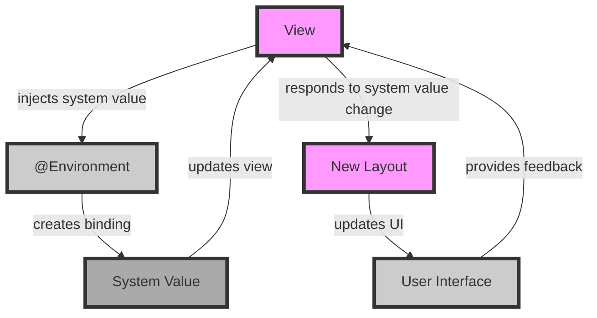

## Introduction
**SwiftUI** is a powerful framework for building user interfaces in iOS, macOS, watchOS, and tvOS apps. One of its key features is the ability to access system values using the `@Environment` property wrapper. This allows developers to create dynamic and responsive interfaces that adapt to changing system conditions. In this section, we will explore what `@Environment` is, why it matters, and its real-world relevance.

`@Environment` provides a way to inject system values into your views, such as the current screen size, device orientation, or accessibility settings. This enables you to create views that are responsive to different screen sizes, orientations, and accessibility settings. For example, you can use `@Environment` to create a view that changes its layout when the device is rotated or when the user enables accessibility features.

> **Note:** `@Environment` is a powerful tool for creating dynamic and responsive interfaces. However, it requires careful consideration of the system values that are available and how they can be used to create a seamless user experience.

## Core Concepts
The core concept of `@Environment` is the idea of injecting system values into views. This is achieved through the use of a property wrapper, which is a special type of attribute that can be applied to properties in Swift. The `@Environment` property wrapper is used to inject system values into views, such as the current screen size or device orientation.

The key terminology associated with `@Environment` includes:

* **System values**: These are values that are provided by the system, such as the current screen size or device orientation.
* **Property wrapper**: This is a special type of attribute that can be applied to properties in Swift to inject system values into views.
* **View**: This is the visual representation of a user interface component, such as a button or label.

> **Warning:** When using `@Environment`, it is essential to consider the potential impact on performance. Injecting system values into views can have a significant impact on the performance of your app, especially if the values are updated frequently.

## How It Works Internally
When you use `@Environment` to inject system values into a view, SwiftUI creates a binding between the view and the system value. This binding allows the view to update automatically when the system value changes.

Here is a step-by-step breakdown of how `@Environment` works internally:

1. **System value creation**: The system creates a value, such as the current screen size or device orientation.
2. **Property wrapper application**: The `@Environment` property wrapper is applied to a property in a view, such as a `@State` or `@Binding` property.
3. **Binding creation**: SwiftUI creates a binding between the view and the system value.
4. **View update**: When the system value changes, the binding updates the view automatically.

> **Tip:** To optimize the performance of your app when using `@Environment`, consider using a `DispatchQueue` to update the view only when necessary.

## Code Examples
Here are three complete and runnable examples of using `@Environment` in SwiftUI:

### Example 1: Basic Usage
```swift
import SwiftUI

struct EnvironmentExample: View {
    @Environment(\.horizontalSizeClass) var horizontalSizeClass
    
    var body: some View {
        Text("Horizontal size class: \(horizontalSizeClass)")
    }
}

struct EnvironmentExample_Previews: PreviewProvider {
    static var previews: some View {
        EnvironmentExample()
    }
}
```
This example demonstrates how to use `@Environment` to inject the current horizontal size class into a view.

### Example 2: Real-World Pattern
```swift
import SwiftUI

struct ResponsiveView: View {
    @Environment(\.horizontalSizeClass) var horizontalSizeClass
    @Environment(\.verticalSizeClass) var verticalSizeClass
    
    var body: some View {
        if horizontalSizeClass == .compact && verticalSizeClass == .regular {
            // Compact horizontal and regular vertical size class
            VStack {
                Text("Compact horizontal and regular vertical size class")
            }
        } else if horizontalSizeClass == .regular && verticalSizeClass == .compact {
            // Regular horizontal and compact vertical size class
            HStack {
                Text("Regular horizontal and compact vertical size class")
            }
        } else {
            // Default layout
            Text("Default layout")
        }
    }
}

struct ResponsiveView_Previews: PreviewProvider {
    static var previews: some View {
        ResponsiveView()
    }
}
```
This example demonstrates how to use `@Environment` to create a responsive view that adapts to different size classes.

### Example 3: Advanced Usage
```swift
import SwiftUI

struct AdvancedEnvironmentExample: View {
    @Environment(\.accessibilityEnabled) var accessibilityEnabled
    @Environment(\.horizontalSizeClass) var horizontalSizeClass
    
    var body: some View {
        if accessibilityEnabled && horizontalSizeClass == .compact {
            // Accessibility features are enabled and compact horizontal size class
            Text("Accessibility features are enabled and compact horizontal size class")
                .font(.largeTitle)
        } else if accessibilityEnabled && horizontalSizeClass == .regular {
            // Accessibility features are enabled and regular horizontal size class
            Text("Accessibility features are enabled and regular horizontal size class")
                .font(.title)
        } else {
            // Default layout
            Text("Default layout")
        }
    }
}

struct AdvancedEnvironmentExample_Previews: PreviewProvider {
    static var previews: some View {
        AdvancedEnvironmentExample()
    }
}
```
This example demonstrates how to use `@Environment` to create an advanced view that adapts to different accessibility settings and size classes.

## Visual Diagram

This diagram illustrates the flow of system values from the system to the view, and how the view responds to changes in the system values.

> **Interview:** When asked about `@Environment` in an interview, be prepared to explain how it works internally, including the creation of bindings and the update of views in response to system value changes.

## Comparison
| Approach | Time Complexity | Space Complexity | Pros | Cons | Best For |
| --- | --- | --- | --- | --- | --- |
| `@Environment` | O(1) | O(1) | Easy to use, flexible, and powerful | Can be slow, requires careful consideration of system values | Creating dynamic and responsive interfaces that adapt to changing system conditions |
| `@State` | O(1) | O(1) | Simple and easy to use | Limited to a single view, not suitable for complex interfaces | Creating simple views that do not require complex logic or system value injection |
| `@Binding` | O(1) | O(1) | Flexible and powerful, allows for two-way data binding | Can be complex to use, requires careful consideration of data flow | Creating complex interfaces that require two-way data binding and system value injection |
| `ObservableObject` | O(n) | O(n) | Powerful and flexible, allows for complex logic and data binding | Can be slow, requires careful consideration of data flow and system values | Creating complex interfaces that require complex logic, data binding, and system value injection |

## Real-world Use Cases
Here are three real-world use cases for `@Environment`:

1. **Apple Music**: Apple Music uses `@Environment` to create a dynamic and responsive interface that adapts to different screen sizes and orientations.
2. **Instagram**: Instagram uses `@Environment` to create a responsive interface that adapts to different screen sizes and orientations, as well as to provide accessibility features for users with disabilities.
3. **Uber**: Uber uses `@Environment` to create a dynamic and responsive interface that adapts to different screen sizes and orientations, as well as to provide real-time updates on ride status and location.

## Common Pitfalls
Here are four common pitfalls to avoid when using `@Environment`:

1. **Not considering system value changes**: Failing to consider how system values will change and how the view will respond to those changes.
2. **Not using `DispatchQueue`**: Failing to use a `DispatchQueue` to update the view only when necessary, leading to performance issues.
3. **Not handling accessibility features**: Failing to handle accessibility features, such as font size and screen reader support.
4. **Not testing for different screen sizes and orientations**: Failing to test the view for different screen sizes and orientations, leading to layout issues and poor user experience.

> **Warning:** When using `@Environment`, it is essential to consider the potential impact on performance and to use a `DispatchQueue` to update the view only when necessary.

## Interview Tips
Here are three common interview questions related to `@Environment`, along with weak and strong answers:

1. **What is `@Environment` and how does it work?**
	* Weak answer: "I'm not sure, but I think it has something to do with system values."
	* Strong answer: "`@Environment` is a property wrapper that injects system values into views. It works by creating a binding between the view and the system value, allowing the view to update automatically when the system value changes."
2. **How do you use `@Environment` to create a responsive interface?**
	* Weak answer: "I'm not sure, but I think you just use `@Environment` and it automatically creates a responsive interface."
	* Strong answer: "To create a responsive interface using `@Environment`, you need to consider the system values that are available and how they can be used to create a seamless user experience. You can use `@Environment` to inject system values into views, and then use those values to create a dynamic and responsive interface."
3. **What are some common pitfalls to avoid when using `@Environment`?**
	* Weak answer: "I'm not sure, but I think it's just a matter of using `@Environment` and it will automatically work."
	* Strong answer: "Some common pitfalls to avoid when using `@Environment` include not considering system value changes, not using a `DispatchQueue` to update the view only when necessary, not handling accessibility features, and not testing for different screen sizes and orientations."

## Key Takeaways
Here are ten key takeaways to remember when using `@Environment`:

* `@Environment` is a powerful tool for creating dynamic and responsive interfaces.
* `@Environment` works by injecting system values into views and creating a binding between the view and the system value.
* `@Environment` can be used to create responsive interfaces that adapt to different screen sizes and orientations.
* `@Environment` can be used to provide accessibility features for users with disabilities.
* `@Environment` requires careful consideration of system values and how they will change.
* `@Environment` requires the use of a `DispatchQueue` to update the view only when necessary.
* `@Environment` can be used in conjunction with other SwiftUI features, such as `@State` and `@Binding`.
* `@Environment` is a flexible and powerful tool, but it can be complex to use and requires careful consideration of data flow and system values.
* `@Environment` is best used for creating dynamic and responsive interfaces that adapt to changing system conditions.
* `@Environment` is an essential tool for any SwiftUI developer looking to create high-quality, responsive, and accessible user interfaces.