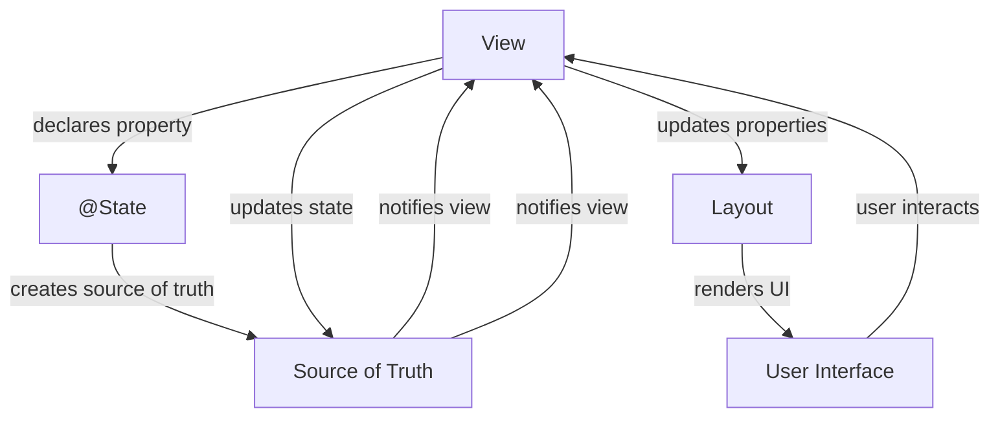

## Introduction
**SwiftUI** is a powerful framework for building user interfaces in iOS, macOS, watchOS, and tvOS apps. It provides a declarative syntax for creating views, which makes it easy to build complex interfaces with minimal code. At the heart of SwiftUI are five property wrappers: `@State`, `@Binding`, `@ObservedObject`, `@StateObject`, and `@EnvironmentObject`. These wrappers enable you to manage state and data in your app, making it easy to create dynamic and interactive user interfaces. In this article, we'll explore each of these property wrappers in depth, including their usage, benefits, and pitfalls.

> **Tip:** When working with SwiftUI, it's essential to understand the concept of state and how it's managed. State is the data that changes over time, and it's what drives the user interface.

## Core Concepts
Let's start with some precise definitions:

* `@State`: A property wrapper that creates a source of truth for a value within a view.
* `@Binding`: A property wrapper that creates a two-way connection between a view and a source of truth.
* `@ObservedObject`: A property wrapper that observes changes to an object and updates the view accordingly.
* `@StateObject`: A property wrapper that creates a source of truth for an object within a view.
* `@EnvironmentObject`: A property wrapper that injects an object into the environment of a view.

> **Note:** These property wrappers are the building blocks of SwiftUI, and understanding how they work is crucial for building robust and scalable apps.

## How It Works Internally
When you use one of these property wrappers, SwiftUI creates a connection between the view and the source of truth. This connection enables the view to update automatically when the state changes. Here's a step-by-step breakdown of how it works:

1. The view declares a property with one of the property wrappers.
2. SwiftUI creates a connection between the view and the source of truth.
3. When the state changes, the source of truth notifies the view.
4. The view updates its properties and layout accordingly.

> **Warning:** Be careful when using `@State` and `@Binding` together, as it can create a retain cycle and cause memory leaks.

## Code Examples
Here are three complete and runnable examples that demonstrate the usage of these property wrappers:

### Example 1: Basic Usage of `@State`
```swift
import SwiftUI

struct Counter: View {
    @State private var count = 0

    var body: some View {
        VStack {
            Text("Count: \(count)")
            Button("Increment") {
                count += 1
            }
        }
    }
}

struct Counter_Previews: PreviewProvider {
    static var previews: some View {
        Counter()
    }
}
```
This example demonstrates how to use `@State` to create a source of truth for a value within a view.

### Example 2: Using `@Binding` to Share State
```swift
import SwiftUI

struct Counter: View {
    @Binding var count: Int

    var body: some View {
        VStack {
            Text("Count: \(count)")
            Button("Increment") {
                count += 1
            }
        }
    }
}

struct ContentView: View {
    @State private var count = 0

    var body: some View {
        Counter(count: $count)
    }
}

struct ContentView_Previews: PreviewProvider {
    static var previews: some View {
        ContentView()
    }
}
```
This example demonstrates how to use `@Binding` to share state between views.

### Example 3: Using `@ObservedObject` to Observe Changes
```swift
import SwiftUI
import Combine

class Counter: ObservableObject {
    @Published var count = 0
}

struct CounterView: View {
    @ObservedObject var counter: Counter

    var body: some View {
        VStack {
            Text("Count: \(counter.count)")
            Button("Increment") {
                counter.count += 1
            }
        }
    }
}

struct ContentView: View {
    @StateObject var counter = Counter()

    var body: some View {
        CounterView(counter: counter)
    }
}

struct ContentView_Previews: PreviewProvider {
    static var previews: some View {
        ContentView()
    }
}
```
This example demonstrates how to use `@ObservedObject` to observe changes to an object and update the view accordingly.

## Visual Diagram

This diagram illustrates how the property wrappers work together to manage state and update the user interface.

## Comparison
Here's a comparison of the five property wrappers:
| Property Wrapper | Purpose | Benefits | Drawbacks |
| --- | --- | --- | --- |
| `@State` | Creates a source of truth for a value | Easy to use, simple to understand | Limited to a single view |
| `@Binding` | Shares state between views | Enables two-way communication | Can create retain cycles |
| `@ObservedObject` | Observes changes to an object | Enables one-way communication | Requires `@Published` properties |
| `@StateObject` | Creates a source of truth for an object | Enables two-way communication | Requires `@Published` properties |
| `@EnvironmentObject` | Injects an object into the environment | Enables global access to an object | Can create tight coupling |

> **Interview:** When asked about the differences between these property wrappers, be sure to explain their purposes, benefits, and drawbacks.

## Real-world Use Cases
Here are three real-world use cases for these property wrappers:

1. **Todo List App**: Use `@State` to manage the todo list, and `@Binding` to share the list between views.
2. **Weather App**: Use `@ObservedObject` to observe changes to the weather data, and `@StateObject` to manage the weather forecast.
3. **Social Media App**: Use `@EnvironmentObject` to inject the user's profile into the environment, and `@State` to manage the user's posts.

## Common Pitfalls
Here are four common pitfalls to avoid:

1. **Retain Cycles**: Be careful when using `@State` and `@Binding` together, as it can create a retain cycle and cause memory leaks.
2. **Tight Coupling**: Avoid using `@EnvironmentObject` to inject objects into the environment, as it can create tight coupling between views.
3. **Overusing `@Published`**: Avoid overusing `@Published` properties, as it can create unnecessary notifications and slow down the app.
4. **Not Using `@StateObject`**: Don't forget to use `@StateObject` to manage objects that need to be updated, as it can cause unexpected behavior.

## Interview Tips
Here are three common interview questions and tips for answering them:

1. **What's the difference between `@State` and `@Binding`?**: Explain the purposes, benefits, and drawbacks of each property wrapper.
2. **How do you manage state in a SwiftUI app?**: Explain the different property wrappers and how they work together to manage state.
3. **What's the purpose of `@EnvironmentObject`?**: Explain how `@EnvironmentObject` injects an object into the environment and how it can be used to share data between views.

## Key Takeaways
Here are ten key takeaways to remember:

* `@State` creates a source of truth for a value within a view.
* `@Binding` shares state between views.
* `@ObservedObject` observes changes to an object and updates the view accordingly.
* `@StateObject` creates a source of truth for an object within a view.
* `@EnvironmentObject` injects an object into the environment of a view.
* Use `@State` and `@Binding` together with caution to avoid retain cycles.
* Use `@ObservedObject` and `@StateObject` to manage objects that need to be updated.
* Avoid overusing `@Published` properties.
* Use `@EnvironmentObject` to share data between views.
* Always test your app thoroughly to catch any unexpected behavior.