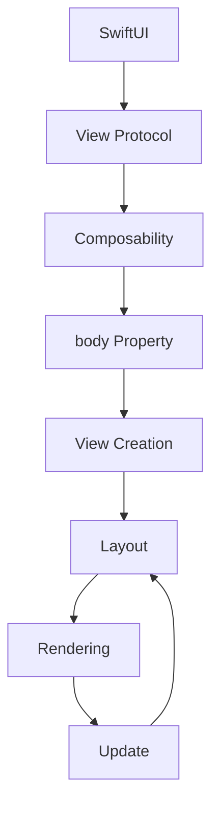

## Introduction
SwiftUI is a revolutionary framework for building user interfaces in iOS, macOS, watchOS, and tvOS apps. At the heart of SwiftUI lies the **View Protocol**, which defines the requirements for any view that wants to participate in the SwiftUI rendering pipeline. The **body Property** is a crucial part of this protocol, as it returns the view's content. Understanding the View Protocol and body Property is essential for building robust, scalable, and maintainable SwiftUI apps. In this article, we will delve into the world of SwiftUI views, exploring the View Protocol, body Property, and their implications on app development.

## Core Concepts
To grasp the View Protocol and body Property, we need to understand the following core concepts:
* **View**: A view is an object that represents a user interface element, such as a button, label, or image.
* **View Protocol**: This protocol defines the requirements for any view that wants to participate in the SwiftUI rendering pipeline. It includes properties and methods that enable views to be composed, laid out, and rendered.
* **body Property**: This property returns the view's content, which can be a single view or a composition of multiple views.
* **Composability**: SwiftUI views are designed to be composable, meaning they can be combined to create more complex views.

> **Note:** The View Protocol is a fundamental concept in SwiftUI, and understanding its properties and methods is crucial for building effective views.

## How It Works Internally
When a view is created, SwiftUI uses the following steps to render it:
1. **View Creation**: The view is created, and its body Property is called to retrieve its content.
2. **Layout**: The view's content is laid out, taking into account factors such as size, position, and alignment.
3. **Rendering**: The view's content is rendered, using the graphics processing unit (GPU) to perform the actual drawing.
4. **Update**: When the view's state changes, SwiftUI updates the view's content and re-renders it as necessary.

> **Tip:** To optimize view rendering, use the `LazyVStack` or `LazyHStack` views to delay the creation of child views until they are actually needed.

## Code Examples
Here are three complete, runnable examples that demonstrate the use of the View Protocol and body Property:
### Example 1: Basic View
```swift
import SwiftUI

struct BasicView: View {
    var body: some View {
        Text("Hello, World!")
    }
}

struct BasicView_Previews: PreviewProvider {
    static var previews: some View {
        BasicView()
    }
}
```
This example creates a simple view that displays the text "Hello, World!".

### Example 2: Composed View
```swift
import SwiftUI

struct ComposedView: View {
    var body: some View {
        VStack {
            Text("Hello")
                .font(.title)
            Text("World!")
                .font(.subtitle)
        }
    }
}

struct ComposedView_Previews: PreviewProvider {
    static var previews: some View {
        ComposedView()
    }
}
```
This example creates a view that composes two text views, using a `VStack` to arrange them vertically.

### Example 3: Advanced View
```swift
import SwiftUI

struct AdvancedView: View {
    @State private var counter = 0

    var body: some View {
        Button("Increment Counter") {
            counter += 1
        }
        .padding()
        .background(Color.blue)
        .foregroundColor(.white)
        .cornerRadius(10)
        Text("Counter: \(counter)")
            .font(.title)
    }
}

struct AdvancedView_Previews: PreviewProvider {
    static var previews: some View {
        AdvancedView()
    }
}
```
This example creates a view that includes a button and a text view, using the `@State` property wrapper to manage the counter's state.

## Visual Diagram

This diagram illustrates the process of creating and rendering a view in SwiftUI, highlighting the role of the body Property and composability.

> **Warning:** Failing to properly manage view state can lead to unexpected behavior and performance issues.

## Comparison
Here is a comparison of different approaches to building views in SwiftUI:
| Approach | Time Complexity | Space Complexity | Pros | Cons | Best For |
| --- | --- | --- | --- | --- | --- |
| Basic View | O(1) | O(1) | Simple, easy to use | Limited functionality | Small, static views |
| Composed View | O(n) | O(n) | Flexible, composable | Can be complex | Medium-sized views |
| Advanced View | O(n log n) | O(n) | Powerful, customizable | Steeper learning curve | Large, dynamic views |

## Real-world Use Cases
Here are three real-world examples of using SwiftUI views in production apps:
* **Apple's Stocks App**: Uses SwiftUI to create a customizable dashboard with real-time stock quotes and news.
* **Twitter's iOS App**: Employs SwiftUI to build a responsive and engaging user interface for tweeting and browsing.
* **Uber's iOS App**: Utilizes SwiftUI to create a seamless and intuitive experience for requesting rides and tracking drivers.

## Common Pitfalls
Here are four common mistakes to avoid when building SwiftUI views:
* **Not managing view state properly**: Failing to use `@State` or `@Binding` can lead to unexpected behavior and performance issues.
* **Not using composability**: Not taking advantage of SwiftUI's composability features can result in rigid and inflexible views.
* **Not optimizing view rendering**: Not using `LazyVStack` or `LazyHStack` can lead to unnecessary view creation and rendering.
* **Not handling errors**: Not properly handling errors can lead to crashes and unexpected behavior.

> **Interview:** Can you explain the difference between `@State` and `@Binding` in SwiftUI? How would you use them in a real-world app?

## Interview Tips
Here are three common interview questions and tips for answering them:
* **What is the purpose of the body Property in SwiftUI?**: A strong answer would explain how the body Property returns the view's content and how it is used to compose views.
* **How do you manage view state in SwiftUI?**: A strong answer would discuss the use of `@State` and `@Binding` to manage view state and how to properly update views.
* **What is the difference between a basic view and a composed view in SwiftUI?**: A strong answer would explain how basic views are simple and static, while composed views are flexible and composable.

## Key Takeaways
Here are ten key takeaways to remember when building SwiftUI views:
* **The View Protocol is fundamental**: Understanding the View Protocol is crucial for building effective views.
* **Composability is key**: Taking advantage of SwiftUI's composability features can result in flexible and reusable views.
* **View state management is critical**: Properly managing view state is essential for avoiding unexpected behavior and performance issues.
* **Optimize view rendering**: Using `LazyVStack` or `LazyHStack` can help optimize view rendering and improve performance.
* **Handle errors properly**: Properly handling errors can help prevent crashes and unexpected behavior.
* **Use `@State` and `@Binding` wisely**: Using `@State` and `@Binding` can help manage view state and improve performance.
* **Keep views simple and focused**: Avoiding complex and tightly coupled views can improve maintainability and scalability.
* **Test and iterate**: Testing and iterating on views can help identify and fix issues early on.
* **Stay up-to-date with SwiftUI**: Keeping up-to-date with the latest SwiftUI features and best practices can help improve app quality and performance.
* **Use SwiftUI's built-in features**: Taking advantage of SwiftUI's built-in features, such as `LazyVStack` and `LazyHStack`, can help simplify view creation and improve performance.