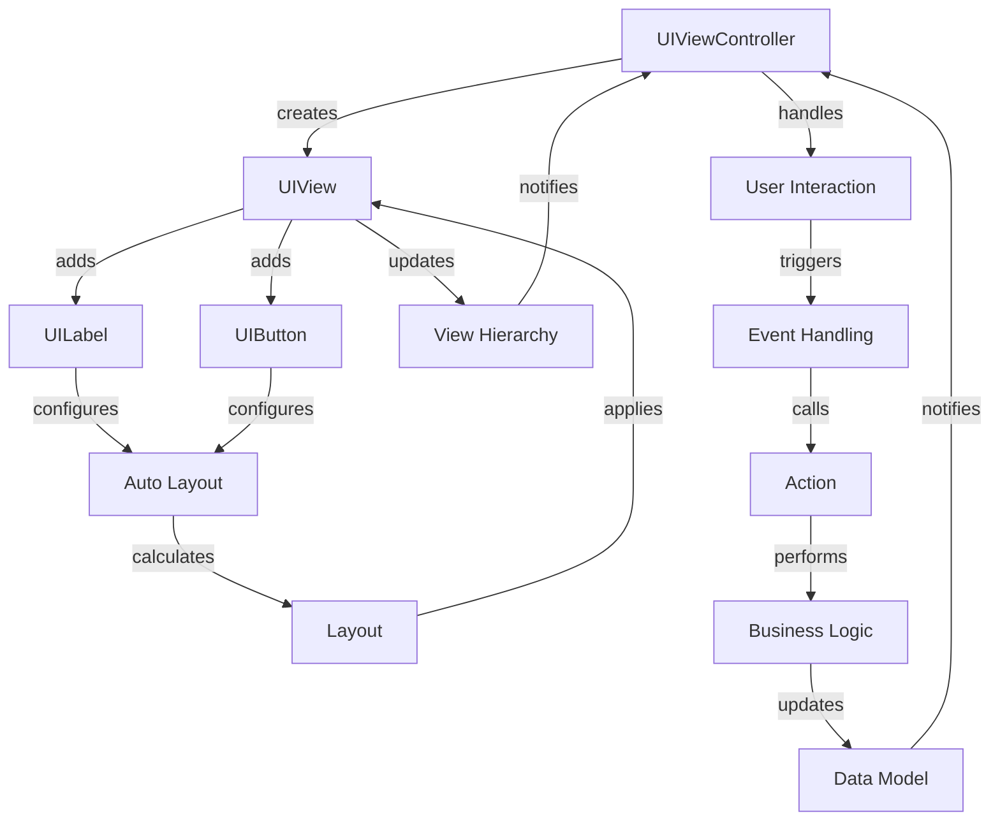

## Introduction
**UIKit** is a fundamental framework in iOS development, providing the building blocks for creating user interfaces. At its core, UIKit consists of two primary components: **UIViewController** and **UIView**. **UIViewController** manages the lifecycle of a view, handling events and interactions, while **UIView** represents the visual elements on the screen. **Auto Layout** is a powerful system for arranging and sizing views in a flexible, adaptive manner. Understanding these components is crucial for any iOS developer, as they form the foundation of every iOS app.

> **Note:** UIKit is not the only framework for building iOS user interfaces; other options include SwiftUI and third-party libraries. However, UIKit remains the most widely used and well-established framework.

In real-world iOS development, UIKit is used in virtually every app, from simple utilities to complex, data-driven applications. Companies like Apple, Facebook, and Instagram rely heavily on UIKit to create their user interfaces. As an iOS developer, having a deep understanding of UIKit is essential for building robust, visually appealing, and user-friendly apps.

## Core Concepts
* **UIViewController**: A controller that manages the lifecycle of a view, handling events, and interactions. It is responsible for creating, configuring, and presenting views.
* **UIView**: A visual element on the screen, which can be a button, label, image, or any other type of view. Views can be combined to create complex user interfaces.
* **Auto Layout**: A system for arranging and sizing views in a flexible, adaptive manner. Auto Layout uses constraints to define the relationships between views, allowing them to adjust their size and position in response to changes in the screen size, orientation, or content.

> **Tip:** When working with Auto Layout, it's essential to understand the concept of **constraints**. Constraints define the relationships between views, such as the distance between two views or the alignment of a view with its superview.

## How It Works Internally
When a **UIViewController** is created, it initializes its **view** property, which is an instance of **UIView**. The view controller is responsible for configuring its view, including setting its frame, background color, and adding subviews.

When a view is added to the view hierarchy, Auto Layout is triggered to calculate the view's size and position based on its constraints. Auto Layout uses a complex algorithm to solve the system of constraints, which involves the following steps:

1. **Constraint creation**: Constraints are created between views, defining the relationships between them.
2. **Constraint propagation**: Constraints are propagated through the view hierarchy, allowing Auto Layout to calculate the size and position of each view.
3. **Layout calculation**: Auto Layout calculates the size and position of each view based on its constraints and the constraints of its superviews.
4. **View layout**: The calculated size and position of each view are applied to the view hierarchy.

The time complexity of Auto Layout's layout calculation algorithm is O(n), where n is the number of views in the hierarchy. The space complexity is O(n) as well, as Auto Layout needs to store the constraints and view hierarchy.

## Code Examples
### Example 1: Basic UIKit Usage
```swift
import UIKit

class ViewController: UIViewController {
    override func viewDidLoad() {
        super.viewDidLoad()
        
        // Create a label
        let label = UILabel()
        label.text = "Hello, World!"
        label.font = UIFont.systemFont(ofSize: 24)
        
        // Add the label to the view
        view.addSubview(label)
        
        // Center the label
        label.translatesAutoresizingMaskIntoConstraints = false
        NSLayoutConstraint.activate([
            label.centerXAnchor.constraint(equalTo: view.centerXAnchor),
            label.centerYAnchor.constraint(equalTo: view.centerYAnchor)
        ])
    }
}
```
This example demonstrates the basic usage of UIKit, creating a **UIViewController** and adding a **UILabel** to its view. Auto Layout is used to center the label in the view.

### Example 2: Real-World UIKit Usage
```swift
import UIKit

class LoginViewController: UIViewController {
    private let usernameField = UITextField()
    private let passwordField = UITextField()
    private let loginButton = UIButton()
    
    override func viewDidLoad() {
        super.viewDidLoad()
        
        // Create the username field
        usernameField.placeholder = "Username"
        usernameField.borderStyle = .roundedRect
        
        // Create the password field
        passwordField.placeholder = "Password"
        passwordField.isSecureTextEntry = true
        passwordField.borderStyle = .roundedRect
        
        // Create the login button
        loginButton.setTitle("Login", for: .normal)
        loginButton.backgroundColor = .systemBlue
        loginButton.addTarget(self, action: #selector(loginButtonTapped), for: .touchUpInside)
        
        // Add the fields and button to the view
        view.addSubview(usernameField)
        view.addSubview(passwordField)
        view.addSubview(loginButton)
        
        // Configure the layout
        usernameField.translatesAutoresizingMaskIntoConstraints = false
        passwordField.translatesAutoresizingMaskIntoConstraints = false
        loginButton.translatesAutoresizingMaskIntoConstraints = false
        
        NSLayoutConstraint.activate([
            usernameField.centerXAnchor.constraint(equalTo: view.centerXAnchor),
            usernameField.topAnchor.constraint(equalTo: view.topAnchor, constant: 100),
            usernameField.widthAnchor.constraint(equalTo: view.widthAnchor, multiplier: 0.8),
            usernameField.heightAnchor.constraint(equalToConstant: 40),
            
            passwordField.centerXAnchor.constraint(equalTo: view.centerXAnchor),
            passwordField.topAnchor.constraint(equalTo: usernameField.bottomAnchor, constant: 20),
            passwordField.widthAnchor.constraint(equalTo: view.widthAnchor, multiplier: 0.8),
            passwordField.heightAnchor.constraint(equalToConstant: 40),
            
            loginButton.centerXAnchor.constraint(equalTo: view.centerXAnchor),
            loginButton.topAnchor.constraint(equalTo: passwordField.bottomAnchor, constant: 20),
            loginButton.widthAnchor.constraint(equalTo: view.widthAnchor, multiplier: 0.8),
            loginButton.heightAnchor.constraint(equalToConstant: 40)
        ])
    }
    
    @objc func loginButtonTapped() {
        // Handle the login button tap
    }
}
```
This example demonstrates a more complex usage of UIKit, creating a **LoginViewController** with username and password fields, and a login button. Auto Layout is used to configure the layout of the fields and button.

### Example 3: Advanced Auto Layout Usage
```swift
import UIKit

class ViewController: UIViewController {
    private let container = UIView()
    private let label = UILabel()
    private let button = UIButton()
    
    override func viewDidLoad() {
        super.viewDidLoad()
        
        // Create the container
        container.backgroundColor = .systemGray
        
        // Create the label
        label.text = "Hello, World!"
        label.font = UIFont.systemFont(ofSize: 24)
        
        // Create the button
        button.setTitle("Tap me", for: .normal)
        button.backgroundColor = .systemBlue
        
        // Add the label and button to the container
        container.addSubview(label)
        container.addSubview(button)
        
        // Add the container to the view
        view.addSubview(container)
        
        // Configure the layout
        container.translatesAutoresizingMaskIntoConstraints = false
        label.translatesAutoresizingMaskIntoConstraints = false
        button.translatesAutoresizingMaskIntoConstraints = false
        
        NSLayoutConstraint.activate([
            container.centerXAnchor.constraint(equalTo: view.centerXAnchor),
            container.topAnchor.constraint(equalTo: view.topAnchor, constant: 100),
            container.widthAnchor.constraint(equalTo: view.widthAnchor, multiplier: 0.8),
            container.heightAnchor.constraint(equalToConstant: 200),
            
            label.centerXAnchor.constraint(equalTo: container.centerXAnchor),
            label.topAnchor.constraint(equalTo: container.topAnchor, constant: 20),
            label.widthAnchor.constraint(equalTo: container.widthAnchor, multiplier: 0.8),
            label.heightAnchor.constraint(equalToConstant: 40),
            
            button.centerXAnchor.constraint(equalTo: container.centerXAnchor),
            button.topAnchor.constraint(equalTo: label.bottomAnchor, constant: 20),
            button.widthAnchor.constraint(equalTo: container.widthAnchor, multiplier: 0.8),
            button.heightAnchor.constraint(equalToConstant: 40)
        ])
    }
}
```
This example demonstrates an advanced usage of Auto Layout, creating a container view with a label and button inside. The container view is centered in the main view, and the label and button are centered inside the container.

## Visual Diagram

This diagram illustrates the relationships between **UIViewController**, **UIView**, and **Auto Layout**, as well as the flow of events and interactions.

## Comparison
| Approach | Time Complexity | Space Complexity | Pros | Cons | Best For |
| --- | --- | --- | --- | --- | --- |
| Auto Layout | O(n) | O(n) | Flexible, adaptive, and easy to use | Can be complex and difficult to debug | Most iOS apps |
| Frames | O(1) | O(1) | Simple and easy to use | Inflexible and not adaptive | Simple views or legacy code |
| Constraints | O(n) | O(n) | Flexible and adaptive | Can be complex and difficult to use | Complex views or custom layouts |
| SwiftUI | O(n) | O(n) | Declarative and easy to use | Limited compatibility and features | New apps or prototyping |

## Real-world Use Cases
* **Facebook**: Uses UIKit to build their iOS app, with a complex and adaptive layout that adjusts to different screen sizes and orientations.
* **Instagram**: Employs UIKit to create their iOS app, with a focus on visual elements and a custom layout that showcases user-generated content.
* **Apple**: Utilizes UIKit to build their own iOS apps, such as the App Store and Music apps, with a focus on simplicity and ease of use.

## Common Pitfalls
* **Incorrect constraint setup**: Failing to properly set up constraints can lead to layout issues and crashes.
* **Insufficient testing**: Not testing the app on different devices and screen sizes can result in layout problems and poor user experience.
* **Overusing Auto Layout**: Relying too heavily on Auto Layout can lead to complex and difficult-to-debug layouts.
* **Not handling rotation**: Failing to handle rotation and orientation changes can result in layout issues and poor user experience.

> **Warning:** When using Auto Layout, be careful not to create conflicting constraints, as this can lead to runtime errors and crashes.

## Interview Tips
* **What is the difference between a view and a view controller?**: A view is a visual element, while a view controller manages the lifecycle of a view and handles events and interactions.
* **How do you handle rotation and orientation changes in an iOS app?**: By using Auto Layout and setting up constraints that adapt to different screen sizes and orientations.
* **What is the purpose of a segue in an iOS app?**: A segue is used to transition between view controllers and pass data between them.

> **Interview:** When asked about UIKit, be prepared to discuss the differences between views and view controllers, how to handle rotation and orientation changes, and the purpose of segues.

## Key Takeaways
* **UIKit is the foundation of iOS development**: Understanding UIKit is essential for building robust and visually appealing iOS apps.
* **Auto Layout is a powerful tool**: Auto Layout allows for flexible and adaptive layouts that adjust to different screen sizes and orientations.
* **Constraints are key**: Constraints define the relationships between views and are essential for creating complex and adaptive layouts.
* **Testing is crucial**: Testing the app on different devices and screen sizes is essential for ensuring a good user experience.
* **Rotation and orientation changes must be handled**: Failing to handle rotation and orientation changes can result in layout issues and poor user experience.
* **Segues are used for transitions**: Segues are used to transition between view controllers and pass data between them.
* **View controllers manage the lifecycle of views**: View controllers handle events and interactions, and are responsible for creating and configuring views.
* **Views are visual elements**: Views represent the visual elements on the screen, and can be combined to create complex user interfaces.