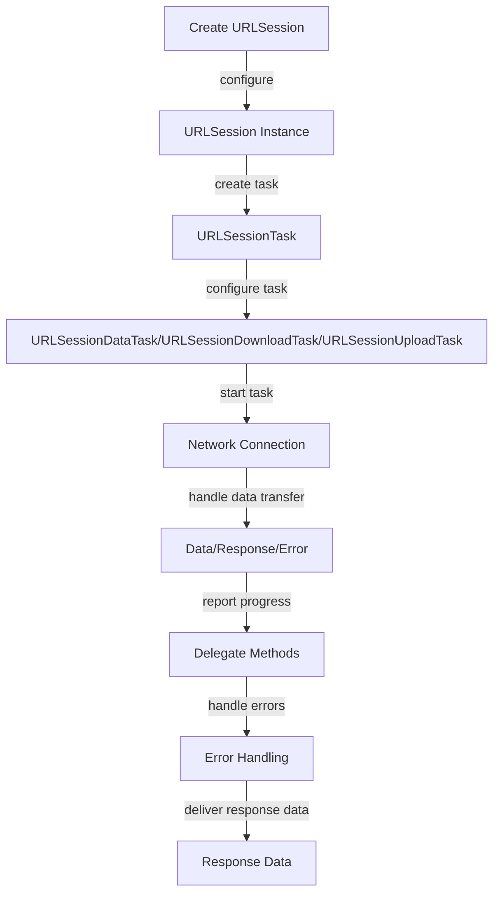

## Introduction
**URLSession** is a fundamental framework in iOS development, allowing developers to perform network requests and handle data transfers. It provides a simple and efficient way to fetch data from a server, upload files, and download resources. In this study guide, we will delve into the world of **URLSession**, exploring its core concepts, internal mechanics, and real-world applications.

> **Note:** **URLSession** is a replacement for the older **NSURLConnection** API, offering improved performance, security, and ease of use.

In real-world scenarios, **URLSession** is used by many popular apps, such as Facebook, Instagram, and Twitter, to fetch data from their servers and update the user interface accordingly. Understanding **URLSession** is essential for any iOS developer, as it is a crucial component of building robust and efficient network-enabled applications.

## Core Concepts
To work with **URLSession**, you need to understand the following key concepts:

* **URLSession**: The main class responsible for managing network requests and data transfers.
* **URLSessionTask**: A base class for all tasks, including data tasks, download tasks, and upload tasks.
* **URLSessionDataTask**: A task that fetches data from a server and returns it as a **Data** object.
* **URLSessionDownloadTask**: A task that downloads a file from a server and saves it to a local file.
* **URLSessionUploadTask**: A task that uploads a file to a server.

> **Tip:** When working with **URLSession**, it's essential to understand the different types of tasks and how to use them to achieve your goals.

## How It Works Internally
When you create a **URLSession** instance, you can configure it with various options, such as the delegate, configuration, and cache policy. The **URLSession** instance is responsible for managing the underlying network connections and handling the data transfer.

Here's a step-by-step breakdown of how **URLSession** works:

1. Create a **URLSession** instance with the desired configuration.
2. Create a **URLSessionTask** instance, such as a **URLSessionDataTask**, **URLSessionDownloadTask**, or **URLSessionUploadTask**.
3. Configure the task with the desired URL, HTTP method, and request body.
4. Start the task using the **resume()** method.
5. The **URLSession** instance will handle the underlying network connection and data transfer.
6. The task will call the delegate methods to report progress, handle errors, and deliver the response data.

> **Warning:** When working with **URLSession**, be aware of the potential pitfalls, such as not handling errors properly or not configuring the task correctly.

## Code Examples
### Example 1: Basic Data Task
```swift
import Foundation

let url = URL(string: "https://example.com/data")!
let session = URLSession(configuration: .default)

let task = session.dataTask(with: url) { data, response, error in
    if let error = error {
        print("Error: \(error)")
        return
    }
    
    if let data = data {
        print("Received data: \(data)")
    }
}

task.resume()
```
This example demonstrates a basic data task that fetches data from a server and prints the received data to the console.

### Example 2: Download Task
```swift
import Foundation

let url = URL(string: "https://example.com/file.zip")!
let session = URLSession(configuration: .default)

let task = session.downloadTask(with: url) { url, response, error in
    if let error = error {
        print("Error: \(error)")
        return
    }
    
    if let url = url {
        print("Downloaded file: \(url)")
    }
}

task.resume()
```
This example demonstrates a download task that downloads a file from a server and saves it to a local file.

### Example 3: Upload Task
```swift
import Foundation

let url = URL(string: "https://example.com/upload")!
let session = URLSession(configuration: .default)

let data = "Hello, World!".data(using: .utf8)!
let task = session.uploadTask(with: url, from: data) { data, response, error in
    if let error = error {
        print("Error: \(error)")
        return
    }
    
    if let data = data {
        print("Received response data: \(data)")
    }
}

task.resume()
```
This example demonstrates an upload task that uploads a file to a server and prints the received response data to the console.

## Visual Diagram

This diagram illustrates the high-level workflow of **URLSession**, from creating a **URLSession** instance to handling the response data.

> **Note:** This diagram is a simplified representation of the **URLSession** workflow and is intended to provide a general understanding of the process.

## Comparison
| Approach | Time Complexity | Space Complexity | Pros | Cons | Best For |
| --- | --- | --- | --- | --- | --- |
| **URLSessionDataTask** | O(1) | O(1) | Simple, efficient, and easy to use | Limited control over the underlying network connection | Fetching small amounts of data |
| **URLSessionDownloadTask** | O(n) | O(n) | Allows for downloading large files | May consume a lot of memory and disk space | Downloading large files |
| **URLSessionUploadTask** | O(n) | O(n) | Allows for uploading large files | May consume a lot of memory and disk space | Uploading large files |
| **NSURLConnection** | O(1) | O(1) | Provides more control over the underlying network connection | More complex and error-prone | Legacy applications or custom networking requirements |

> **Tip:** When choosing an approach, consider the specific requirements of your application and the trade-offs between simplicity, efficiency, and control.

## Real-world Use Cases
1. **Facebook**: Uses **URLSession** to fetch data from its servers and update the user interface accordingly.
2. **Instagram**: Uses **URLSession** to download and upload images and videos.
3. **Twitter**: Uses **URLSession** to fetch tweets and update the user interface in real-time.

> **Interview:** Can you explain the difference between **URLSessionDataTask**, **URLSessionDownloadTask**, and **URLSessionUploadTask**?

## Common Pitfalls
1. **Not handling errors properly**: Failing to handle errors correctly can lead to unexpected behavior and crashes.
2. **Not configuring the task correctly**: Failing to configure the task correctly can lead to unexpected behavior and errors.
3. **Not using the correct delegate methods**: Failing to use the correct delegate methods can lead to unexpected behavior and errors.
4. **Not handling memory and disk space constraints**: Failing to handle memory and disk space constraints can lead to performance issues and crashes.

> **Warning:** Be aware of these common pitfalls and take steps to avoid them in your application.

## Interview Tips
1. **What is the difference between **URLSessionDataTask**, **URLSessionDownloadTask**, and **URLSessionUploadTask****: Be prepared to explain the differences between these tasks and how to use them correctly.
2. **How do you handle errors with **URLSession****: Be prepared to explain how to handle errors correctly and provide examples of error handling code.
3. **What are some best practices for using **URLSession****: Be prepared to explain best practices for using **URLSession**, such as handling memory and disk space constraints.

> **Tip:** Be prepared to answer these questions and provide examples of your experience with **URLSession**.

## Key Takeaways
* **URLSession** is a fundamental framework in iOS development for performing network requests and handling data transfers.
* **URLSessionTask** is a base class for all tasks, including data tasks, download tasks, and upload tasks.
* **URLSessionDataTask** is a task that fetches data from a server and returns it as a **Data** object.
* **URLSessionDownloadTask** is a task that downloads a file from a server and saves it to a local file.
* **URLSessionUploadTask** is a task that uploads a file to a server.
* Handling errors correctly is crucial for robust and efficient network-enabled applications.
* Configuring the task correctly is essential for achieving the desired behavior and avoiding errors.
* Using the correct delegate methods is necessary for handling the response data and reporting progress.
* Handling memory and disk space constraints is essential for avoiding performance issues and crashes.

> **Note:** These key takeaways provide a summary of the essential concepts and best practices for working with **URLSession**.