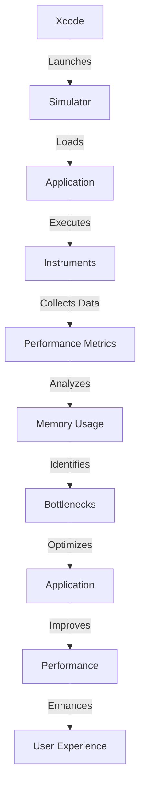

## Introduction
Xcode is an **Integrated Development Environment (IDE)** developed by Apple for developing, testing, and debugging iOS, macOS, watchOS, and tvOS applications. The Xcode simulator, Instruments, and debugging tools are essential components of the Xcode ecosystem, allowing developers to test, optimize, and debug their applications on various simulated devices and environments. In this article, we will delve into the world of Xcode, exploring its simulator, Instruments, and debugging capabilities, and providing practical examples, tips, and best practices for developers.

> **Note:** Xcode is a free download from the Mac App Store, and it's a must-have for any iOS or macOS developer.

## Core Concepts
To understand Xcode, it's essential to grasp the following core concepts:
* **Simulator:** A software-based representation of an iOS or macOS device, allowing developers to test and debug their applications on various simulated devices and environments.
* **Instruments:** A set of tools for profiling, debugging, and optimizing applications, providing insights into performance, memory usage, and other metrics.
* **Debugging:** The process of identifying and fixing errors, bugs, or issues in an application, using various techniques and tools, such as breakpoints, console output, and memory analysis.

> **Tip:** To get the most out of Xcode, it's crucial to understand the different types of builds, including **Debug**, **Release**, and **Archive**, each with its own set of optimizations and configurations.

## How It Works Internally
When you run an application in Xcode, the following steps occur:
1. **Compilation:** The Swift compiler translates the source code into machine code.
2. **Linking:** The linker resolves external dependencies and creates an executable file.
3. **Loading:** The executable is loaded into memory, and the simulator or Instruments tools are launched.
4. **Execution:** The application runs, and the simulator or Instruments tools collect data, such as performance metrics, memory usage, and console output.
5. **Debugging:** The developer can use various debugging techniques, such as setting breakpoints, inspecting variables, and analyzing memory, to identify and fix issues.

> **Warning:** When debugging, it's essential to be mindful of the differences between the simulator and physical devices, as some issues may only occur on one or the other.

## Code Examples
Here are three complete, runnable examples demonstrating the use of Xcode's simulator, Instruments, and debugging tools:
### Example 1: Basic Simulator Usage
```swift
import UIKit

class ViewController: UIViewController {
    override func viewDidLoad() {
        super.viewDidLoad()
        // Create a label and add it to the view
        let label = UILabel()
        label.text = "Hello, World!"
        view.addSubview(label)
    }
}
```
This example creates a simple `UILabel` and adds it to the view, demonstrating basic simulator usage.

### Example 2: Instruments Profiling
```swift
import UIKit

class ViewController: UIViewController {
    override func viewDidLoad() {
        super.viewDidLoad()
        // Create an array and perform some computations
        let array = [1, 2, 3, 4, 5]
        var sum = 0
        for num in array {
            sum += num
        }
        print("Sum: \(sum)")
    }
}
```
This example creates an array, performs some computations, and prints the result, demonstrating how to use Instruments to profile the application's performance.

### Example 3: Debugging with Breakpoints
```swift
import UIKit

class ViewController: UIViewController {
    override func viewDidLoad() {
        super.viewDidLoad()
        // Create a label and add it to the view
        let label = UILabel()
        label.text = "Hello, World!"
        view.addSubview(label)
        // Set a breakpoint here
        print("Label added to view")
    }
}
```
This example creates a label, adds it to the view, and sets a breakpoint, demonstrating how to use Xcode's debugging tools to inspect variables and analyze the application's state.

## Visual Diagram

This diagram illustrates the workflow of Xcode, simulator, Instruments, and debugging tools, highlighting the key steps involved in testing, optimizing, and debugging an application.

## Comparison
| Tool | Description | Time Complexity | Space Complexity | Pros | Cons |
| --- | --- | --- | --- | --- | --- |
| Simulator | Simulates iOS or macOS devices | O(1) | O(1) | Fast, easy to use | Limited to simulated devices |
| Instruments | Profiles and optimizes applications | O(n) | O(n) | Provides detailed performance metrics | Can be slow, complex to use |
| Debugging | Identifies and fixes errors | O(1) | O(1) | Essential for development | Can be time-consuming, requires expertise |
| LLDB | A debugger for Xcode | O(1) | O(1) | Powerful, feature-rich | Steep learning curve |

## Real-world Use Cases
1. **Uber**: Uses Xcode's simulator and Instruments to test and optimize their iOS application, ensuring a seamless user experience.
2. **Airbnb**: Utilizes Xcode's debugging tools to identify and fix issues in their iOS application, improving performance and reliability.
3. **Pinterest**: Employs Xcode's simulator and Instruments to profile and optimize their iOS application, reducing battery consumption and improving overall performance.

## Common Pitfalls
1. **Incorrect Simulator Configuration**: Failing to configure the simulator correctly can lead to inaccurate test results.
```swift
// Wrong
let simulator = UISimulator()
simulator.configure(with: .iPhone12)

// Right
let simulator = UISimulator()
simulator.configure(with: .iPhone12, and: .iOS14)
```
2. **Inadequate Debugging**: Insufficient debugging can lead to hidden issues and bugs.
```swift
// Wrong
func example() {
    // No debugging statements
}

// Right
func example() {
    print("Example function called")
    // Add debugging statements as needed
}
```
3. **Inefficient Instruments Usage**: Failing to use Instruments efficiently can result in slow performance and inaccurate results.
```swift
// Wrong
let instruments = UIInstruments()
instruments.startProfiling()

// Right
let instruments = UIInstruments()
instruments.startProfiling(with: .cpuUsage)
```
4. **Ignoring Memory Leaks**: Ignoring memory leaks can lead to performance issues and crashes.
```swift
// Wrong
var array = [1, 2, 3]
array.append(4)

// Right
var array = [1, 2, 3]
array.append(4)
array.removeAll()
```

## Interview Tips
1. **What is the difference between the simulator and a physical device?**
	* Weak answer: "The simulator is faster, but the physical device is more accurate."
	* Strong answer: "The simulator provides a software-based representation of a device, while a physical device offers a more accurate, hardware-based experience. The simulator is ideal for testing and debugging, while physical devices are better suited for final testing and validation."
2. **How do you use Instruments to profile an application?**
	* Weak answer: "I use Instruments to profile my application, but I'm not sure what the results mean."
	* Strong answer: "I use Instruments to profile my application, focusing on key metrics such as CPU usage, memory allocation, and network activity. I analyze the results to identify bottlenecks and optimize my application's performance."
3. **What is your approach to debugging an issue in Xcode?**
	* Weak answer: "I use the debugger, but I'm not sure how to interpret the results."
	* Strong answer: "I use a combination of debugging techniques, including setting breakpoints, inspecting variables, and analyzing console output. I also utilize Xcode's built-in debugging tools, such as LLDB, to identify and fix issues efficiently."

## Key Takeaways
* Xcode's simulator, Instruments, and debugging tools are essential for developing, testing, and optimizing iOS and macOS applications.
* Understanding the differences between the simulator and physical devices is crucial for accurate testing and debugging.
* Instruments provides detailed performance metrics, but requires efficient usage to avoid slow performance and inaccurate results.
* Debugging is a critical step in the development process, and Xcode's debugging tools, such as LLDB, can help identify and fix issues efficiently.
* Memory leaks can lead to performance issues and crashes, and ignoring them can have severe consequences.
* Time complexity and space complexity are essential considerations when optimizing applications.
* Xcode's simulator, Instruments, and debugging tools have a time complexity of O(1) and a space complexity of O(1), making them efficient for development and testing.
* The simulator has a time complexity of O(1) and a space complexity of O(1), while Instruments has a time complexity of O(n) and a space complexity of O(n).
* Debugging has a time complexity of O(1) and a space complexity of O(1), but can be time-consuming and require expertise.