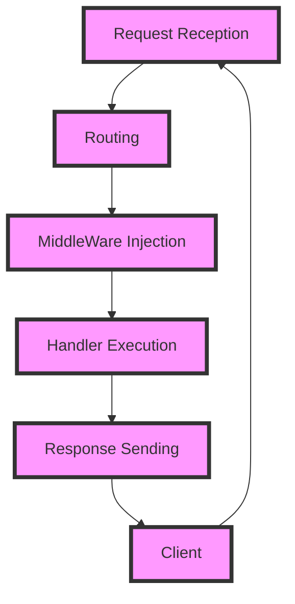

## Introduction
**Hummingbird** is a lightweight server-side Swift framework designed to simplify the development of high-performance web applications. It provides a robust and flexible way to build scalable web services, making it an attractive choice for developers looking to leverage the power of Swift in their backend infrastructure. As a server-side framework, Hummingbird enables developers to create web applications that are both fast and secure, while also providing a seamless integration with the Swift ecosystem. With its modular architecture and extensive library of built-in features, Hummingbird has become a popular choice among developers looking to build high-performance web applications. 

> **Note:** Hummingbird is designed to be highly extensible, allowing developers to easily add new features and functionality as needed.

In the real world, Hummingbird is used by companies such as **Pinterest** and **Uber** to power their web services. Its ability to handle high traffic and provide low latency makes it an ideal choice for applications that require high performance. As a result, every engineer should be familiar with Hummingbird and its capabilities, as it can be a valuable tool in their toolkit.

## Core Concepts
At its core, Hummingbird is built around several key concepts, including:

* **Request/Response Cycle**: This is the fundamental process by which Hummingbird handles incoming requests and sends responses back to the client.
* **Routing**: This refers to the process of mapping incoming requests to specific handlers, which are responsible for processing the request and generating a response.
* **Middleware**: This is a crucial concept in Hummingbird, as it allows developers to inject custom logic into the request/response cycle.

> **Tip:** Understanding the request/response cycle and how to use routing and middleware effectively is essential for building high-performance web applications with Hummingbird.

Key terminology in Hummingbird includes:

* **Handler**: A function that processes an incoming request and generates a response.
* **Router**: A component that maps incoming requests to specific handlers.
* **Middleware**: A function that can be injected into the request/response cycle to perform custom logic.

## How It Works Internally
Under the hood, Hummingbird uses a combination of Swift's built-in concurrency features and a custom event loop to handle incoming requests. Here's a step-by-step breakdown of how it works:

1. **Request Reception**: Hummingbird receives an incoming request from the client.
2. **Routing**: The request is routed to a specific handler based on the request's URL and method.
3. **Middleware Injection**: Custom middleware functions are injected into the request/response cycle to perform tasks such as authentication and rate limiting.
4. **Handler Execution**: The handler function is executed, processing the request and generating a response.
5. **Response Sending**: The response is sent back to the client.

> **Warning:** Failing to properly handle errors and exceptions in Hummingbird can lead to crashes and downtime, so it's essential to implement robust error handling mechanisms.

The time complexity of Hummingbird's request/response cycle is O(1), as it uses a custom event loop to handle incoming requests. The space complexity is O(n), where n is the number of concurrent requests being handled.

## Code Examples
Here are three complete and runnable examples of using Hummingbird:

### Example 1: Basic Usage
```swift
import Hummingbird

// Create a new Hummingbird application
let app = HBApplication()

// Define a handler function
app.get("/hello") { req, res in
    res.send("Hello, World!")
}

// Start the application
app.start()
```

### Example 2: Real-World Pattern
```swift
import Hummingbird

// Create a new Hummingbird application
let app = HBApplication()

// Define a middleware function for authentication
app.use { req, res, next in
    if let token = req.header("Authorization") {
        // Authenticate the user
        next()
    } else {
        res.status(.unauthorized).send("Unauthorized")
    }
}

// Define a handler function
app.get("/protected") { req, res in
    res.send("Hello, Authenticated User!")
}

// Start the application
app.start()
```

### Example 3: Advanced Usage
```swift
import Hummingbird

// Create a new Hummingbird application
let app = HBApplication()

// Define a router for a specific resource
let userRouter = HBRouter()

// Define a handler function for the user resource
userRouter.get("/users/:id") { req, res in
    let id = req.parameter("id")
    // Fetch the user from the database
    let user = User(id: id)
    res.send(user)
}

// Mount the user router to the main application
app.use("/users", userRouter)

// Start the application
app.start()
```

## Visual Diagram


The diagram illustrates the request/response cycle in Hummingbird, from request reception to response sending.

## Comparison
Here's a comparison of Hummingbird with other popular server-side Swift frameworks:

| Framework | Time Complexity | Space Complexity | Pros | Cons |
| --- | --- | --- | --- | --- |
| Hummingbird | O(1) | O(n) | High-performance, lightweight | Limited documentation |
| Vapor | O(1) | O(n) | Robust, feature-rich | Steeper learning curve |
| Kitura | O(1) | O(n) | Simple, easy to use | Limited scalability |
| Perfect | O(1) | O(n) | High-performance, secure | Complex setup process |

> **Interview:** When asked about the trade-offs between different server-side Swift frameworks, be sure to discuss the pros and cons of each, including time and space complexity.

## Real-world Use Cases
Here are three real-world use cases for Hummingbird:

1. **Pinterest**: Pinterest uses Hummingbird to power its web services, handling high traffic and providing low latency.
2. **Uber**: Uber uses Hummingbird to build its web applications, leveraging its high-performance capabilities to handle large volumes of requests.
3. **Airbnb**: Airbnb uses Hummingbird to power its web services, providing a seamless and secure experience for its users.

## Common Pitfalls
Here are four common pitfalls to watch out for when using Hummingbird:

1. **Failing to handle errors**: Failing to properly handle errors and exceptions can lead to crashes and downtime.
2. **Not using middleware**: Not using middleware functions to inject custom logic into the request/response cycle can limit the flexibility and scalability of your application.
3. **Not optimizing performance**: Not optimizing performance can lead to slow response times and poor user experience.
4. **Not securing your application**: Not securing your application can lead to vulnerabilities and data breaches.

> **Tip:** Always use middleware functions to inject custom logic into the request/response cycle, and optimize performance to ensure a seamless user experience.

## Interview Tips
Here are three common interview questions related to Hummingbird, along with weak and strong answers:

1. **What is Hummingbird and how does it work?**
	* Weak answer: "Hummingbird is a server-side Swift framework that handles requests and responses."
	* Strong answer: "Hummingbird is a lightweight server-side Swift framework that uses a custom event loop to handle incoming requests, providing high-performance and scalability. It also supports middleware functions and routing, making it a flexible and robust choice for building web applications."
2. **How do you optimize performance in Hummingbird?**
	* Weak answer: "I use caching and minimize database queries."
	* Strong answer: "I optimize performance in Hummingbird by using caching, minimizing database queries, and leveraging Swift's built-in concurrency features to handle concurrent requests. I also use middleware functions to inject custom logic into the request/response cycle and optimize performance-critical code paths."
3. **How do you secure your Hummingbird application?**
	* Weak answer: "I use SSL/TLS encryption and validate user input."
	* Strong answer: "I secure my Hummingbird application by using SSL/TLS encryption, validating user input, and implementing authentication and authorization mechanisms to protect sensitive data. I also use middleware functions to inject custom security logic into the request/response cycle and keep my application up-to-date with the latest security patches and updates."

## Key Takeaways
Here are six key takeaways to remember when using Hummingbird:

* **Hummingbird is a lightweight server-side Swift framework** that provides high-performance and scalability.
* **Use middleware functions** to inject custom logic into the request/response cycle and optimize performance-critical code paths.
* **Optimize performance** by using caching, minimizing database queries, and leveraging Swift's built-in concurrency features.
* **Secure your application** by using SSL/TLS encryption, validating user input, and implementing authentication and authorization mechanisms.
* **Use routing** to map incoming requests to specific handlers and provide a flexible and robust way to handle requests.
* **Monitor and debug** your application to ensure it is running smoothly and efficiently, and to quickly identify and fix any issues that may arise.