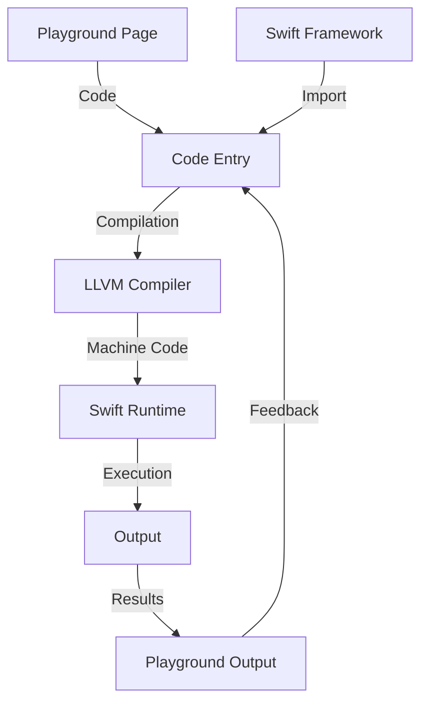

## Introduction
**Swift Playgrounds** is an interactive development environment (IDE) designed by Apple to help beginners and experienced developers learn and explore the **Swift** programming language. It provides a unique, interactive way to write and execute code, making it an ideal platform for learning and experimentation. With Swift Playgrounds, developers can create, test, and refine their code in a sandboxed environment, making it easier to learn and master the Swift language. 
> **Note:** Swift Playgrounds is available for both macOS and iPad, providing a consistent learning experience across devices.

In real-world scenarios, Swift Playgrounds is used by both individuals and organizations to learn and teach Swift. Many educational institutions and companies use Swift Playgrounds as a tool to introduce students and employees to the Swift programming language. For example, Apple's own **Swift Curriculum** for schools is based on Swift Playgrounds, providing a comprehensive learning path for students.

## Core Concepts
To understand how Swift Playgrounds works, it's essential to grasp some core concepts:
- **Playgrounds**: A playground is a self-contained environment where you can write, execute, and experiment with Swift code.
- **Pages**: A playground is divided into pages, each representing a separate section of code or a specific topic.
- **Code Execution**: Swift Playgrounds executes code line-by-line, providing real-time feedback and results.

Mental models for learning Swift include thinking of a playground as a **notebook** where you can jot down ideas, experiment with code, and see the results instantly. Key terminology includes **playground**, **page**, and **code execution**.

## How It Works Internally
Under the hood, Swift Playgrounds uses the **LLVM compiler** to compile and execute Swift code. When you write code in a playground, it's compiled into machine code, which is then executed by the **Swift Runtime**. The results are displayed in the playground's output area, providing instant feedback.

Here's a step-by-step breakdown of the process:
1. **Code Entry**: You write Swift code in a playground page.
2. **Compilation**: The LLVM compiler compiles the code into machine code.
3. **Execution**: The Swift Runtime executes the compiled code.
4. **Output**: The results are displayed in the playground's output area.

> **Tip:** To get the most out of Swift Playgrounds, it's essential to understand how the compilation and execution process works.

## Code Examples
### Example 1: Basic Swift Playground
```swift
// Import the Swift framework
import Swift

// Define a variable
var greeting = "Hello, World!"

// Print the greeting
print(greeting)
```
This example demonstrates the basic syntax of a Swift playground. You can create a new playground, add this code, and see the results instantly.

### Example 2: Swift Playground with Functions
```swift
// Import the Swift framework
import Swift

// Define a function
func greet(name: String) {
    print("Hello, \(name)!")
}

// Call the function
greet(name: "John")
```
This example shows how to define and call a function in a Swift playground. You can experiment with different function signatures and implementations.

### Example 3: Swift Playground with Classes
```swift
// Import the Swift framework
import Swift

// Define a class
class Person {
    var name: String
    var age: Int

    init(name: String, age: Int) {
        self.name = name
        self.age = age
    }

    func greet() {
        print("Hello, my name is \(name) and I'm \(age) years old.")
    }
}

// Create an instance of the class
let person = Person(name: "Jane", age: 30)

// Call the greet method
person.greet()
```
This example demonstrates how to define and use classes in a Swift playground. You can experiment with different class definitions and implementations.

## Visual Diagram

This diagram illustrates the internal workings of Swift Playgrounds, from code entry to output. It shows how the LLVM compiler and Swift Runtime work together to execute Swift code.

## Comparison
| Approach | Time Complexity | Space Complexity | Pros | Cons | Best For |
|----------|----------------|-----------------|------|------|----------|
| Swift Playgrounds | O(1) | O(1) | Interactive, real-time feedback, easy to use | Limited to Swift language, not suitable for large-scale projects | Learning Swift, prototyping, experimentation |
| Xcode | O(n) | O(n) | Comprehensive IDE, supports multiple languages, large-scale project management | Steeper learning curve, more complex | Large-scale projects, production development |
| Online Code Editors | O(1) | O(1) | Convenient, accessible, collaborative | Limited features, not suitable for large-scale projects | Quick prototyping, code sharing, collaboration |
| Command-Line Tools | O(n) | O(n) | Flexible, customizable, scriptable | Steeper learning curve, not interactive | Automation, scripting, system administration |

## Real-world Use Cases
1. **Apple's Swift Curriculum**: Apple's own curriculum for teaching Swift in schools is based on Swift Playgrounds, providing a comprehensive learning path for students.
2. **Ray Wenderlich's Tutorials**: Ray Wenderlich's tutorials and courses often use Swift Playgrounds as a teaching tool, providing interactive and engaging learning experiences for students.
3. **Udacity's Swift Course**: Udacity's Swift course uses Swift Playgrounds as a primary learning environment, providing hands-on experience and real-time feedback for students.

## Common Pitfalls
1. **Not Understanding the Playground's Sandbox Environment**: Swift Playgrounds provides a sandboxed environment, which can lead to confusion when working with external resources or frameworks.
> **Warning:** Be aware of the sandbox environment and its limitations when working with Swift Playgrounds.
2. **Not Using the Correct Import Statements**: Swift Playgrounds requires specific import statements to work correctly.
> **Tip:** Always use the correct import statements when working with Swift Playgrounds.
3. **Not Handling Errors Properly**: Swift Playgrounds can make it easy to overlook error handling, leading to unexpected behavior or crashes.
> **Interview:** Be prepared to discuss error handling strategies and best practices when working with Swift Playgrounds.
4. **Not Optimizing Code for Performance**: Swift Playgrounds can hide performance issues, making it essential to optimize code for production environments.
> **Note:** Always consider performance optimization when working with Swift Playgrounds and transitioning to production environments.

## Interview Tips
1. **What is Swift Playgrounds, and how does it work?**: Be prepared to explain the basics of Swift Playgrounds, including its interactive environment and real-time feedback.
> **Interview:** A strong answer should demonstrate a clear understanding of Swift Playgrounds and its features.
2. **How do you handle errors in Swift Playgrounds?**: Be prepared to discuss error handling strategies and best practices when working with Swift Playgrounds.
> **Interview:** A weak answer might focus on ignoring errors or using try-catch blocks without proper handling.
3. **What are some common pitfalls when working with Swift Playgrounds?**: Be prepared to discuss common pitfalls, such as not understanding the sandbox environment or not using correct import statements.
> **Interview:** A strong answer should demonstrate awareness of potential issues and strategies for avoiding them.

## Key Takeaways
* **Swift Playgrounds is an interactive development environment** designed for learning and experimentation.
* **Understand the internal workings** of Swift Playgrounds, including compilation, execution, and output.
* **Use Swift Playgrounds for learning and prototyping**, but consider other tools for large-scale projects.
* **Optimize code for performance** when transitioning from Swift Playgrounds to production environments.
* **Error handling is crucial** in Swift Playgrounds, and proper strategies should be employed.
* **Be aware of common pitfalls**, such as not understanding the sandbox environment or not using correct import statements.
* **Swift Playgrounds has a time complexity of O(1)** and a space complexity of O(1), making it suitable for interactive and real-time applications.
* **Swift Playgrounds is best for learning Swift, prototyping, and experimentation**, but not suitable for large-scale projects or production development.