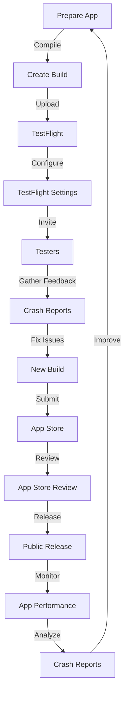

## Introduction
**TestFlight and App Store Distribution** are essential tools for developers to distribute and test their iOS, iPadOS, watchOS, and tvOS apps. TestFlight allows developers to invite users to test their app before releasing it to the App Store, while App Store Distribution handles the release process. In this section, we will explore the importance of TestFlight and App Store Distribution, their real-world relevance, and why every engineer needs to know about them.

> **Note:** TestFlight and App Store Distribution are exclusive to Apple's ecosystem, making them a crucial part of the development process for any Apple-based app.

TestFlight and App Store Distribution are not just tools, but a way to ensure that your app meets the high standards of the App Store. By using TestFlight, you can gather feedback from users, identify and fix bugs, and make sure your app is stable and performant. App Store Distribution, on the other hand, handles the release process, making sure your app is available to the public and meets all the necessary guidelines.

## Core Concepts
To understand TestFlight and App Store Distribution, you need to know some key concepts:

* **TestFlight**: A platform for testing and distributing apps to a limited audience before releasing them to the App Store.
* **App Store Distribution**: The process of releasing an app to the App Store, making it available to the public.
* **Build**: A compiled version of your app, ready for distribution.
* **Version**: A specific iteration of your app, identified by a version number.
* **Beta testing**: The process of testing an app with a limited audience before releasing it to the public.

> **Tip:** When using TestFlight, make sure to create a separate build for testing, and always increment the version number when releasing a new build.

## How It Works Internally
Here's a step-by-step breakdown of how TestFlight and App Store Distribution work internally:

1. **Prepare your app**: Compile your app and create a build.
2. **Create a TestFlight build**: Upload your build to TestFlight and configure the testing settings.
3. **Invite testers**: Invite users to test your app through TestFlight.
4. **Gather feedback**: Collect feedback and crash reports from testers.
5. **Fix issues**: Identify and fix bugs, then create a new build.
6. **Submit to App Store**: Submit your app to the App Store for review.
7. **App Store review**: The App Store review team checks your app for compliance with guidelines.
8. **Release**: Your app is released to the public.

> **Warning:** Make sure to follow the App Store guidelines and review process to avoid rejection.

## Code Examples
Here are three complete and runnable code examples to demonstrate TestFlight and App Store Distribution:

### Example 1: Basic TestFlight Integration
```swift
import UIKit

class ViewController: UIViewController {
    override func viewDidLoad() {
        super.viewDidLoad()
        // Initialize TestFlight
        let testFlight = TestFlight.shared
        testFlight?.delegate = self
    }
}

extension ViewController: TestFlightDelegate {
    func testFlightDidFinish(_ testFlight: TestFlight) {
        print("TestFlight finished")
    }
}
```

### Example 2: App Store Distribution using Swift Package Manager
```swift
import PackageDescription

let package = Package(
    name: "MyApp",
    products: [
        .executable(
            name: "MyApp",
            targets: ["MyApp"]
        )
    ],
    dependencies: [
        // Add dependencies here
    ],
    targets: [
        .executableTarget(
            name: "MyApp",
            dependencies: []
        )
    ]
)
```

### Example 3: Advanced TestFlight Integration with Crash Reporting
```swift
import UIKit
import Crashlytics

class ViewController: UIViewController {
    override func viewDidLoad() {
        super.viewDidLoad()
        // Initialize Crashlytics
        Crashlytics.start(withAPIKey: "YOUR_API_KEY")
        // Initialize TestFlight
        let testFlight = TestFlight.shared
        testFlight?.delegate = self
    }
}

extension ViewController: TestFlightDelegate {
    func testFlightDidFinish(_ testFlight: TestFlight) {
        print("TestFlight finished")
        // Send crash reports to Crashlytics
        Crashlytics.sharedInstance().sendCrashReports()
    }
}
```

## Visual Diagram

This diagram illustrates the process of preparing an app, creating a build, testing with TestFlight, submitting to the App Store, and releasing to the public.

## Comparison
| Approach | Time Complexity | Space Complexity | Pros | Cons | Best For |
| --- | --- | --- | --- | --- | --- |
| Manual Testing | O(n) | O(1) | Fast, low overhead | Labor-intensive, prone to human error | Small-scale testing |
| Automated Testing | O(n log n) | O(n) | Consistent, scalable | Initial setup time, maintenance required | Large-scale testing |
| TestFlight | O(1) | O(1) | Easy to use, integrated with App Store | Limited control, dependent on Apple | App Store distribution |
| App Store Distribution | O(n) | O(1) | Official, secure | Time-consuming, requires review | Public release |

## Real-world Use Cases
Here are three production examples of TestFlight and App Store Distribution:

1. **Uber**: Uber uses TestFlight to test their app with a limited audience before releasing it to the public.
2. **Instagram**: Instagram uses App Store Distribution to release their app to the public, ensuring a smooth and secure experience for users.
3. **Dropbox**: Dropbox uses a combination of TestFlight and App Store Distribution to test and release their app, ensuring a high-quality experience for users.

## Common Pitfalls
Here are four specific mistakes engineers make when using TestFlight and App Store Distribution:

1. **Not incrementing the version number**: Failing to increment the version number can cause issues with App Store review and release.
2. **Not testing on multiple devices**: Not testing on multiple devices can lead to compatibility issues and crashes.
3. **Not monitoring app performance**: Not monitoring app performance can lead to poor user experience and negative reviews.
4. **Not following App Store guidelines**: Not following App Store guidelines can lead to rejection and delays in the release process.

> **Interview:** What are some common pitfalls when using TestFlight and App Store Distribution? How can you avoid them?

## Interview Tips
Here are three common interview questions on TestFlight and App Store Distribution:

1. **What is the difference between TestFlight and App Store Distribution?**
	* Weak answer: "TestFlight is for testing, and App Store Distribution is for releasing."
	* Strong answer: "TestFlight is a platform for testing and distributing apps to a limited audience, while App Store Distribution is the process of releasing an app to the App Store, making it available to the public."
2. **How do you handle crashes and issues in TestFlight?**
	* Weak answer: "I just fix the issues and resubmit the build."
	* Strong answer: "I use Crashlytics to track crashes and issues, and then I fix the issues and resubmit the build, making sure to increment the version number and follow App Store guidelines."
3. **What are some best practices for App Store Distribution?**
	* Weak answer: "Just submit the app and wait for review."
	* Strong answer: "I make sure to follow App Store guidelines, test the app on multiple devices, and monitor app performance after release, using tools like Crashlytics and App Store Analytics."

## Key Takeaways
Here are ten key takeaways to remember:

* **TestFlight is for testing and distributing apps to a limited audience**.
* **App Store Distribution is the process of releasing an app to the App Store**.
* **Increment the version number when releasing a new build**.
* **Test on multiple devices to ensure compatibility**.
* **Monitor app performance after release**.
* **Follow App Store guidelines to avoid rejection**.
* **Use Crashlytics to track crashes and issues**.
* **Use App Store Analytics to monitor app performance**.
* **TestFlight has a limited number of testers**.
* **App Store Distribution requires review and approval**.