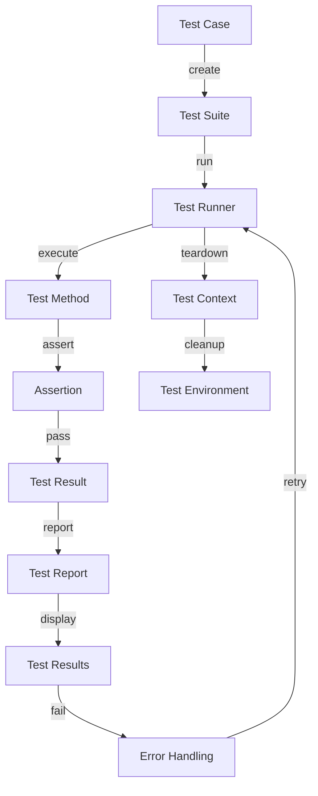

## Introduction
XCTest is a testing framework developed by Apple, designed to help developers write and run unit tests and user interface tests for their iOS, macOS, watchOS, and tvOS applications. It provides a comprehensive set of tools and APIs to ensure that your app is reliable, stable, and functions as expected. As a developer, you should be familiar with XCTest to guarantee the quality of your code and to catch bugs early in the development process. In real-world scenarios, XCTest is used by companies like Apple, Google, and Amazon to test their mobile applications.

## Core Concepts
**Unit testing** is the process of verifying that individual units of code, such as functions or methods, behave as expected. **UI testing** involves verifying that the user interface of an application functions correctly. Key terminology in XCTest includes **test cases**, **test suites**, and **assertions**. A test case is a single test that verifies a specific piece of functionality, while a test suite is a collection of related test cases. Assertions are used to verify that the expected behavior occurs.

> **Note:** Understanding the difference between unit testing and UI testing is crucial. Unit testing focuses on individual components, while UI testing focuses on the overall user experience.

## How It Works Internally
XCTest uses a combination of Objective-C and Swift to provide a testing framework that integrates seamlessly with Xcode. When you run a test, XCTest creates an instance of your test class and calls the `test` method. The `test` method contains the code that verifies the behavior of your app. Under the hood, XCTest uses a **test runner** to execute your tests and report the results. The test runner is responsible for creating and managing the test environment, including setting up and tearing down the test context.

> **Warning:** Failing to properly set up and tear down the test context can lead to test failures and false positives.

## Code Examples
### Example 1: Basic Unit Test
```swift
import XCTest

class Calculator {
    func add(_ a: Int, _ b: Int) -> Int {
        return a + b
    }
}

class CalculatorTests: XCTestCase {
    var calculator: Calculator!

    override func setUp() {
        super.setUp()
        calculator = Calculator()
    }

    func testAdd() {
        // Arrange
        let a = 2
        let b = 3
        let expectedResult = 5

        // Act
        let result = calculator.add(a, b)

        // Assert
        XCTAssertEqual(result, expectedResult)
    }
}
```
### Example 2: UI Test
```swift
import XCTest

class LoginScreenTests: XCTestCase {
    var app: XCUIApplication!

    override func setUp() {
        super.setUp()
        app = XCUIApplication()
        app.launch()
    }

    func testLogin() {
        // Arrange
        let usernameTextField = app.textFields["Username"]
        let passwordTextField = app.textFields["Password"]
        let loginButton = app.buttons["Login"]

        // Act
        usernameTextField.tap()
        usernameTextField.typeText("username")
        passwordTextField.tap()
        passwordTextField.typeText("password")
        loginButton.tap()

        // Assert
        XCTAssertEqual(app.navigationBars["Login"].exists, false)
    }
}
```
### Example 3: Advanced Unit Test with Mocking
```swift
import XCTest
import Mockingbird

class NetworkManager {
    func fetch(_ url: URL, completion: @escaping (Data?, Error?) -> Void) {
        // Implement networking logic
    }
}

class NetworkManagerTests: XCTestCase {
    var networkManager: NetworkManager!
    var mockURLSession: MockURLSession!

    override func setUp() {
        super.setUp()
        networkManager = NetworkManager()
        mockURLSession = MockURLSession()
    }

    func testFetch() {
        // Arrange
        let url = URL(string: "https://example.com")!
        let expectation = XCTestExpectation(description: "Fetch completes")

        // Act
        networkManager.fetch(url) { data, error in
            // Assert
            XCTAssertNotNil(data)
            XCTAssertNil(error)
            expectation.fulfill()
        }

        // Wait for the expectation to be fulfilled
        wait(for: [expectation], timeout: 1)
    }
}
```
## Visual Diagram

The diagram illustrates the flow of a test case, from creation to execution and reporting.

## Comparison
| Approach | Time Complexity | Space Complexity | Pros | Cons | Best For |
| --- | --- | --- | --- | --- | --- |
| Unit Testing | O(1) | O(1) | Fast, isolated, and reliable | Can be time-consuming to write | Small, isolated components |
| UI Testing | O(n) | O(n) | Comprehensive, user-centric | Can be slow and brittle | Complex, user-facing features |
| Integration Testing | O(n) | O(n) | Verifies interactions between components | Can be complex and time-consuming | Large, distributed systems |
| End-to-End Testing | O(n) | O(n) | Comprehensive, real-world scenario | Can be slow and expensive | Critical, high-stakes features |

## Real-world Use Cases
* Apple uses XCTest to test their iOS and macOS operating systems.
* Google uses XCTest to test their Google Maps and Google Drive applications.
* Amazon uses XCTest to test their Amazon Shopping and Amazon Prime Video applications.

> **Tip:** Use a combination of unit testing, UI testing, and integration testing to ensure comprehensive coverage of your app's functionality.

## Common Pitfalls
* **Not properly setting up and tearing down the test context**: This can lead to test failures and false positives.
* **Not using mocking and stubbing**: This can make tests slower and more brittle.
* **Not testing for edge cases**: This can lead to unexpected behavior and crashes.
* **Not using a testing framework**: This can make testing more difficult and time-consuming.

> **Warning:** Failing to address these common pitfalls can lead to poor test quality and reduced confidence in your app's functionality.

## Interview Tips
* **What is the difference between unit testing and UI testing?**: A weak answer might focus on the tools used, while a strong answer would discuss the goals and benefits of each approach.
* **How do you write a good unit test?**: A weak answer might focus on the mechanics of writing a test, while a strong answer would discuss the importance of isolating dependencies and testing for expected behavior.
* **What is the role of mocking and stubbing in testing?**: A weak answer might focus on the tools used, while a strong answer would discuss the benefits of using mocking and stubbing to improve test reliability and performance.

> **Interview:** Be prepared to discuss your experience with testing frameworks, including XCTest, and to provide examples of how you have used testing to improve the quality of your code.

## Key Takeaways
* **XCTest is a powerful testing framework for iOS, macOS, watchOS, and tvOS applications**.
* **Unit testing and UI testing are essential for ensuring the quality of your app**.
* **Mocking and stubbing can improve test reliability and performance**.
* **Testing for edge cases is crucial for preventing unexpected behavior and crashes**.
* **Using a testing framework can make testing more efficient and effective**.
* **XCTest provides a comprehensive set of tools and APIs for writing and running unit tests and UI tests**.
* **The test runner is responsible for executing tests and reporting results**.
* **Assertions are used to verify expected behavior**.
* **Test suites and test cases are used to organize and run tests**.