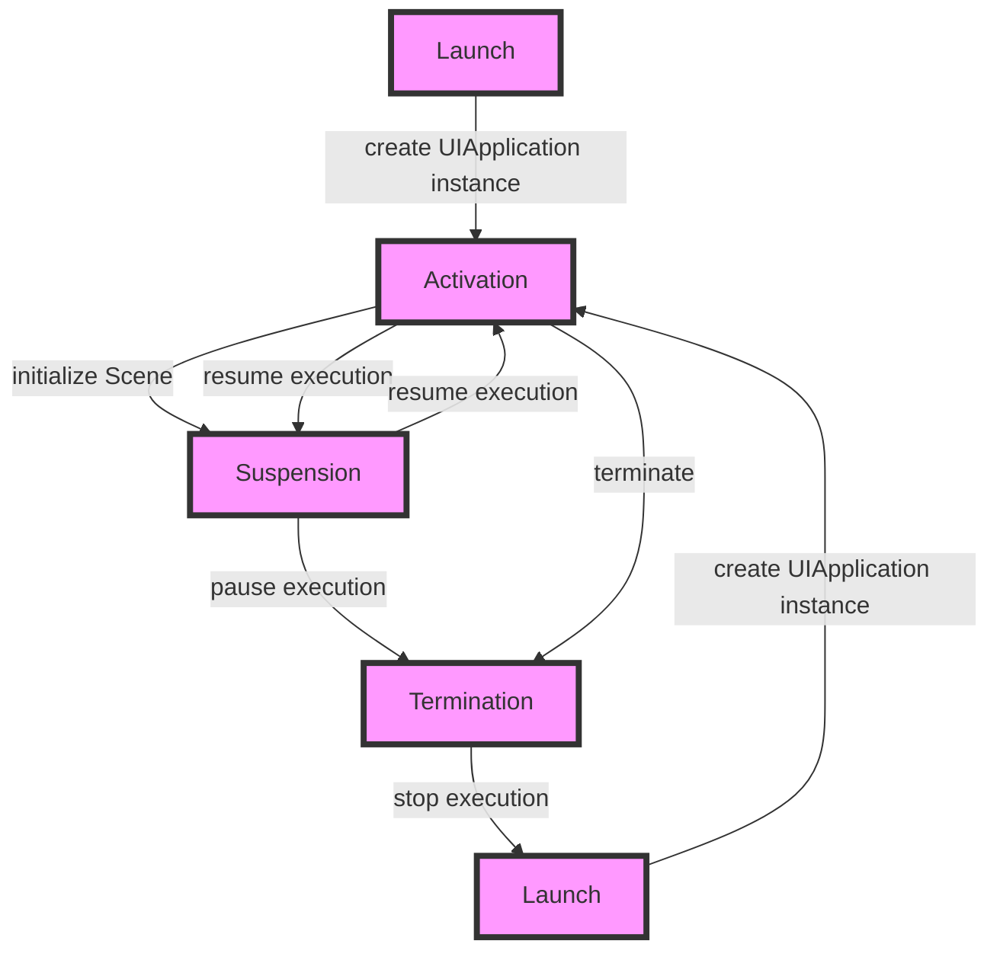

## Introduction
The **App Lifecycle** is a crucial concept in modern iOS development, particularly with the introduction of **SwiftUI**. It refers to the series of events that occur from the moment an app is launched to the moment it is terminated. Understanding the app lifecycle is essential for building robust, efficient, and user-friendly applications. In this section, we will delve into the world of app lifecycles, exploring why it matters, its real-world relevance, and why every engineer needs to know this.

The app lifecycle is a complex process that involves various stages, including launch, activation, suspension, termination, and more. Each stage has its own set of rules and best practices that developers must follow to ensure a seamless user experience. By mastering the app lifecycle, developers can optimize their apps for performance, battery life, and memory usage.

> **Note:** The app lifecycle is not unique to iOS development. Other platforms, such as Android and macOS, also have their own app lifecycle models. However, the concepts and principles discussed in this section are specific to iOS development with SwiftUI.

## Core Concepts
To understand the app lifecycle, we need to define some key terms and concepts:

* **Launch**: The process of starting an app from a terminated state.
* **Activation**: The process of bringing an app to the foreground, making it visible and interactive.
* **Suspension**: The process of pausing an app's execution, typically when the user switches to another app.
* **Termination**: The process of stopping an app's execution, typically when the user closes the app or the system terminates it due to memory constraints.
* **Scene**: A self-contained piece of UI that represents a single task or workflow.

These concepts are fundamental to the app lifecycle, and understanding them is crucial for building effective and efficient apps.

## How It Works Internally
The app lifecycle is managed by the **UIApplication** class, which is responsible for coordinating the app's launch, activation, suspension, and termination. When an app is launched, the **UIApplication** instance is created, and the app's **Scene** is initialized.

The app lifecycle can be broken down into several stages:

1. **Launch**: The app is launched, and the **UIApplication** instance is created.
2. **Activation**: The app is activated, and the **Scene** is initialized.
3. **Suspension**: The app is suspended, and its execution is paused.
4. **Termination**: The app is terminated, and its execution is stopped.

Each stage has its own set of rules and best practices that developers must follow to ensure a seamless user experience.

## Code Examples
Here are three complete and runnable code examples that demonstrate the app lifecycle in action:

### Example 1: Basic App Lifecycle
```swift
import SwiftUI

@main
struct MyApp: App {
    var body: some Scene {
        WindowGroup {
            ContentView()
        }
    }
}

struct ContentView: View {
    var body: some View {
        Text("Hello, World!")
    }
}
```
This example demonstrates a basic app lifecycle, where the app is launched, activated, and terminated.

### Example 2: App Lifecycle with Scene
```swift
import SwiftUI

@main
struct MyApp: App {
    var body: some Scene {
        WindowGroup {
            Scene {
                ContentView()
            }
        }
    }
}

struct ContentView: View {
    var body: some View {
        Text("Hello, World!")
    }
}
```
This example demonstrates an app lifecycle with a **Scene**, where the app is launched, activated, and suspended.

### Example 3: App Lifecycle with Custom Lifecycle Methods
```swift
import SwiftUI

@main
struct MyApp: App {
    var body: some Scene {
        WindowGroup {
            Scene {
                ContentView()
            }
        }
    }
    
    func applicationWillEnterForeground(_ notification: Notification) {
        print("App will enter foreground")
    }
    
    func applicationDidBecomeActive(_ notification: Notification) {
        print("App did become active")
    }
    
    func applicationWillResignActive(_ notification: Notification) {
        print("App will resign active")
    }
    
    func applicationDidEnterBackground(_ notification: Notification) {
        print("App did enter background")
    }
}

struct ContentView: View {
    var body: some View {
        Text("Hello, World!")
    }
}
```
This example demonstrates an app lifecycle with custom lifecycle methods, where the app is launched, activated, suspended, and terminated.

## Visual Diagram

This diagram illustrates the app lifecycle, showing the different stages and transitions between them.

## Comparison
| Approach | Time Complexity | Space Complexity | Pros | Cons | Best For |
| --- | --- | --- | --- | --- | --- |
| App Lifecycle | O(1) | O(1) | Simple, efficient, and easy to implement | Limited control over the lifecycle | Small to medium-sized apps |
| Custom Lifecycle Methods | O(n) | O(n) | More control over the lifecycle, flexible | Complex, harder to implement | Large and complex apps |
| Scene-based Lifecycle | O(1) | O(1) | Simple, efficient, and easy to implement | Limited control over the lifecycle | Small to medium-sized apps with multiple scenes |
| Manual Memory Management | O(n) | O(n) | More control over memory management, flexible | Complex, harder to implement | Apps with specific memory requirements |

## Real-world Use Cases
Here are three real-world use cases that demonstrate the app lifecycle in action:

* **Uber**: Uber's app lifecycle is a great example of a complex app lifecycle, where the app is launched, activated, suspended, and terminated multiple times during a single ride.
* **Instagram**: Instagram's app lifecycle is a great example of a scene-based lifecycle, where the app is launched, activated, and suspended multiple times during a single session.
* **Facebook**: Facebook's app lifecycle is a great example of a custom lifecycle, where the app is launched, activated, and terminated multiple times during a single session, with custom lifecycle methods handling the different stages.

## Common Pitfalls
Here are four common pitfalls that developers may encounter when implementing the app lifecycle:

* **Not handling the app lifecycle correctly**: Failing to handle the app lifecycle correctly can lead to crashes, freezes, and other issues.
* **Not implementing custom lifecycle methods**: Not implementing custom lifecycle methods can limit the app's control over the lifecycle, leading to inflexibility and reduced performance.
* **Not using scenes correctly**: Not using scenes correctly can lead to memory leaks, crashes, and other issues.
* **Not managing memory correctly**: Not managing memory correctly can lead to crashes, freezes, and other issues.

> **Warning:** Failing to handle the app lifecycle correctly can lead to serious issues, including crashes, freezes, and data loss.

## Interview Tips
Here are three common interview questions related to the app lifecycle, along with weak and strong answers:

* **What is the app lifecycle, and how does it work?**
	+ Weak answer: "The app lifecycle is a series of events that occur when an app is launched and terminated."
	+ Strong answer: "The app lifecycle is a complex process that involves multiple stages, including launch, activation, suspension, and termination. It is managed by the **UIApplication** class, and developers can implement custom lifecycle methods to control the lifecycle."
* **How do you handle the app lifecycle in your app?**
	+ Weak answer: "I don't handle the app lifecycle explicitly. I just use the default lifecycle methods."
	+ Strong answer: "I handle the app lifecycle explicitly by implementing custom lifecycle methods, such as **applicationWillEnterForeground** and **applicationDidBecomeActive**. I also use scenes to manage the app's UI and memory."
* **What are some common pitfalls when implementing the app lifecycle?**
	+ Weak answer: "I'm not sure. I've never encountered any issues with the app lifecycle."
	+ Strong answer: "Some common pitfalls when implementing the app lifecycle include not handling the app lifecycle correctly, not implementing custom lifecycle methods, not using scenes correctly, and not managing memory correctly. To avoid these issues, I make sure to handle the app lifecycle explicitly, implement custom lifecycle methods, use scenes correctly, and manage memory correctly."

## Key Takeaways
Here are six key takeaways to remember when implementing the app lifecycle:

* **The app lifecycle is a complex process**: The app lifecycle involves multiple stages, including launch, activation, suspension, and termination.
* **Custom lifecycle methods are essential**: Custom lifecycle methods, such as **applicationWillEnterForeground** and **applicationDidBecomeActive**, provide more control over the lifecycle.
* **Scenes are important for memory management**: Scenes help manage the app's UI and memory, reducing the risk of memory leaks and crashes.
* **Memory management is critical**: Memory management is essential to prevent crashes, freezes, and other issues.
* **The app lifecycle is platform-specific**: The app lifecycle is specific to iOS development, and developers must understand the platform's rules and best practices.
* **Testing is essential**: Testing is essential to ensure that the app lifecycle is handled correctly and that the app is stable and performant.