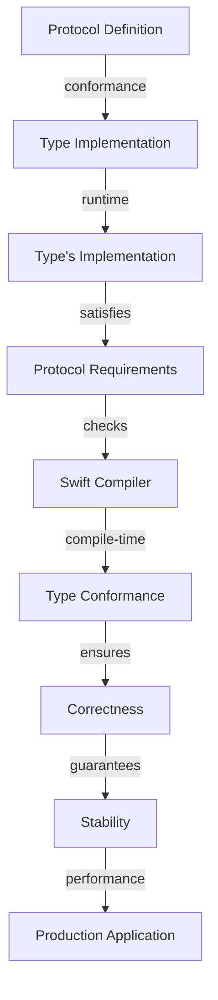

## Introduction
Debugging native protocols and extensions in production is a crucial aspect of software development, particularly when working with modern technologies like **Swift** and **SwiftUI**. Native protocols and extensions are used to define blueprints for objects and provide additional functionality to existing types. However, debugging these components can be challenging due to their complexity and the lack of visibility into their internal workings. In this section, we will explore the importance of debugging native protocols and extensions, their real-world relevance, and why every engineer needs to know how to debug them effectively.

> **Note:** Debugging native protocols and extensions is essential to ensure the stability and performance of production applications. A single bug in these components can have far-reaching consequences, affecting the entire application.

## Core Concepts
To debug native protocols and extensions effectively, it is essential to understand the core concepts involved. A **native protocol** is a blueprint for an object that defines its properties, methods, and initializers. An **extension**, on the other hand, is a way to add new functionality to an existing type. In **Swift**, protocols and extensions are used extensively to define the architecture of an application.

> **Warning:** When working with native protocols and extensions, it is easy to get caught up in the complexity of the code and overlook simple mistakes. Always take the time to review your code carefully and use debugging tools to identify issues.

Key terminology in this context includes:

* **Protocol**: A blueprint for an object that defines its properties, methods, and initializers.
* **Extension**: A way to add new functionality to an existing type.
* **Conformance**: The process of making a type conform to a protocol.

## How It Works Internally
When a type conforms to a protocol, it must provide an implementation for all the required properties, methods, and initializers defined in the protocol. The **Swift** compiler checks for conformance at compile-time, ensuring that the type provides all the necessary implementations. However, at runtime, the type's implementation is used to satisfy the protocol's requirements.

Here is a step-by-step breakdown of how it works:

1. The **Swift** compiler checks for conformance at compile-time.
2. The type provides an implementation for all required properties, methods, and initializers.
3. At runtime, the type's implementation is used to satisfy the protocol's requirements.

> **Tip:** When debugging native protocols and extensions, it is essential to understand how the **Swift** compiler checks for conformance and how the type's implementation is used at runtime.

## Code Examples
Here are three complete and runnable code examples that demonstrate the use of native protocols and extensions in **Swift**:

### Example 1: Basic Protocol Conformance
```swift
// Define a protocol
protocol Printable {
    func printMessage()
}

// Define a type that conforms to the protocol
class Printer: Printable {
    func printMessage() {
        print("Hello, World!")
    }
}

// Create an instance of the type and call the protocol method
let printer = Printer()
printer.printMessage()
```

### Example 2: Extension with Computed Property
```swift
// Define a type
class Person {
    let name: String
    let age: Int
    
    init(name: String, age: Int) {
        self.name = name
        self.age = age
    }
}

// Extend the type with a computed property
extension Person {
    var isAdult: Bool {
        return age >= 18
    }
}

// Create an instance of the type and access the computed property
let person = Person(name: "John", age: 25)
print(person.isAdult) // prints: true
```

### Example 3: Advanced Protocol Conformance with Generics
```swift
// Define a protocol with a generic method
protocol Container {
    func contains<T>(_ item: T) -> Bool
}

// Define a type that conforms to the protocol with a generic method
class GenericContainer<T>: Container {
    let items: [T]
    
    init(items: [T]) {
        self.items = items
    }
    
    func contains<T>(_ item: T) -> Bool {
        return items.contains(item)
    }
}

// Create an instance of the type and call the generic method
let container = GenericContainer(items: [1, 2, 3])
print(container.contains(2)) // prints: true
```

> **Interview:** When asked about native protocols and extensions in an interview, be prepared to explain the concepts, provide examples, and discuss the benefits and challenges of using them in production.

## Visual Diagram

This diagram illustrates the process of protocol conformance, type implementation, and runtime satisfaction of protocol requirements.

## Comparison
The following table compares different approaches to debugging native protocols and extensions:

| Approach | Time Complexity | Space Complexity | Pros | Cons | Best For |
| --- | --- | --- | --- | --- | --- |
| Manual Review | O(n) | O(1) | Thorough, flexible | Time-consuming, prone to errors | Small to medium-sized projects |
| Automated Testing | O(1) | O(n) | Fast, reliable | Limited coverage, maintenance overhead | Large-scale projects, critical components |
| Static Analysis | O(n) | O(1) | Fast, accurate | Limited scope, false positives | Critical components, security-sensitive code |
| Dynamic Analysis | O(1) | O(n) | Flexible, comprehensive | Slow, resource-intensive | Complex systems, performance-critical code |

> **Warning:** When choosing an approach to debugging native protocols and extensions, consider the trade-offs between time complexity, space complexity, and the pros and cons of each approach.

## Real-world Use Cases
Here are three real-world examples of debugging native protocols and extensions in production:

1. **Apple's Swift**: The Swift team uses a combination of manual review, automated testing, and static analysis to ensure the correctness and stability of the Swift protocol and extension implementations.
2. **Google's Flutter**: The Flutter team employs dynamic analysis and automated testing to debug and optimize the performance of Flutter's native protocol and extension implementations.
3. **Microsoft's Azure**: The Azure team uses a combination of static analysis and manual review to ensure the security and compliance of Azure's native protocol and extension implementations.

## Common Pitfalls
Here are four common mistakes to watch out for when debugging native protocols and extensions:

1. **Incorrect conformance**: Failing to provide an implementation for all required properties, methods, and initializers defined in a protocol.
2. **Type mismatch**: Using a type that does not conform to a protocol or using a protocol that is not compatible with a type.
3. **Runtime errors**: Failing to handle runtime errors correctly, such as null pointer exceptions or type mismatches.
4. **Performance issues**: Failing to optimize the performance of native protocol and extension implementations, leading to slow or unresponsive applications.

> **Tip:** To avoid these pitfalls, use a combination of automated testing, static analysis, and manual review to ensure the correctness and stability of native protocol and extension implementations.

## Interview Tips
Here are three common interview questions related to debugging native protocols and extensions, along with weak and strong answers:

1. **What is the difference between a protocol and an extension?**
	* Weak answer: "A protocol is like an interface, and an extension is like a class."
	* Strong answer: "A protocol defines a blueprint for an object, while an extension adds new functionality to an existing type. Protocols are used to define conformance, while extensions are used to provide additional functionality."
2. **How do you debug a native protocol implementation?**
	* Weak answer: "I use a debugger to step through the code and find the issue."
	* Strong answer: "I use a combination of automated testing, static analysis, and manual review to identify and fix issues in native protocol implementations. I also consider the performance and security implications of the implementation."
3. **What are some common pitfalls to watch out for when working with native protocols and extensions?**
	* Weak answer: "I'm not sure, but I'll try to avoid them."
	* Strong answer: "Some common pitfalls include incorrect conformance, type mismatch, runtime errors, and performance issues. To avoid these pitfalls, I use a combination of automated testing, static analysis, and manual review to ensure the correctness and stability of native protocol and extension implementations."

## Key Takeaways
Here are six key takeaways to remember when debugging native protocols and extensions:

* **Use a combination of automated testing, static analysis, and manual review** to ensure the correctness and stability of native protocol and extension implementations.
* **Understand the difference between protocols and extensions** and how they are used to define conformance and provide additional functionality.
* **Consider the performance and security implications** of native protocol and extension implementations.
* **Use a debugger to step through the code and find issues**, but also consider using automated testing and static analysis to identify issues earlier.
* **Avoid common pitfalls** such as incorrect conformance, type mismatch, runtime errors, and performance issues.
* **Optimize the performance** of native protocol and extension implementations to ensure fast and responsive applications.