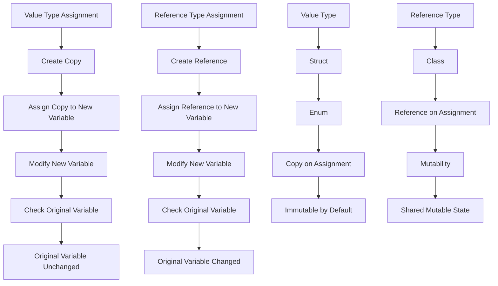

## Introduction
Debugging value vs reference types is a crucial aspect of high-performance application development. In Swift, understanding the difference between **value types** and **reference types** is essential to avoid common pitfalls and optimize code for better performance. Value types, such as **structs** and **enums**, are copied when assigned to a new variable, whereas reference types, such as **classes**, are passed by reference. In this article, we will delve into the core concepts, internal mechanics, and provide code examples to demonstrate the importance of debugging value vs reference types in high-performance applications.

## Core Concepts
To understand the difference between value and reference types, we need to grasp the concepts of **copying**, **mutability**, and **identity**. Value types are copied when assigned to a new variable, which means that changes made to the new variable do not affect the original variable. On the other hand, reference types are passed by reference, which means that changes made to the new variable affect the original variable. **Immutability** is a key concept in value types, as it ensures that the state of the object remains unchanged.

> **Note:** In Swift, **structs** and **enums** are value types, while **classes** are reference types.

## How It Works Internally
When you assign a value type to a new variable, Swift creates a copy of the original value. This copy is stored in a new location in memory, and any changes made to the new variable do not affect the original variable. In contrast, when you assign a reference type to a new variable, Swift creates a new reference to the same location in memory. This means that changes made to the new variable affect the original variable.

Here's a step-by-step breakdown of what happens when you assign a value type to a new variable:
1. Swift creates a copy of the original value.
2. The copy is stored in a new location in memory.
3. The new variable is assigned a reference to the new location in memory.

> **Warning:** When working with reference types, be aware of the **shared mutable state** problem, where multiple variables reference the same location in memory, leading to unintended behavior.

## Code Examples
### Example 1: Basic Value Type Assignment
```swift
struct Person {
    let name: String
    var age: Int
}

var person1 = Person(name: "John", age: 30)
var person2 = person1

person2.age = 31

print(person1.age) // prints 30
print(person2.age) // prints 31
```
In this example, we define a **struct** `Person` with a **let** property `name` and a **var** property `age`. We create two variables `person1` and `person2` and assign `person1` to `person2`. When we modify `person2.age`, it does not affect `person1.age`, demonstrating the value type behavior.

### Example 2: Reference Type Assignment
```swift
class Person {
    let name: String
    var age: Int

    init(name: String, age: Int) {
        self.name = name
        self.age = age
    }
}

var person1 = Person(name: "John", age: 30)
var person2 = person1

person2.age = 31

print(person1.age) // prints 31
print(person2.age) // prints 31
```
In this example, we define a **class** `Person` with a **let** property `name` and a **var** property `age`. We create two variables `person1` and `person2` and assign `person1` to `person2`. When we modify `person2.age`, it affects `person1.age`, demonstrating the reference type behavior.

### Example 3: Advanced Value Type with Nested Structs
```swift
struct Address {
    let street: String
    let city: String
    let state: String
    let zip: String
}

struct Person {
    let name: String
    var address: Address
}

var person1 = Person(name: "John", address: Address(street: "123 Main St", city: "Anytown", state: "CA", zip: "12345"))
var person2 = person1

person2.address.city = "Othertown"

print(person1.address.city) // prints "Anytown"
print(person2.address.city) // prints "Othertown"
```
In this example, we define two **structs** `Address` and `Person`. We create two variables `person1` and `person2` and assign `person1` to `person2`. When we modify `person2.address.city`, it does not affect `person1.address.city`, demonstrating the value type behavior for nested structs.

## Visual Diagram

This diagram illustrates the difference between value and reference types in Swift. It shows how value types are copied on assignment, while reference types are passed by reference.

## Comparison
| Approach | Time Complexity | Space Complexity | Pros | Cons | Best For |
| --- | --- | --- | --- | --- | --- |
| Value Type | O(1) | O(n) | Immutable by default, thread-safe | Copying can be expensive for large objects | Small to medium-sized objects, concurrent programming |
| Reference Type | O(1) | O(1) | Shared mutable state, efficient for large objects | Can lead to unexpected behavior, not thread-safe | Large objects, complex data structures |
| Nested Value Type | O(n) | O(n) | Immutable by default, thread-safe | Copying can be expensive for large objects | Complex data structures, concurrent programming |
| Nested Reference Type | O(1) | O(1) | Shared mutable state, efficient for large objects | Can lead to unexpected behavior, not thread-safe | Complex data structures, large objects |

## Real-world Use Cases
1. **Apple's Swift Standard Library**: The Swift Standard Library uses value types extensively to ensure thread safety and immutability.
2. **Facebook's Swift SDK**: Facebook's Swift SDK uses reference types to manage complex data structures and shared mutable state.
3. **Uber's Swift API Client**: Uber's Swift API client uses a combination of value and reference types to optimize performance and ensure thread safety.

## Common Pitfalls
1. **Unintended Shared Mutable State**: When using reference types, be aware of the shared mutable state problem, where multiple variables reference the same location in memory.
2. **Inefficient Copying**: When using value types, be aware of the copying overhead, especially for large objects.
3. **Incorrect Assumptions about Immutability**: When using value types, do not assume that all properties are immutable by default.
4. **Ignoring Thread Safety**: When using reference types, do not ignore thread safety considerations, especially in concurrent programming.

## Interview Tips
1. **What is the difference between value and reference types in Swift?**: A strong answer should explain the copying behavior of value types and the reference behavior of reference types.
2. **How do you optimize performance when using value types?**: A strong answer should discuss techniques such as using **lazy** properties and minimizing copying overhead.
3. **What are some common pitfalls when using reference types?**: A strong answer should discuss the shared mutable state problem and thread safety considerations.

## Key Takeaways
* Value types are copied on assignment, while reference types are passed by reference.
* Immutability is a key concept in value types, ensuring thread safety and predictable behavior.
* Reference types can lead to unexpected behavior due to shared mutable state.
* Copying overhead can be expensive for large objects.
* Thread safety considerations are crucial when using reference types.
* **Lazy** properties can optimize performance when using value types.
* Minimizing copying overhead is essential when using value types.
* Understanding the difference between value and reference types is critical for high-performance application development in Swift.